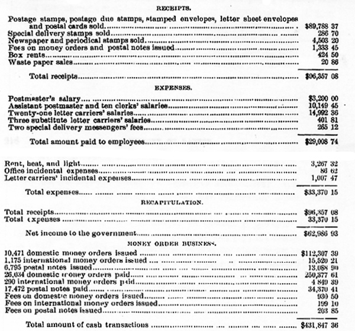

# Chapter Twelve

In 1805, the corporate history of Dayton began. The first act of the legislature investing the young settlement with corporate powers was passed February 12th, of that year. This charter was amended in 1814, and again in 1829. The town was named in honor of Hon. Jonathan Dayton, LL. D., of New Jersey, a Revolutionary soldier, a delegate to the Constitutional Convention, and a member of Congress, who was one of the four original owners of the town site. At that time, separated by only half the life of a generation from the stirring scenes of the Revolution, it was natural to find soldiers foremost in all large enterprises upon the frontier. Still it is worthy of remark that of the four original owners, two had been commanders-in-chief of the armies of the United States General St. Clair in 1791 and General Wilkinson in 1796, while General Brown, 'one of the first settlers, who lived in 179-7 and 1798 in a log cabin on. the southwest corner of Jefferson and Water streets, attained the same distinguished position in 1821, and held it until his death in 1828. He entered the army from civil life when the War of 1812 broke out, and served with great credit. For distinguished bravery on the battle fields of Chippewa and Niagara Falls, and at the siege of Fort Erie, he was voted the thanks of Congress and a gold medal. At the close of the war he was continued in commission as a major-general of the regular army, until his promotion to the chief command. Three of the principal streets, in compliment to Colonel Ludlow, General St. Clair, and General Wilkinson, have always retained their names.

The town site was bounded on the north by the Miami River, on the south by South or Sixth Street, on the east by Mill Street, and on the west by Wilkinson Street. The plat of the village at this date contemplated a public square at the intersection of Main and Third streets, in the center of which the courthouse was to be located; but this arrangement was changed by plats subsequently made. In the interval between the making of this plat and of that finally adopted, it was seriously proposed, in consequence of the great flood in March, 1805, to abandon the improvements already made and locate the village on the high ground of what is now East Third Street and east of high Street. But our pioneer fathers clung to the water courses, "tile natural highways." They knew how convenient they were at times, and they were not to be driven from the river backs even by destructive floods.

The difficulties connected with securing titles to the lands have been set forth in other pages. Daniel C. Cooper, by preemption, by legislation, and by the consent of the community, became proprietor of the town site, and the original settlers or their representatives received their letters through him. In the adjustment of their difficulties as to titles, a new plat was made by D. C. Cooper and Israel Ludlow April 26, 1802, and on the 27th it was sent to Cincinnati and recorded in the records of Hamilton County. In 1804, D. C. Cooper made a large plat, but it was not recorded until November, 1805.

It was three or four years after this before the individual difficulties of title were all adjusted, and after this had been done, in 1809, Mr. Cooper made a revised plat to conform to deeds and patents of citizens, as then fixed, and this has remained the plat of the town. Unfortunately the records of the city from 1805 until 1829 have been lost, and with them much valuable information concerning the early history of Dayton. By the act of incorporation, a town marshal, collector, supervisor, and seven trustees were to be elected annually by the freeholders who could claim six months' residence. The trustees were to elect a president and recorder from among themselves, and a treasurer, who was not required to be a trustee.

On the first Monday of May, 1805, the first town election was held. The seven trustees elected comprised the select council of the town of Dayton, and their president was in efect mayor. In 1810, the population was but 383, and Cincinnati contained but 2,320. A paving ordinance at this date shows that the boundaries of the settlement were the river on the north from Main to Mill streets, Third Street on the south from Ludlow to St. Clair. The most closely-settled street seems to have been Main Street, front the river to Third Street. On July 4, 1814, the first market house was opened to the public. A frame building occupied the center of Second Street, for a distance of one hundred feet, between Main and Jefferson streets, which was, for many years after the building was torn down, in 1830, called Old Market Street. Market was held here on each Wednesday and Saturday, from 4 A. M. to 10 A. M. The ordinance to regulate the market prohibited retailing country produce, fresh meat, and within the town limits except on market days, but fresh meat and fish might be sold every day before eight o'clock in the morning. In 1816, D. C. Cooper was elected president of the select council; Joseph Peirce, recorder, and Aaron Baker, H. G. Phillips, Ralph Wilson, O. B. Connor, and George Grove, trustees. In 1820, H. G. Phillips was elected president of the select council; George S. Houston, recorder, and Aaron Baker, Luther Bruen, David Henderson, William Huffman, and Dr. John Steele, trustees. In 1821, Matthew Patton was president of the council, and George S. Houston, recorder. In 1823, John Compton was president, and Joseph H. Conover, recorder. In 1824, John Compton was president, and John W. Van Cleve, recorder. In 1825, Simeon Broadwell was president, and Warren Munger, recorder. In 1826, Elisha Brabham was president, and R J. Skinner, recorder. In 1827, Dr. John Steele was president, and R. J. Skinner, recorder. In 1828, Dr. John Steele was president, and John W. Van Cleve, recorder. In 1829, certain amendments were made to the charter, especially. in restricting the suffrage to those who had been residents one year in the town, and in the power conferred on the council to regulate, license, or suspend the sale of liquor. The first election under the amended charter was held March 6th of that year, and John Folkerth was elected mayor; David Winters, recorder, and Nathaniel Wilson, James Haight, John Rench, Luther Bruen, and William Atkins, trustees. On the 24th of November, 1829, the council passed an ordinance separating the town into wards with the following boundaries:

> FIRST WARD--Bounded on the north by the Miami and Mad rivers; on the south by Second Street; on the west by Jefferson Street, and on the east by the corporation line.

> SECOND WARD--Bounded on the north by the Miami River; on the south by Second Street; on the east by Jefferson Street, and on the west by the Miami River.

> THIRD WARD--Bounded on the north by Second Street; on the south by the south line of Market Street, and a continuance of that line due west to the river; east by Jefferson Street, and west by the river.

> FOURTH WARD--Bounded on the north by a line running clue cast from the river to the south line of Market Street and along that line to Jefferson Street; thence north to Third Street, and along Third Street to the corporation line; on the south by Fifth Street, and on the east by the corporation line.

> FIFTH WARD--Bonded on the north by Fifth Street; south by east and west by the corporation line.

The lines made by the river on the north and west, Mill Street and the canal on the east, and Sixth Street on the south included about all the improvements of the town.

In October, 1829, the building committee of the new market-house were authorized by the council to build, in addition to, the market-house of two hundred feet, a council house on the west end of the market space fronting on Main Street, to be of brick, 20x16 feet, surmounted by a cupola. On September 14, 1830, the old market-house on Second Street was sold and the new one occupied, and in 1836 this was extended through to Jefferson Street.

In March, 1830, the following city officers were elected: John W. Van Cleve, mayor; E. W. Davies, recorder; Elisha Brabham, First Ward, A. Darst, Second Ward, R. J. Skinner, Third Ward, N. Wilson, Fourth Ward, and Thomas Brown, Fifth Ward, trustees. In March, 1831, Mr. Van Cleve was reelected mayor, and Mr. Davies recorder. The following were the trustees elected at that time: First Ward, Thomas Clegg; Second Ward, Charles R. Greene; Third Ward, David Hawthorn; Fourth Ward, N. Wilson; and Fifth Ward, Beniah Tharpe. In March, 1832, Mr. Van Cleve was again elected mayor, F. F. Carnell, recorder, and the following were the trustees: First Ward, C. G. Swain; Second Ward, John Compton; Third Ward, Dr. John Steele; Fourth Ward, N. Wilson; and Fifth Ward, Beniah Tharpe.

In March, 1833, the following officers were elected; Mayor, Dr. Job Haines; recorder, Rev. David Winters; trustees, First Ward, Alexander Grimes; Second Ward, Henry A. Pierson; Third Ward, Jacob Leeds; Fourth Ward, David Davis; Fifth Ward, Thomas Brown. In March, 1834, .he following: Mayor, Henry Stoddard; recorder, Rev. David Winters; trustees, First Ward, Alexander Grimes; Second Ward, H. A. Pierson; Third Ward, James Stover; Fourth Ward, N. Wilson; and Fifth Ward, David Pruden. March, 1835: Mayor, John Anderson; recorder, Rev. David Winters; trustees, First Ward, Samuel Foley; second Ward, Levi B. Jones; Third Ward, James Stover; Fourth Ward, John Engles; Fifth Ward, Henry Slaght. March, 1836: Mayor, D. W. Wheelock; recorder, Rev. David Winters; trustees, First Ward, Samuel Foley; Second Ward, Dr. Edwin Smith; Third Ward, Richard Greene; Fourth Ward, David Stone; Fifth Ward, Henry Slaght. March, 1837: Mayor, D. W. Wheelock; recorder, J. M. Mills; trustees, First Ward, John Lehman; Second Ward, Dr. Edwin Smith; Third Ward, Richard Greene; Fourth Ward, John Engles; Fifth Ward, Augustus George. March, 1838: Mayor, D. W. Wheelock; recorder, Joseph Davidson; trustees, First Ward, J. Lehman; Second Ward, R. C. Schenck; Third Ward, J. Boyer; Fourth

Ward, John Ingles; Fifth Ward, J. Malambre. March, 1839: Mayor, William J. McKinney; recorder, J. Davidson; trustees, First Ward, Samuel Foley; Second Ward, J. M. Mills; Third Ward, George Owen; Fourth Ward, John Engles; Fifth Ward, J. Malambre. March, 1840: Mayor, W. J. McKinney; recorder, James McDaniel; trustees, First Ward, Henry Kimes; Second Ward, Isaac Demarest; Third Ward, Henry L. Brown; Fourth Ward, E. W. Davies; Fifth Ward, J. Malambre. March, 1841: Mayor, Morris Seely; recorder, A. M. Bolton; trustees, First Ward, Henry Kimes; Second Ward, John Garner; Third Ward, H. L. Brown; Fourth Ward, E. W. Davies; Fifth Ward, J. Malambre.

The officers under this election served but a short time, another election taking place under the new charter in the following May. This charter was granted March 8th, of that year, but was subject to a vote of the people. The vote, as published by the recorder, was as follows: Three hundred and eighty-two for it, to 378 against it. The mayor, in presence of the council, proclaimed that the act to incorporate the city of Dayton had taken effect and was in full force. It was thereupon resolved that the mayor should issue a proclamation for an election under the charter on Saturday, May 22, from 12 M. to 4 P. M., for a mayor, marshal, treasurer, and two trustees for each ward, all of whom shall hold his office until the first Monday in January, 1842. At the election 902 votes were cast. William J. McKinney was elected mayor, Epriam Broadwell, marshal, and David Stout, treasurer. The councilmen elected were: First Ward, Henry Kimes and Samuel T. Harker; Second Ward, Peter Odlin and Samuel McPherson; Third Ward, Henry L. Brown and David Winters; Fourth Ward, Davis and John Engle; Fifth Ward, Madison Munday and Henry Strickler. In June Mr. McPherson resigned, and William F. Comly was elected by the council to the vacancy.

On May 24, 1841, the new council assembled for the first time, and elected Peter Odlin president, and A. M. Bolton clerk and recorder. The salary of the mayor was fixed at $200, and that of the clerk and recorder at $400. Te salary of the marshal was fixed at $360, and the treasurer was allowed two per cent on all disbursements.

In December, 1841, an official plum attracted the attention of the city fathers, and the council ordered the publication of a pamphlet with statistics of Dayton to present to the commissions appointed by the president to report on the location of a western armory. Seven hundred copies of this pamphlet were printed, but their publication did not succeed in securing the location of the armory at Dayton. After a protracted discussion the council this month resolved to fix no compensation for themselves, but at a subsequent meeting in the same month, they established their compensation at fifty cents for each meeting. At the election held this month there were 616 votes cast, and the following officers were elected: Mayor, William J. McKinney; marshal, Ephraim Broadwell; constables, Samuel Foley and Ebenezer Henderson; treasurer, David Stout; trustees-First Ward, D. A. Wareham, one year; J. G. Stutsman, two years. Second Ward, Peter Odlin, one year; William F. Comly, two years. Third Ward, Richard Greene, one year; 11. L. Brown, two years. Fourth Ward, Daniel Keifer, one year; John 11. Mitchell, two years. Fifth Ward, Madison Munday, one year; Henry Strickler, two years. The new council organized January 3, 1843, electing Peter Odlin president, and A. M. Bolton clerk.

In December, 1842, the following council was elected: First Ward, George C. Davis; Second Ward, Peter Odlin; Third Ward, William Huffman; Fourth Ward, Henry Kissinger; Fifth Ward, John Painter. December, 1843, William J. McKinney was reelected mayor, and the following councilmen were elected: First Ward, J. G. Stutsman; Second Ward, William F. Comly; Third Ward, Henry L. Brown; Fourth Ward, David Davis; Fifth Ward, Henry Strickler. Peter Odlin was reelected president, and A. M. Bolton, clerk. December, 1844, the councilmen elected were as follows: First Ward, George C. Davis; Second Ward, Peter Odlin; Third Ward, Hiram Wyatt; Fourth Ward, Henry Kissinger; Fifth Ward, Richard Chambers. The same persons were again elected president and clerk of the council.

In December, 1845, William J. McKinney was reelected mayor. The following councilmen were also elected: First Ward, J. G. Stutsman; Second, Ward, William F. Comly; Third Ward, Adam Speice; Fourth Ward, Jacob Malambre; Fifth Ward, Samuel Marshall. The offices of president and clerk again fell to Peter Odlin and A. M. Bolton. In December, 1846, the councilmen elected were: First Ward, J. H. Achey; Second Ward, John Howard; Third Ward, J. M. Sullivan; Fourth Ward, Henry Kissinger; Fifth Ward, D. S. Raymond. John Howard was chosen president, and A. M. Bolton, clerk.

In December, 1847, G. W. Bomberger was elected mayor for two years, but died June 21, 1848, and John Howard was appointed his successor by the council. E. Fowler was appointed to the vacancy thus made in the Second Ward. The councilmen elected in December, 1847, were as follows: First Ward, J. G. Stutsman; Second Ward, William F. Comly; Third Ward, B. Gilbert; Fourth Ward, Jonathan Kinney; Fifth Ward, A. E. McClure. December, 1848, the councilmen elected were: First Ward, Adam Pritz; Second Ward, Henry Herrman; Third Ward, R. A. Kerfoot; Fourth Ward, Jacob Richmond; Fifth Ward, Wesley Boren, and from the newly created Sixth Ward, W. N. Love, one year, and William John. Mr. John resigned and D. S. Raymond was elected May 25, 1849. William F. Comly was elected president of the council, and William C. Bartlett, clerk.

In December, 1849, John Howard was elected mayor, and the following councilmen were elected: First Ward, Samuel Taylor; Second Ward, William F. Comly; Third Ward, Mark Reed; Fourth Ward, Jonathan Kinney; Fifth Ward, F. C. Baker; Sixth Ward, W. N. Love. William F. Comly was elected president of the council, and William C. Bartlett, clerk. In June, 1850, Henry Beichler was elected to represent the Fifth Ward in the place of F. C. Baker, resigned. August 9th Andrew Gump took the place of R. A. Kerfoot, resigned. In December, 1850, the councilmen elected were: First Ward, A. Decker; Second Ward, I. B. Chapman; Third Ward, Jonathan Ilarshman; Fourth Ward, Methusaleh Worman; Fifth Ward, Wesley Boren; Sixth Ward, A. E. McClure. In July, 1842, the council agreed to make the annual salary of the mayor $150, that of the clerk $250, that of the marshal $400, and of the members of council one dollar each for each meeting held after June 1, 1843.

In the fall of 1843, John Quincy Adams passed through Dayton on his way to Cincinnati to dedicate the observatory, and the hospitality of the city was tendered him by the following resolution of the council, passed November 6th: “Information having been received that John Quincy Adams will reach Dayton this evening:

> Resolved, That the members of the council proceed to the corporation line, and escort Mr. Adams to the city, when the president is instructed to welcome him to the hospitality of the city.

A committee, consisting of Messrs. Davis, Stutsman, and Comly, was appointed to arrange with Mrs. Blair, the landlady, for the entertainment of the distinguished guest, and Mr. Comly was directed to strike of handbills, to notify the citizens. Mr. Adams made a brief responsefrom the balcony of the hotel to the address of welcome, and the next morning resumed his journey.

On November 18, 1848, the following ordinance was adopted, establishing landmarks:

> Whereas, The face of the eastern wall of the courthouse, and the original face of the eastern wall of the old tavern on in-lot Number 13, has been determined by general agreement of surveyors and by judicial proceedings to be on the true western line of Main Street; therefore, resolved, that three stones be set by the surveyor of Montgomery County and the city engineer, the stones to be four feet long, eighteen inches on one face, and nine inches on the other. One of said stones to be set in Main Street, the top level with the curbstone, sixteen and one half feet from the perpendicular line of the face of the brick work of the east wall of the courthouse; one in Main Street, facing east, which face shall be sixteen and one half feet from the perpendicular line of the east face of the original log wall of the old tavern, on the corner of Main and Water streets, and the northern face in range with the north face of said tavern; one of said stones to be set in Water Street, the northern face sixteen and one half feet from the Water Street front of the dwelling, corner of Water and Mill streets, and the eastern edge in exact range with the Mill Street front of the same house.

These stones were set as reported to the council April, 1846, by William G. George, county surveyor, and James H. Mitchell, city engineer, in presence of J. W. Van Cleve and sixteen other witnesses. In September, 1844, the following polling places were established: For the First Ward, at Swaynie's Hotel, First Street, just east of the canal; Second Ward, at Independent Engine House, on Second Street, between Main and Jefferson; Third Ward, at Safety Engine House, on Ludlow Street, between Second and Third; Fourth Ward, at Jimmy Elliott's cabinet shop, northwest corner of Fourth and Main streets; Fifth Ward, at Eastern School House, on Brown Street.

That portion of the city called Oregon, lying south of Frenchtown and east of the canal, was platted in 1845, and about the same time the plat of West Dayton, from the river west on Third to Williams streets, was made, and that of Mexico, lying immediately west of West Dayton. All that part of the city lying west of the river, between Wolf Creek and the Germantown pike, was subsequently called Miami City, and now West Dayton.

In the summer of 1849, Dayton had a severe visitation of the cholera, about two hundred and twenty-five deaths occurring during the summer.

A board of health was appointed, of which George B. Holt was president. A. cholera hospital was established, with Dr: Edwin Smith in charge. Liberal appropriations were made by the council; citizens' relief committees were appointed; the streets and alleys were white and redolent with chloride of lime. Business was almost suspended, but few people left town. The officers of the city, the physicians and the citizens united to remain at their posts and help those in need.

The polling places in 1855 were as follows: First Ward, Neptune Engine House; Second Ward, Independent Engine House; Third Ward, council chamber; Fourth Ward, Deluge Engine House; Fifth Ward, Oregon Engine House; Sixth Ward, Eastern School House. Having heretofore given an account of the result of the city elections, including that of 1850, the record is now continued to the present date, 1889. In December, 1851, John Howard was elected mayor, and the following councilmen: First Ward, Louis Heintz; Second Ward, Joseph T. Reed; Third Ward, John H. Achey; Fourth Ward, Jonathan Kenney; Fifth Ward, James Turner; Sixth Ward, W. N. Love. In December, 1852, an ordinance was adopted, changing the time of the city election from December to the first Monday in April, and the officers, whose terms expired in January, 1853, held over until April following. In April, 1853, the following officers were elected: Mayor, John Howard; councilmen, First Ward, B. M. Ayres; Second, J. B. Chapman; Third, Nicholas Ohmer; Fourth, Jacob Richmond; Fifth, Samuel Marshall; Sixth, A. E. McClure; president of the council, Jonathan Kenney; clerk, George W. Malambre; city solicitor, F. Collins; treasurer, D. Stout.

Following are lists of the various city officers since 1853:

MAYORS--1854, George M. Young; 1855, D. W. Iddings; 1860, W. H. Gillespie; 1864, E. Ellis; 1866, Jonathan Kenney; 1868, C. L. Bauman; 1870, James D. Morrison; 1872, W. H. Sigman; 1874, L. Butz, Jr; 1876, W. H. Rouzer; 1878, L. Butz, Jr.; 1880, F. M. Hosier; 1882, John L. Miller; 1884, John Bettelou; 1886, Ira Crawford.

CITY SOLICITORS--1854, E. J. Forsyth; 1857, J. Ackerman; 1859, L. B. Bruen; 1861, Josiah Lovell; 1865, William Craighead; 1867, D. B. Corwin; 1871, J. C. Baggott; 1872, A. A. Thomas; 1875, 0. M. Gottschall; 1877, W. Belleville; 1879; A. W. Kumler; 1883, John Hanitch; 1889, D. B. Corwin.

CITY CLERKS--1854, G. W. Malambre; 1855, D. A. Houk; November, 1855, Fielding Loury, elected upon the resignation of D. A. Houk; 1859, A. A. Butterfield; 1860, A. Stephens; 1865, John U. Kreidler; October, 1867, J. A. Leonard; January, 1869, D. II. Dryden; April, 1869, A. Stephens; 1872, A. A. Butterfield; 1875, N. Metz; 1876, A. H. Whytte; 1878, N. Metz; 1879, George M. Lane; 1883, C. H. Herbig; 1887, Eugene Shinn.

CITY TREASURERS--1854, David Stout; 1856, A. V. Stausifer; June, 1857, Smith Davisson; 1859, C. C. Kiefer; 1861, James Anderton; 1862, D. W. Reese. Since the expiration of Mr. Reese's term the county treasurer has also served as city treasurer.

PRESIDENTS OF COUNCIL--1854, John H. Achey; 1855, James Turner; 1856, B. M. Ayres; 1859, William Bomberger; 1861, A. Decker; 1862, W. N. Love; 1893, Amos Decker; Iddins; 1871, AV. `I. Mills; 1875, D. C. Taft; 1876, E. MI.1Vood; Pease; 1880, S. T. Bryce; 1886, Galen C. 1V ise; 1889, E. P. Mathews. 1854 to 1889, both years inclusive: 1854, J. Lane; James Turner, J. McClure, and W. N. Love. 1864, I. H. Kiersted; 1865, D. W. 1872, D. W. Iddings; 1874, E. M. Wood; 1878, John 11. Fletcher; 1879, C. E. 1883, John H. Fletcher; 1884, Jacob Weinrich; 1887, Samuel A. Ambrose; 1888, J. W. Allison; 1889, E. P. Mathews.

Following is a list of the councilmen elected from year to year from 1854 to 1889, both years inclusive:

1854–-J. H. Achey, Thomas H. Phillips, William Dickey, Richard H. Thomas, for unexpired terms of A. E. McClure and W. N. Love.

1855--B. M. Ayres, J. H. Chapman, H. Gebhart, Jonathan Kenney, George Owen, and A. E. McClure.

1856--William Dickey, Thomas 11. Phillips, J. II. Achey, Richard Lane, B. N. Beaver, and W. N. Love.

1857--B. M. Ayres, William Trebein, H. Gebhart, John Stephens, George Owen, and A. E. McClure.

1858--Amos Decker, Thomas 11. Phillips, E. A. More, L. L. Gilliland, Ezra Thomas, and Peter Lutz.

1859--Hugh Wiggim, Ezra Binlm, Isaac II. Kiersted, James Boyer, Lawrence Butz, and William Bomberger.

1860--Amos Decker, Thomas II. Phillips, John 11. Shank, L. L. Gilliland, George Lehman, and Peter Lutz.

1861—-Hugh Wiggim, Ezra Bunn, I. H. Kiersted, I. A. Miunick, William Patton, and W. N. Love.

1862--Amos Decker, Hiram Strong, George W. Rogers, L. L. Gilliland, George Lehman, and Jacob Decker.

1863--William Dickey, Ezra Bimm, I. H. Kiersted, I. A. Minnick, Ezra Thomas, and W. N. Love.

1864--A. Kuhns, D. W. Iddings, John H. Shank, H. H. Hilgefort, George Lehman, and W. R. Bennet.

1865--J. S Geary, It. W. It. Brenner, D. Kiefer, John Clingman, John W. Butt, W. N. Love, John Colhauer, and Lawrence Butz, Jr.

1866--A. Kuhns, D. AV. Iddings, J. It. Shank, Alexander Gebhart, George Lehman, W. N. Love, George Braunsweiger, and Lawrence Butz, Jr.

1867--John Wiggins, II. W. R. Brunner, D. Kiefer, John Clingman, James Turner, John Anian, John Colhauer, and James Boyle.

1868--John R. Brownell, D. W. Iddings, A. Pruden, A. Gebhart, John C. Baird, D. V. Pottle, George Braunsweiger, D. C. Taft, and George Lehman.

1869--George Miller, C. Herchelrode, D. Kiefer, John Clingman, George Lehman, Henry Guckes, T. J. Welty, G. W. Murray, A. C. Fehring, and H. Barnhart.

1870--J. B. Gilbert, D. W. Iddings, J. H. Shank, A. Gebhart, T. N. Sowers, James Hammond, W. Wassenich, D. C. Taft, W. R. Tomlinson, A. C. Fehring, and H. Barnhart.

1871--George Miller, John Breene, D. Kiefer, John Clingman, J. Kratochwill, John Weaver, George Neiland, John Roher, George W. Murray, W. M. Mills, William Huffman, and Charles E. Smith

1872--A. Kuhns, D. W. Iddings, John H. Shank, Ashley Brown, Andrew Slentz, Samuel A. Ambrose, Joseph Hammond, W. Wassenich, D. C. Taft, Henry Webbert, John Kemp, and Ilerniann Gerdes.

1873--George Miller, John Breene, J. J. Rossell, E. M. Wood, John Clingman, James Turner, Charles G. Meyers, Joseph Herhold, M. Cain, Charles E. Smith, J. W. Sollenberger, and N. Metz.

1874--J. B. Gilbert, S. F. Woodsum, Joseph Corner, William Kiefer, John W. Butt, Joseph L. Hammond, W. Wassenich, D. C. Taft, Henry Webbert, Joseph Ptoutz, and John F. Gerber.

1875--George Miller, J. B. Smith, John H. Shank, E. M. Wood, James Turner, W. J. Oblinger, Joseph Herhold, Julius Wehner, Charles E. Smith, Thomas Hill, and William Huffman.

1876--A. C. Nixon, Henry Theobald, Joseph Conner, Washington Silzell, John H. Waymire, Johnson Snyder, JYn1IIi Schoen, Thomas Gavin, John G. Feight, L. D. Baer, and John F. Gerber.

1877--J. R. Fletcher, William II. Pritz, P. JoHautgen, E. M. Wood, S. T. Bryce, John W. Kuanb, Joseph Desch, Simon Goodman, David Cosad, Adam Schantz, and A. E. Jenner.

1878--John Bohlender, C. E. Pease, Joseph Cotter, F. J. McCormick, H. Soehiner, Samuel F. Estabrook, James Turner, J. R. Meyer, Joseph Hammond, George W. McDargh, Jacob Sortman, John Carney, W. H. Gillespie, John G. Feight, Ferdinand S. Unger, James Carberry, and Charles Canary.

1879--George Butterworth, James Campbell, William H. Pritz, W. Silzell, H. Soehuer, Charles E. Clark, John Meyer, Otto Guenther, J. W. Sortman, George C. Davies, John Breese, T. C. Kidd, John C. Cline, John Grisemeier, and E. B. Lyon.

1880--Henry Tietze, C. E. Pease, A. C. Fenner, II. S. Gordon, W. E. Crume, Joseph Hammond, John Griesmeier, F. J. McCormick, JohnG. Feight, S. T. Bryce, and George W. Scherer.

1881--John B. Brownell, First Ward, long term; A. Beebe, First Ward, short term; James Campbell, John H. Shank, George Butterworth, S. A. Ambrose, Charles H. Geary, W. Wasseinich, Jacob Weinrich, E. O. Thomas, Jr., Adam Schantz, and George W. Sherer.

1882--John M. McKee, C. Haltman, Adam Pritz, H. S. Gordon, John R. Fletcher, George D. Hauitch, G. C. Wise, J. H. Stoppelman, John Vance, S. T. Bryce, and F. Haeffleman.

1883--J. Gross, Thomas Wyatt, C. P. Sweetman, W. Silzell, J. K. Webster, D. C. Taft, Adolph Menke, Jacob Weinrich, C. F. Corns, S. E. Kemp, and James McEntee.

1884--John F. Canfield, Adam Pritz, J. B. Bright, S. E. Kemp, H. W. Meyer, J. A. Miller, Galen C. Wise, John A. Stoppelman, and C. A. Amend.

1885--C. J. Gerdes, Charles D. Iddings, J. A. Weed, C. F. Corns, Herman Rogge, D. C. Taft, John Huesman, Jacob Weinrich, and James McEntee.

1886--C. L. Reber, S. A. Ambrose, D. L. Rike, Joseph W. Allison, H. W. Meyer, James H. Miller, Galen C. Wise, J. E. D. Ward, and William McGee.

1887--C. J. Gerdes, Albert F. Steinmetz, Charles F. Corns, Wilbur Heathman, Charles F. Beckler, James R. Mercer, John linesman, and John A. Hahne.

1888--E. P. Matthews, S. A. Ambrose, S. E. McClure, Joseph W. Allison, Charles H. Shellabarger, David M. Martin, Fred Moehlman, and J. E. D. Ward.

1889--C. J. Gerdes, Albert F. Steinmetz, Charles F. Corns, Phillip Bossard, John Rock, John R. Rhea, and John Weismantel.

On March 10, 1827, was organized the first volunteer fire company of Dayton. Some months before an engine had been brought to Dayton from Philadelphia. Previous to this time the only protection for the town from fire was a bucket brigade and ladders. By ordinance every householder was required to provide himself with two leather buckets, to have his name painted on them, and to keep them hanging in some place easily accessible in case of fire. The town council provided ladders, which hung on the outside wall of the market-house, and were carried to fires on the shoulders of the first volunteers.

A hook and ladder company was organized at the same time. George C. Davis was captain of the frst company, and, Joseph Hollinsworth of the hook and ladder company. The engine had to be filled by hand, and the council bought eighty-eight leather buckets, one half of them to be kept with the engine, and one half to be taken by the members to their homes. The first board of fire wardens was appointed by the council in the spring of 1827, and it was a part of their duty to examine periodically the buckets and other fire apparatus, and to see that everything was in working order. Soon afterward a board of fire guards was appointed, whose duty it was to isolate and control the burning district during and immediately after the fire. The church bells were relied upon for communicating the alarm of fire, and the council paid fifty cents to each sexton for every alarm rung after nine o'clock at night, and one dollar to the one whose bell was first heard. John W. Van Cleve was appointed chief engineer of this modest fire department.

In November, 1833, it hand engine, called the "Safety," of more advanced type, having suction hose and gallery brakes, was bought by the council, and at the same time five hundred feet of hose; and the Safety Fire Engine and Hose Company Number 1 was organized, and its services were accepted by the council. The first officers were: James Perrine, foreman; Valentine Winters, assistant foreman; J. D. Loomis, secretary ; T. R. Black, treasurer; Thomas Brown, leader of hose company; Henry Diehl, assistant leader; William P. Huffman, Jacob Wilt, Peter Baer, Henry Beichler, Abraham Overlease, directors. During this same year, and soon thereafter, fire cisterns were built under the streets, at First and Main, at Third and Main, at Fifth and Main, and at two or three other points in the city, which were filled by pumping from adjacent wells, and sometimes by the engines with hose from the canal or river, and used as reservoirs to draw upon in time of fire.

The Independent Fire Company, the Vigilance, Deluge, Oregon, and others, were organized under the auspices of the council in the next few years, and managed by some of the foremost business men, but as these advanced in years and dignity, they gave place to younger men. As time passed on the complexion of the companies changed and a rougher element predominated. It came to be a closely disputed honor as to which company threw the first water on the fire, and this gave rise to outrages, cutting hose, throwing stones, and occasionally the firemen would cease fighting the fire and commence fighting each other. It was necessary to stimulate the rivalry of the firemen as to which should throw the first water on the fire, but it was found equally necessary and more difficult to quell the spirit thus evoked.

This was one of the causes of a growing opposition to a volunteer f ire department. The manifest inefficiency of hand-engines, as compared with the newly-invented fire engines, under the control of men who were paid to give their whole time to their management and care, led to public agitation and discussion looking forward to such a change, which extended through a period of several years, from 1856 or 1857, until the first steamer was purchased in 1863.

The force now consists of a chief, D. Larkin; assistant chief, F. B. Ramby; telegraph manager, George Kirby, and fifty men. There are three steam engines, two chemical engines, nine hose wagons, two hook and ladder wagons, and twenty-four-horses.

During the prevalence of epidemics at several periods in the earlier history of Dayton, boards of health had been appointed for temporary service, but it was not until June 3, 1867, that a permanent board of health was created by the council under authority of an act of the legislature of the preceding March. The board is composed of the mayor, who is ex-ofcio president, and six members appointed by the council. The board elects a health officer and their own clerk and pleat inspector. The first board consisted of T. D. Mitchell, president; W. W. Lane, and B. F. Wait, appointed for one year; L. Patterson and J. W. Dietrich, appointed for two years, and C. Parker and J. W. Butt, appointed for three years--two new members coming in each year. Thomas L. Neal was health officer and J. A. Marlay, clerk. The duties of the board are to give such directions as are necessary to insure the cleanliness of the city, improve its sanitary condition and prevent the spread of contagious or epidemic diseases, to keep a record of births and of deaths and the causes thereof. Under this general limitation, their powers are very large, but their orders are always subject to the approval of the council. In 1868, L. Patterson and C. L. Hawes were elected members of the board, and the health officer and clerk were the same as for the first year. In 1869, the members and officers were the same as for 1868. In 1870, the members were the same except that Lawrence Butz, Jr., took the place of John W. Butt. The officers remained the same. In 1871, the members of the board were C. Parker, B. F. Wait, C. L. Hawes, P. Brundrett, John Wiggim, and L. Butz, Jr., and the officers still remained the same. In 1872, the members were Parker, Wait, Hawes, Brundrett, Wiggim, and John W. Dietrich, the officers remaining the same except that E. B. Davis, M. D., became clerk. For the next two years the members and officers remained the same. For 1875 the members were Parker,. Wait, Brundrett, Wiggim, Robert Craig, and Benjamin B. Childs, the officers being the same as for the two previous years. In 1876, there was no change. In 1877, H. S. Jewett, M. D., took the place of John Wiggim. For the next three years there was no change. In 1881, the board consisted of Parker, Wait, Brundrett, Jewett, Alfred Pruden, and J. K. Webster, M. D., the officers still being the same. In 1882, the members were Wait, Brundrett, Jewett, Webster, F. W. Thomas, M. D., and G. W. Rogers, officers the same. In 1883, the members were the same except that A. C. Fenner took the place of G. W. Rogers. The officers remained the same. For 1884 the members of the board were John H. Fickensher, B. F. Wait, F. W. Thomas, M. D., A. E. Fenner, Jesse Cornell, and W. P. Treon; and A. H. Iddings, M. D., health officer, and Charles P. Waltz, clerk. For 1885 the members were Fickensher, Wait, Fenner, Cornell, J. L. Mcllhenney, M. D., and J. S. Beck, M. D. The officers remained as before. For 1886 there was no change except that Frank S. Rechsteiner took the place of A. E. Fenner. For 1887 the board consisted of Wait, Mcllhenny, Beck, Rechsteiner, William Webster, M. D., and J. A Ambrose, M. D. James M. Weaver, M. D., was health officer, and George O. Warrington, clerk. In 1888, the members were B F. Wait., J. A. Ambrose, M. D., William Webster, M. D., W. P. Green, M. D., and John Sherlock. The officers remained the same, and for .1889 the board consists of the following members: J. A. Ambrose, M. D., William Webster, M. D., John Sherlock, George Stofiel, E. C. Crum, M. D., and W. P. Treon, M. D., and the officers are James M. Weaver, M. D., health officer, and George Warrington, clerk. The city had no prison of its own until 1858, municipal offenders being confined in the county jail. Then a part of Deluge Engine-house, on Main Street, between Fifth and Sixth streets, was fitted up with cells and used for that purpose. In 1870, better accommodations were secured by the purchase of the United Brethren Church, for ten thousand dollars, standing on the corner of Smith and Tecumseh streets. This building was fitted up upstairs for a mayor's court, with cell rooms below. There is now also a substation house west of the river and south of Fourth Street. In 1875, when the county commissioners vacated the stone jail on the corner of Main and Sixth streets, the city authorities had it arranged for a work-house, and have occupied it for that purpose since early in the fall of 1876. Male offenders sent there were employed in breaking stone to use on the streets of the city, and female offenders were employed in necessary household work. The administration of the workhouse is committed to a board of workhouse directors. During the present year (1889" the breaking of stone has been given up, and the whole force is now employed in making brushes. The material and machinery are furnished by a firm in Cincinnati, who take the entire output of manufactured brushes. The city pays the commissioners no rent for the property, as it holds it on a tenure requiring its use for the purposes of a prison.

From the incorporation of the town, in 1805, until 1818, a marshal constituted the entire police force, and for seventeen years thereafter, or until 1835, one deputy formed his staff. The marshal was then authorized to appoint patrolmen to serve as night-watchmen. After the granting of the city charter, in 1841, an ordinance was passed providing for the election of two constables. In 1855, an epidemic of burglaries caused a meeting of citizens to consider remedies, and on an appeal from this body the council, on March 16, 1855, authorized the mayor to employ one hundred detectives. To whatever limit this authority was used, the appointments were evidently but temporary. In 1853, the regular force was increased to six men besides the marshal, his deputy, and two constables. No further increase was made until 1866, when it was enlarged to eight patrolmen and a captain. Under the ordinance of July, 1869, the department consisted of the city marshal, as ex-officio chief, one captain, two lieutenants, and twenty-two regular policemen, two from each ward. Appointments were made annually by the mayor with the advice and consent of the council.

In 1873, the metropolitan police force was organized with a chief, first and second lieutenants, twenty-six patrolmen, three roundsmen and three turnkeys. This arrangement made in pursuance of an act of the legislature is substantially that now in force. The appointments are made by the police commissioners, formerly an elective body, now a nonpartisan board of four persons appointed by the governor, under an act of the legislature of March 2, 1887. With them, and not with the city council, now lies the whole control of the police force. The commissioners receive a salary of two hundred dollars each per annum. In 1873, the police commissioners were E. W. Davies, E. S. Young, William Clark, W. H. Gillespie, D. A. Houk, and Joseph Clegg. E. W. Davies died and E. S. Young resigned during the year. The mayor was ex-ofcio president The police force consisted of thirty-five men. In 1874, the commissioners were: W. M. Seely, Joseph Clegg, Harvey Conover, and W. H. Gillespie. In 1875, John Bettelon, Joseph Clegg, W. M. Seely, Harvey Conover. In 1876, Joseph Clegg, John Bettelon, W. P. Callahan, S. F. Woodsum. In 1877, W. P. Callahan, John Bettlelon, S. F. Woodsum, H. C. Graves. In 1878, John Bettelon, H. C. Graves, S. F. Woodsum, H. C. Marshall. S. F. Woodsurn died in July and was succeeded by T. J. Weakley. In 1879, II. C. Graves, C. A. Phillips, H. C. Marshall, and T. J. Weakley. In 1880, H. C. Graves, H. C. Marshall, Charles A. Phillips, and E. V. Moodie. In 1881, H. C. Marshall, Charles A. Phillips, E. V. Moodie, and James P. Wolf. In 1882, Charles A. Phillips, E V. Moodie, James P. Wolf, and H. H. Laubach. In 1883, E. V. Moodie, James P. Wolf, William Iluiman, and H. H. Laubach. In 1884, James P. Wolf, H. H. Laubach, William Huffman, and T. J. Weakley. In 1885, H. H. Laubach, T. J. Weakley, William Huffman, and John L. Brenner. In 1886, William Hufman, T. J. Weakley, John L. Brenner, and A. B. Ridgway. In 1887, J. E. Gimperling, John C. Cline, John L. Miller, and R. C. Anderson. In 1888, R. C. Anderson, J. E. Gimperling, J. C. Cline, and John L. Miller. The same board was chosen for 1889. D. B. Wilcox was secretary of the board from 1873 to 1875; F. M. Hosin from 1876 to 1879; Patrick Kelly in 1880; J. H. Gorman from 1881 to 1882; J. H. Ensign in 1883 and 1884; C. W. Faber in 1885 and 1886 and O. E. Davidson in 1887, 1888, and 1889.

Captain Stewart served as captain a few months in the spring of 1873. Colonel William H. Martin was captain and acting superintendent of police in 1873 and 1874. Amos Clark served then until 1881. George Butterworth in 1881 and 1882. Captain William Patton in 1883 to 1884, 1885, and 1886. Under the new law, Captain W. H. Shoemaker was elected superintendent in 1887. and served until June, 1889, when he resigned, and A. Steinmetz was elected.

The force at present (1889) consists of the superintendent or chief, one captain, two detectives, four sergeants, two turnkeys, and fifty patrolmen; total, sixty-one. There are also a surgeon, Dr. P. N. Adams, and a matron, Miss Lou Bowman.

In 1877, the Dayton Police Benevolent Association was incorporated. It is supported and managed by the police, every one of whom pays an established fee on joining the force, and also regular dues thereafter if desiring to participate in its benefits. There is also another fund for their protection, called the life and health fund. Under the law no policeman can accept any reward or gratuity, but all sums offered in this way, and the proceeds of unclaimed property go to the above named fund. This fund is managed by the commissioners and two policemen elected by the force, constituting six trustees, and at their discretion any policemen injured in the discharge of his duty may be paid a weekly sum while disabled. This fund affording so desirable a protection to men engaged in a hazardous employment, now amounts to something over $2,500. The first official action taken by the city council of Dayton with reference to the construction of water works, was on March 19, 1869, when an ordinance was passed to submit the question to the voters of the city, whether water works should or should not be erected at a cost not to exceed two hundred thousand dollars. This ordinance provided that the question should be voted upon at the election to be held April 5th following. At the election the question was settled in the affirmative by the following vote: For the water works, 2,769; against them, 1,936.

At a special meeting of the council, held May 21, 1869, a select committee of three was appointed to examine and report upon plans for water works, they to recommend that system which they might think best adapted to the wants of the city for all purposes. The committee was authorized to visit places having water works, and to obtain the fullest and best possible information. The committee consisted of Messrs. George Lehman, George W. Murray, and D. W. Iddings. On the 13th of August, 1869, three plans for the construction of water works were submitted through the committee to the council by Joseph L. Loury. The Ames Manufacturing Company, of Chicopee, Massachusetts, submitted a proposition, which was read at the same time. There was also a proposition from Stout, Mills & Temple, of Dayton, one from John R. Brownell, one from Henry R. Worthington, of New York, and one from the Holly Manufacturing Company, of Lockport, New York. It was then resolved that the various plans and bids for water works be referred to a select committee of five, with instructions to report at the next meeting. The committee selected consisted of George Lehman, J. Clingman, D. V. Pottle, A. Gebhart, and Alfred Pruden. This committee on the 20th of August reported in favor of the Holly Manufacturing Company, its system being the best and cheapest. The same select committee was thereupon authorized and instructed, in connection with the city solicitor, to make and execute a contract in the name of the city with the Holly Manufacturing Company for water works and machinery upon the basis of their proposition, which- had been made August 4, 1869.

The proposition of the Holly Manufacturing Company was in substance as follows: To erect a set of machinery to consist of two of Holly's patent elliptical rotary pumps, and one of Holly's patent six cylinder gauge pumps, each of the capacity of two million gallons in twenty-four hours. Also one double cylinder piston steam engine, and one rotary steam engine, two of Holly's patent tubular, upright steam boilers, one of Holly's patent hydraulic regulators, together with donkey engine, feed pumps, gears, shafting, steam and water gauges, and all other necessary fixtures and machinery to make the works effective and complete. The rotary pumps were to be of such size and power as to throw six powerful fire streams at once from hose attached to hydrants, and each stream from one inch nozzle to a vertical height of one hundred feet. The price for this machinery was thirty-seven thousand dollars, to be paid in three twenty per cent installments in one, two, and three months, respectively from the date of the acceptance of the proposition, and the balance of forty per cent when the machinery had been set up, and had been accepted by the city of Dayton. The city of Dayton was to erect the necessary buildings and lay the foundations for the machinery, and also to lay the mains, set the hydrants and furnish hose. The contract between the city of Dayton and the Holly Manufacturing Company was read, approved, and placed on file September 3, 1869. On the 17th of September, 1869, a standing committee on water-works was appointed as follows: George Lehman, George Niebert, and A. Gebhart. On October 8, 1869 the special committee on water pipe reported, having made a contract with T. G. Gaylord & Company, of Cincinnati, for one thousand tons of pipe. On the 15th of the month an ordinance was passed establishing a board of trustees of water-wroks. On the 29th of October the committee on water-works reported that the bid for the erection of the building for the work, submitted by Anderton & kemp, was the lowest, and their guarantee was placed on file. November 26, 1869, the committee was authorized to purchase two acres of land on the northeast corner of Keowee and Ottawa streets. The rotary pumps for the water-works arrived in Dayton January 6, 1870. On the 1st of April, 1870, the committee on water-works made a report to the council to the effect that the machinery and fixtures placed in position were in successful operation, and were up to and over the standard guaranteed by the company.

The first board of trustees of the water-works was as follows: Samuel Marshall, John Temple, and J. H. Balsley. This board organized on the 16th of April by the election of the following officers: Samuel Marshall, president; A. J. Hiller, secretary; George McCain, superintendent; E. I. Howard, engineer; Henry Farnham, assistant engineer; H. G. Marshall, assistant secretary and collector; Ezra Thomas, assistant superintendent. According to the first annual report of the works from water rents, from April $3,168.66, and the running expenses at the same time were $10,325. 85. The entire expenditures for the works up to that time had been $115,053.21, and the entire cost $324,450.31. There had been an uninterrupted supply of water in the well from the commencement of the working of the machinery, and from July 1st to January 1, 1871, there had been delivered into the pipes 92,520,060 gallons of water. The total amount of pipe of all sizes laid up to the time was 20 miles and 56 feet. The total number amount of pipe of all sizes laid up to the time was 20 miles and 56 feet. The total number of five hydrants set up was 198, and there were 257 stop-valves in use.

The officers for 1871 were the same as for 1870, expect that Jesse Demint took the place of John H. Balsley as trustee, and G. S. Johnson became assistant engineer. According to the report of the trustees for the year ending December 31, 1871, the receipts from water rents was $9,660.85. The amount of water supplied to the city during the year had been 209,625,940 gallons. The trustees for the year 1872 were the same as the year before, as also were the other officers, except that the office of superintendent was abolished. The receipts from water rents for the year ending December 31, 1872, were $12,617.79, and the number of gallons of water pumped during the year was 270,740,165. In April, 1873, Hon. Jonathan Kenney was elected a trustee, in place of Samuel Marshall, whose three years' term had expired. Martin L. Weaver was appointed assistant engineer April 26, 1873, the other officers remaining the same. For the year ending December 31, 1873, the receipts from water-rates amounted to $17,516.26, and the current expenses to $18,637.69. For the next year, that ending April, 1875, the trustees were John Temple, president, Jonathan Kenney, and Josiah E. Boyer. The remaining officers were principally the same. For the year ending December 31, 1874, the receipts from water rates were $19,864.89, and the total receipts $107,347.74. The total expenditures amounted to $104,193.03. Of this amount, $42,915,50 had been expended for extending the water mains, and $32,420.9: for new machinery. For the year ending in April, 1873, Milton Bennet took the place of John Temple as a trustee, Jonathan Kenney, however, being elected president. M. L. Weaver succeeded E. I. Howard as engineer, For the year ending in April, 1877, Josiah E. Boyer was president of the board, and the other members were Milton Bennet and George J. Roberts. Since that time the trustees elected each succeeding year, each of whom was elected for three years, have been as follows: Thomas B Hannah, elected in 1879; John W. Butt, in 1880; Luther Peters, in 1881; T. B. Hannah, in 1885; John Hesseyman, in 1886; William Huffman, in 1887; U. H. Odell, in 1888.

The secretaries have been A. J. Hiller, until April, 1878; D, B. Wilcox, until 1880; Charles W, Snyder, until 1887, and since then, Charles A. Herbig. Since the retirement of M. L. Weaver as chief engineer, in 1882, Edward E. Eucheuhofer served until 1887, when M. L. Weaver again became engineer, and serves at the present time. The following table shows the amount of water rents, etc., received since the establishment of the system:

Since the construction of the above table, there has been laid pipe sufficient to bring the total length of pipe up to fifty-one miles, and there attached thereto four hundred and and eighty fire hydrants. Dayton claims to furnish through her system of water-works better and purer water than is furnished, by the water works of any other city in the country. It is practically free from organic matter, and it is as cold and clear as it is good and clear. At the public drinking fountain, in front of the water works pumping station, water is constantly flowing the temperature of which is fifty degrees.

During the months of July and August, 1887, the board of water works trustees constructed, in the bed of Mad River, east of Keowee Street, a series of tube wells, thirty in number, eight inches in diameter, and all average depth of forty feet. The water from these wells flows of its own accord, rising above the tops of the wells and above the level of Mad River an average height of three feet. The temperature of the water in some of these wells being thirty-six degrees. A valve is attached to each well so that the water can be turned of or on at pleasure. These tube wells are all connected into a twenty-inch main pipe leading to the pumping station, there being a fall of eight feet from the farthest well east to the pumping station, a distance of 2,500 feet, the wells and the main connecting there are all under ground; the water is. not exposed in reservoirs or other receptacles as in other cities, where too often injurious matter is allowed to concentrate. It is impossible for impurities to enter into this water, as the source is subteranean, it being carried directly from the wells to the consumer. The supply seems inexhaustible, however, should the growing population in the future require more water, additional wells can be added to the plant at a trifling cost. With the machinery now under construction the water works will have a capacity to pump seventeen million gallons of water per day.

The following table shows the totals and averages of water distributed, and cost of delivery, for each year since the completion the of works :

The Dayton postoffice was established in 1804 or 1805. Benjamin Van Cleve being then appointed Postmaster, opened the office in his residence on the southeast corner pf First and St. Clair, and held that position until his death, in 1831.

From 1831 to 1843 David Cathcart was postmaster, when James Brooks for six months served, by executive appointment. During the latter part of 1843 Thomas Blair succeeded Brooks, and in the spring of 1845 I. W. McCorkle, subsequently a member of Congress from California, and for some years a prominent figure in the stormy politics of the Pacific slope, was appointed and held the office until the appointment by President Taylor of General Adam Speice, a veteran of the Mexican War, in 1849.

General Speice, was displaced, in 1853, by Polk, and Colonel E. A. King succeeded him, remaining in office until another change of National politics gave the place, in 1861, to William Comly.

In 1868, Major W. M. Green succeeded Comly, and in 1875 Colonel E. A. King succeeded him, the latter giving place, in 1882, to A. D. Wilt, whom W. H. Gillespie succeeded in 1886. Lewis J. Judson, the present incumbent, was appointed by President Harrison August 17, 1889.

The migrations of the postoffice during the last forty-five years have been as follows: From the south side of Third Street, between main and Jefferson, to a building one square further east; from thence, beginning of the war, to the northwest corner of Third and Jefferson, under the Beckel House, now occupied by the Third National Bank; under Major Greene's administration, from the Beckel House corner to the southwest corner of Fourth and Jefferson; and in 1884, during the term of A. D. Wilt, from Fourth and Jefferson to the northeast corner of Fifth and Main.

Below is presented a statement of the business during 1888:

