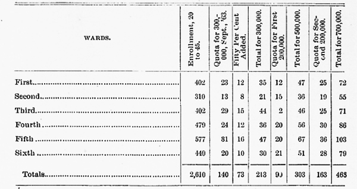

# Chapter 15

For the general history of the war with Mexico the reader is referred to the various authorities on the history of the United States. A few dates and facts, however, in connection with the beginning of that war, are appropriate and even indispensable in a work of this kind, in order that the dependence of local events upon general events may be clearly discerned.

General Zachary Taylor landed his forces on St. Joseph's Island, July 25, 1845, and soon afterward embarked for Corpus Christi, a Mexican village near the mouth of the Nueces River, which river the Mexican government claimed as the boundary between that country and Texas, while the Texan government claimed that the Rio Grande was the boundary. General Taylor located his camp at Corpus Christi in September, and remained there during the winter. January 13, 1846, the secretary of war ordered General Taylor to advance to near the mouth of the Rio Grande, opposite the city of Matamoras, because he thought the Mexicans intended to invade Texas, and when, on the 25th of March, he encamped at Point Isabel, about twenty-eight miles from Matamoras, he was warned by the Mexican authorities that he was on foreign soil. On the 28th of. March, 1846, he advanced to the banks of the Rio Grande, and commenced the erection of a fort which subsequently received the name of Fort Brown. General Paredes, who had recently been elected president of Mexico, immediately sent General Ampudia to Matamoras to drive General Taylor beyond the Nueces. He arrived on the 11th of April, but when General Taylor refused to comply with his demand to withdraw within twenty-four hours, lie was superseded by General Arista, who was thought to be a more active general. General Arista arrived on the 25th of April, and on the 26th notified General Taylor that hostilities had begun. On the same day a body of American troops was attacked by a party of Mexicans east of the Rio Grande, the Americans, who were under Captain S. B. Thornton, after losing sixteen men in killed and wounded, being obliged to surrender.

Point Isabel was now threatened by a party of Mexicans, and General Taylor, leaving a regiment to complete Fort Brown, himself hastened to Point Isabel to prevent his stores at that point from falling into the hands of the Mexicans. Perceiving this movement of General Taylor, General Arista, thinking the Americans in full retreat, opened a heavy cannonade upon Fort Brown, which lasted three days, at the end of which time signal guns were fired for General Taylor to return to the relief of the fort. On his way back to Fort Brown, General Taylor, on the 8th of the month, encountered the Mexicans under General Arista, six thousand strong, at Palo Alto, fought the battle which bears that name, and won the victory. Thus was commenced the war with Mexico. What Dayton did for the country during that war, of the justice and necessity for which many of her citizens were strongly in doubt, to say the least, it is now the province of this history to record.

January 16, 1846, the- intelligence was published in the Dayton papers, that the position and movements of the United States troops at Corpus Christi, ever since General Taylor had been there, had caused much alarm, fear, and jealousy in the minds of the Mexicans. They seemed to be hourly expecting that the United States troops would march upon Matamoras, seize upon that place, and march thence upon other cities. On April 17th the Dayton Journal said that General Taylor, in his advance, met two parties of Mexicans on the Rio Grande; that these Mexicans had orders to fire upon the Americans, but that they did not are, and that no blood was shed. Immediately upon the receipt of the news that General Taylor's refusal to withdraw beyond the Nueces, in accordance with the demand of General Ampudia, was the cause of the declaration of war by the Mexican general, and that as a consequence, men were needed for the defense of the country, the governor of Texas called out two thousand and four hundred troops, and the governor of Louisiana called out two thousand and five hundred troops. On May 11, 1846, President Polk called for fifty thousand men and ten million dollars for the war. On May 13th war was officially declared.

By May 19th there was considerable war spirit manifested in Dayton. Not only among the militia companies, but among the citizens generally, there were indications of a prevailing desire to take part in the contest. The militia of the county, organized as the First Brigade, which was commanded by Brigadier-General Adam Speice, was attached to the Tenth Division of Ohio Militia, all under the command of Major-General Hiram Bell, of Greenville. In order to give such of the militia as desired to enlist, an opportunity to do so, an office was opened for recruiting at the office of T. B. Tilton, and by the 20th of May about twenty-five names had been enrolled. On the 21st, a public meeting was held at the City Hall, which was " literally jammed full of people." General Adam Speice was called to the chair, and Major Thomas B. Tilton appointed secretary. The chairman stated that the object of the meeting was to give an expression of the sentiment of the people with reference to the war, and to adopt such measures as were calculated to encourage the enrollment of volunteers. Captain Luther Giddings, of the Dayton Cavalry, in response to a call, made some patriotic remarks, as' did also Captain M. B. Walker, of the Germantown Cavalry; Major Tilton; Captain Lewis Hormell, of the Dayton National Guards; Lieutenant Atlas Stout, of the Dayton Gun Squad; Lieutenant John Love, of the United States Army, and others.

At the close of the speaking, the following resolutions were offered and adopted:

> WHEREAS, The military despot who has recently usurped the government of Mexico, has refused to receive the olive branch borne to the gates of his capital by a minister of the United States; has concentrated his forces upon our southern frontier, and commenced with murder an offensive war; therefore,
>
> Resolved, That we view with satisfaction the promptness with which our congress has drawn the sword and appealed to the God of battles to establish-what has been as earnestly sought as it has been insolently refused-peace with Mexico and peace with Texas.
>
> Resolved, That it becomes us as American citizens, desiring the success of our arms, to cast of the shackles of party and unite in carrying our country speedily and triumphantly through the war. "Resolved, That, as it is our duty as soldiers to be always ready, we will exert ourselves to fll up the ranks of our companies, and whenever the requisite number of good and true men shall have been obtained, we will march to the seat of war, rejoicing in the opportunity afforded of defending our country.

At that time Honorable Mordecai Bartley was governor of Ohio. On the 20th of the month, the governor, in compliance with the president's requisition, issued General Order Number 1, calling upon division generals to muster their commands at once, and thus ascertain how many men would enlist as infantry or riflemen for twelve months' service, unless sooner discharged. Major-General Bell, who was at Greenville, received the order on the 23d, and immediately ordered the Tenth Division to assemble by brigades at the following places: The ' First Brigade at Dayton, May 26th; the Second at Troy, May 27th; the Third at Sidney, May 28th; and the Fourth at Greenville, May 29th. Ohio was called on for three regiments, an aggregate number of two thousand, three hundred and thirty-one men. Upon the receipt of this order of General Bell's, General Adam Speice, on the 25th of the month, issued his General Order Number 1, ordering the commandants of companies to parade at Dayton on the 26th, with their full strength, 11 armed and equipped according to law." At eleven o'clock on that morning, nine companies reported and paraded the streets, with the view of immediate organization for the service of the United States. They marched to the southern part of the city, where they were addressed by Major-General Bell. As the numbers of the companies were not full, the general gave the several commandants another day to see their men. The National Guard began recruiting at their armory, on the north side of Second Street; the Dayton Dragoons at McCann's store, northeast corner of Third and Jefferson streets, but receiving the information that the government would not receive cavalry, they the next day organized as the Dayton Riflemen.

On May 28th a meeting was held at the City Hall. Enthusiastic men of all parties participated in the proceedings. A series of resolutions was adopted to the effect that whatever differences of opinion may have existed, or might still exist with reference to the causes or the necessity of the war with Mexico, now that it had actually begun, it was the duty of every citizen, as well as the dictate of enlightened patriotism, to forego those differences of opinion, and to forget all other and meaner considerations for that of the glory of our cherished country, and approving the call for fifty thousand men to carry on the war. Other resolutions were adopted, among them one, moved by John G. Lowe, providing for the appointment of a committee of five to procure a loan of money to be disbursed on the order of General Speice, to defray the expenses of the volunteers from Montgomery County until they should be mustered into the service of the United States. The committee consisted of Thomas Brown, Peter Odlin, William Eaker, T. J. S. Smith, and F. Gebbart. An executive committee of twenty was then appointed to raise funds for the support of the families of the volunteers during their absence in the war, the committee being as. follows: Alexander Swaynie, Robert W. Steele, H. G. Phillips, P. P. Lowe, Henry L. Brown, and Samuel Marshall, of Dayton; Joseph Barnett, of Harrison Township; Jefferson Patterson, of Van Buren Township; Henry S. Gunckel, of German Township; Jonathan Harshman of Mad River Township; John Conley, of Miami Township; John Burnett, of Jeferson Township; John Sherer, of Randolph Township; James Patterson, of Madison Township; Henry Shidler, of Jackson Township; William Baggott, of Butler Township; Amos Irwin, of Washington Township; Moses Sherer, of Wayne Township; Isaac Voorhees, of Clay Township, and Dr. Lindsley, of Perry Township. The committee was organized by the selection of H. G. Phillips, chairman; Robert W. Steele, secretary, and Henry L. Brown, treasurer. General Speice established his depot and headquarters at the corner of Jefferson and Third streets, and detailed Major Tilton as mustering officer in command of the volunteers. By June 1st one hundred and seventeen men were enrolled, fifty-two belonging to Captain Giddings' rifle company, and the remainder to the German National Guard. The Dayton Riflemen were organized on the 30th of May, with the following officers: Captain, Luther Giddings; frst lieutenant, D. Long; second lieutenant, D. Brecount; frst sergeant, J. P. Speice; second sergeant, N. Allen; third sergeant, G. Coon; fourth sergeant, C. L. Helrigle; first corporal, W. G. Davis; second corporal, V. B. Howard; third corporal, John Smith; fourth corporal, James Craig. Camp Washington was established in Mill Creek Valley, near Cincinnati, as a rendezvous for the Ohio volunteers, and Samuel R. Curtis, adjutant general of the State, placed in command. The two companies from Dayton started for Camp Washington on the 4th of June, 1846. The Riflemen were under command of Captain Giddings and the National Guard under Captain Hormell. They went to Cincinnati by the canal, leaving Dayton at sunset. A beautiful flag was presented to the Riflemen by the citizens, before they left the city, which bore on one side an embroidered eagle and the motto, "Our Country," and on the other side the State arms with the name, " Dayton Riflemen." The two companies were escorted to the canal by the Dragoons and a large concourse of people, and the banks of the canal were covered with spectators. The National Guard was offered as follows: Captain, Lewis Hormell; first lieutenant, William Egry; second lieutenant, Christ Knecht; first sergeant, William Spangler; second sergeant, Peter Weist; third sergeant, Adam Ziller; fourth sergeant., Frederick Ploch. When these two companies left Dayton, there was being enrolled another company, which for a time was known as the "Tall Company." The aggregate height of the first twenty-one men enrolled was one hundred and twenty-three feet, an average of very nearly six feet. By the 8th of June this company had sixty-two men enrolled. It was officered as follows: Captain, A. L. Stout; first lieutenant, Daniel Tucker; second lieutenant, J. M. D. Foreman; first sergeant, M. Umbaugh; second sergeant, Owen Smith; third sergeant, Joshua Bowersock; fourth sergeant, William Anderson; corporals, Lewis Motter, Russel George, Boyer Decker, and Andrew Curtner. This company left Dayton for Camp Washington, June 9, 1846, at ten A. M., amid the cheers of the men and the waving of handkerchiefs by the women. The first two companies that left Dayton, as above narrated, had in their ranks when they left the city, ninety-six and ninety-two men respectively, and in order to reduce the size of the companies, any who desired to do so had the privilege granted them of returning home, and though it was not a very popular step to take, yet several availed themselves of the privilege, and by this means the number in each company was reduced to seventy-seven men. These two companies were incorporated into the First Regiment, while the third company was excluded from all organizations for the reason that too many men volunteered for the necessities of the service. But this company of Captain Stout's had in it two Germans, while the Dayton National Guard had in it two Americans, and at Camp Washington the two captains made an even trade, two Americans for two Germans, in order that the German company, the National Guard, might be all Germans. On June 24th, the returned company, sadly disappointed because they were not accepted, passed a series of resolutions strongly denouncing the State authorities for having rejected them, the company being under the impression at the time that their rejection was on account of political reasons.

The three regiments which Ohio was asked to furnish were all organized at Camp Washington on the 23d of June. The officers of the First Regiment were as follows: Colonel, Alexander M. Mitchell, of Cincinnati; lieutenant-colonel, John B. Weller, of Butler County; Major, Thomas L. Hamer, of Brown County; and the two Dayton companies (the Rifles and the Guard) became Company B and Company C respectively of this regiment.

On the 2d of July, the three Ohio regiments marched from Camp Washington into Cincinnati, and embarked on the steamers New World and North Carolina, at the foot of Broadway. These three regiments arrived at Point Isabel about July 15th, and according to a letter from the German company, they all enjoyed good health, the climate was fine, and the water good. In August they were at Fort Belknap, on the Texas side of the Rio Grande. Captain Giddings, of Company B, was promoted to major; Lieutenant Brecount was elected captain; Sergeant J. P. Speice, second lieutenant, and Nathan Allen orderly sergeant. At Camargo, Captain Brecount resigned, and Lieutenant Speice died, his death occurring on the 27th of August, 1846. August Rex, first sergeant of Captain Hormell's company, died the day before. Lieutenant David Long was promoted to captain, and Sergeant Nathan Allen was promoted to second lieutenant. At the battle of Monterey, Colonel Mitchell was severely wounded, as was also Lieutenant-Colonel Weller, and thus the command of the regiment devolved upon Major Giddings. In this battle the Ohio soldiers bore themselves with conspicuous bravery, most of the companies remaining compactly together throughout the day. The battle was described in a letter published in the Cincinnati Atlas as the greatest achievement of modern times, and the loss in the battle was only thirty men in General Worth's command, eight of these being from Dayton. One of the killed was Corporal William G. Davis, and one of the wounded Lieutenant L. Motter.

During the winter of 1846-1847 it was decided to raise a regiment for the regular army, the Fifteenth, to serve during the Mexican war. This regiment was to be recruited in Ohio, Michigan, Iowa, and Wisconsin. E. A. King, of Dayton, was appointed a captain in this regiment, and Thomas B. Tilton lieutenant. Of this company, twenty-two men were from Montgomery County, and thirty-eight from Logan County. It left Dayton for Cincinnati, April 24, 1847, a large concourse being in the neighborhood of the packet depot to witness its departure. Mayor McKinney, on behalf of the citizens, bade the boys farewell, and Captain King responded on behalf of the soldiers. There were five Ohio companies in the regiment, three from Michigan and two from Wisconsin. The colonel was George W. Morgan; lieutenant-colonel, John Howard, of Michigan, and the major, Samuel Woods. The Michigan and Wisconsin companies passed through Dayton on their way to the war, May 12, 1847.

The same day on which these companies passed through the city, news was received that the two companies that first went out to the war, Companies B and C of the First Ohio Regiment, were on their way home from Mexico, and it was immediately determined to give them an appropriate reception. A committee was appointed to arrange the reception ceremonies. A meeting of this committee was held on the 17th to complete the arrangements; The Dayton Rifles, Company B, was mustered out at New Orleans on the 11th of June, and Captain Hormell's Company C on the 12th. Company B reached Dayton on the 26th of the month with but forty men. The regiment, when it left Cincinnati the year before, numbered about eight hundred men. Of this number thirty-three had died of disease, one had been accidentally killed by a comrade, six had been murdered by the Mexicans, sixteen had been killed at the battle of Monterey, and two at the battle of Ceralvo. The average strength of the regiment had been fve hundred and thirty-three. Upon the arrival of the forty men in Dayton, the people turned out en masse to receive them. Citizens from the town and country, with the militia, with the brass band and the gun squad, assembled at the foot of Main Street, upon the canal, to the number of about five thousand. The volunteers were escorted to the National House, where a speech of welcome was made to them by Mayor McKinney. Major Giddings made a speech in reply, in which he alluded to the trials through which they had passed while. away from home, to the small number of those that' returned, to the twenty-one who had been buried in Mexico, and to the flag which had been presented to them by the ladies of Dayton before they went away, and which they had brought back with them, tattered and torn, but with untarnished honor. Cheer upon cheer was given to the brave volunteers, and crowds waited upon each man to his home. Captain Hormell's company, the National Guard, reached home on Tuesday, the 29th of the same month. They were welcomed at the National House by J. W. McCorkle in a brief but eloquent address. The volunteers under the first call having served their term and been discharged, another call was made upon Ohio for a regiment of soldiers. The Dayton German Grenadiers was raised under this call, and was officered as follows: Captain, John Werner; first lieutenant, John Fries; second lieutenant, Henry Toepfer. There were one hundred enlisted men in this company-thirty-five from Montgomery County, twenty-five from Columbus, and the rest from the vicinity of Bremen. On May 31st they were escorted to the public landing, where they boarded the packet for Cincinnati, and were there assigned to the Fourth Ohio Regiment. Of this regiment Captain Werner was made lieutenant-colonel, Lieutenant Fries was promoted captain, Henry Toepfer became first lieutenant, and William Graebe second lieutenant. C. H. Brough was made colonel of the regiment. The regiment was with General Scott at Contreras, Cherubusco, Chapultepec, and the city of Mexico. At the storming of the city of Mexico the Dayton company suffered severely, Lieutenant Toepfer and a number of his men being killed. Captain John Fries was wounded. In February, 1848, the regiment was on garrison duty at Puebla, and in July, 1848, the Dayton company returned home with only thirty-six men. Upon their arrival they were escorted by the National Guard and artillery to the common just east of Bainbridge Street, near Third, where a grand dinner was served.

An incident occurred in September, 1847, to which considerable interest attached at the time. It is well known by all who have given attention to the history of the Mexican war, that there was a large party in the country at the time who disapproved of the war from its commencement, and that there were some who condemned, if they did not oppose it, all the way through. This was the case very generally with the Whigs. The sentiment of those opposed to the war is perhaps as well expressed in the following resolution introduced into congress by the Iron. Thomas H. Benton, as in any language that was used by anyone in connection with the subject:

> Resolved, That the incorporation of the left bank of the Rio del Norte, in the American Union, by virtue of a treaty with Texas, comprehending in the said incorporation certain portions of the Mexican departments of New Mexico, Coahuila, and Taurnalipas, would be a direct aggression on Mexico, for all the consequences of which the United States would stand responsible.

The Hon. Thomas Corwin, then United States senator from Ohio, and the Hon. Robert C. Schenck, then representative in congress from this district, were conspicuous in their condemnation of the war and its objects. This course was very distasteful to many if not to most of the soldiers who went into the army from Dayton. In order to give expression to their views, a meeting was held by the returned volunteers September 18,1847, at which they adopted a long series of resolutions. The meeting was held at the Farmers and Mechanics' Hotel. Captain Hormell was made chairman of the meeting, and M. H. Umbaugh secretary. The object of the meeting, as stated by the presiding officer, was to make arrangements for the celebration of the battle of Monterey. The committee on resolutions consisted of Lieutenant McCarter, Lieutenant Kline, Lieutenant Knecht, and Sergeants Coon and George. There were thirteen resolutions in the series, two of which, together with the preamble, were as follows:

> Whereas, We have in contemplation the celebration of one of the most glorious achievements of American arms, the storming and capture of the Mexican city of Monterey, and deeming it necessary to vindicate ourselves from the stigma which a portion of the American people seem desirous of casting upon us, by denouncing the war in which we fought as unrighteous, unholy, damnable, and unjust, we give expression to our views in the following resolutions:
>
> Resolved, that we consider the present war between the United States and Mexico as first brought on by the act of Mexico by refusing to amicably adjust the difficulties existing between us, with having ordered her troops to cross the Rio Grande and attack the American arms.
>
> Resolved, that hostilities having thus commenced, and war having been thus declared actually to exist by the act of Mexico, it became the duty of every patriotic citizen to give it his entire and cordial support until Mexico should be forced to terms of peace.

Other resolutions were very severe in their criticisms upon Senator Corwin and lion. R. C. Schenck for the course they had pursued in congress, and the twelfth resolution extended a cordial invitation to the military of the city to unite in the celebration of the anniversary of the battle of Monterey.

This war was brought to a close early in 1848, by a treaty of peace which was made February 2d, of that year, and which was ratified by the senate of the United States, March 10th, following. By this treaty the boundary line, was defined as follows: The Rio Grande, from its mouth to the southern limits of New Mexico; thence westward along the southern, and northward along the western boundary of that territory to the River Gila; thence down that river to the Colorado, and thence westward to the Pacific Ocean. The United States agreed to pay to Mexico fifteen million dollars, and to assume all debts due from the Mexican government to American citizens, to any amount not to exceed three million five hundred thousand dollars. Peace was proclaimed by President Polk, July 4, 1848.

Although the war of the rebellion did not actually commence until the firing upon Fort Sumter took place, yet the events of the political arena occurring during the latter part of 1860 and the early part of 1861, were so intimately related to that great struggle that it is deemed proper to introduce the history of this conflict with a brief reference to the leading movements of both the great political parties immediately precedent to the initiation of the strife. The Republican National Convention assembled in Chicago on the 16th of May, 1860. After the usual contest among the several candidates for the nomination for the presidency, the convention nominated Abraham Lincoln on the 17th of May. It is a remarkable fact, and one that may not be remembered by all who were cognizant of it at the time, that in October, 1859, eight months before the nomination was actually made by the Republican convention at - Chicago, Abraham Lincoln had been named for the presidency at Dayton by the Hon. Robert C. Schenck, in a speech made from the same platform from which Mr. Lincoln had himself addressed the people but a few hours before.

The Wide Awakes, which played such an important part during the campaign which followed, held a meeting on Saturday night, June 9th, at which J. C. Healy was chairman and S. B. Jackson secretary. At this meeting the draft of a constitution was read, and on the 11th an organization was effected and the constitution adopted. G. G. Prugh was chosen president of the organization, and the vice-presidents, one for each ward of the city, were as follows: S. B. Leach, C. Snevely, A. W. Tenuy, W. 11. Rouzer, George Lehman, P. Lutzs; corresponding secretary, J. C. Healy; recording secretary, John McMasters; treasurer, John Procunier; executive committee, H. W. Orvis, chairman, Moses Crowell, John Winder, W. J. Comstock, George Gohen, S. A. Hendricks, and Noah Shafer. On the same day upon which the Wide Awakes held their first meeting as mentioned above, there was held a meeting of the Democrats which was addressed by George W. Houk, who had been a delegate to the Charleston convention, which failed to nominate a candidate for the presidency. Mr. Houk dwelt at some length on the causes which led to the disruption of the convention, and was very severe upon the Southern members thereof, by whose secession there from a nomination was prevented. J. Durbin Ward followed Mr. Houk, and after his address Mr. Hofer read a series of resolutions endorsing Mr. Houk's course at Charleston, and instructing him to vote for Stephen A. Douglas at Baltimore.

At the presidential election, which occurred on the 6th of November, 1860, the following was the vote cast in the several wards for the several candidates, together with the total vote at the preceding October election:

<TABLE>
    <TR>
        <TD></TD>
        <TD>
            Lincoln
        </TD>
        <TD>
            Douglas
        </TD>
        <TD>
            Bell
        </TD>
        <TD>
            Breck
        </TD>
        <TD>
            Total
        </TD>
        <TD>
            October
        </TD>
    </TR>
    <TR>
        <TD>
            First Ward
        </TD>
        <TD>
            248
        </TD>
        <TD>
            210
        </TD>
        <TD>
            10
        </TD>
        <TD>
            1
        </TD>
        <TD>
            469
        </TD>
        <TD>
            498
        </TD>
    </TR>
    <TR>
        <TD>
            Second
        </TD>
        <TD>
            258
        </TD>
        <TD>
            136
        </TD>
        <TD>
            11
        </TD>
        <TD>
            5
        </TD>
        <TD>
            410
        </TD>
        <TD>
            432
        </TD>
    </TR>
    <TR>
        <TD>
            Third
        </TD>
        <TD>
            324
        </TD>
        <TD>
            188
        </TD>
        <TD>
            31
        </TD>
        <TD>
            8
        </TD>
        <TD>
            551
        </TD>
        <TD>
            578
        </TD>
    </TR>
    <TR>
        <TD>
            Fourth
        </TD>
        <TD>
            290
        </TD>
        <TD>
            413
        </TD>
        <TD>
            17
        </TD>
        <TD>
            5
        </TD>
        <TD>
            725
        </TD>
        <TD>
            753
        </TD>
    </TR>
    <TR>
        <TD>
            Fifth
        </TD>
        <TD>
            397
        </TD>
        <TD>
            359
        </TD>
        <TD>
            13
        </TD>
        <TD>
            12
        </TD>
        <TD>
            781
        </TD>
        <TD>
            830
        </TD>
    </TR>
    <TR>
        <TD>
            Sixth
        </TD>
        <TD>
            322
        </TD>
        <TD>
            262
        </TD>
        <TD>
            2
        </TD>
        <TD>
            1
        </TD>
        <TD>
            587
        </TD>
        <TD>
            622
        </TD>
    </TR>
    <TR>
        <TD>
            Total Wards
        </TD>
        <TD>
            1,839
        </TD>
        <TD>
            1,568
        </TD>
        <TD>
            84
        </TD>
        <TD>
            32
        </TD>
        <TD>
            3,523
        </TD>
        <TD>
            3,713
        </TD>
    </TR>
</TABLE>

There was great excitement in Dayton on the 27th of December, for on that day the news was received that Major Anderson had transferred his command from Fort Moultrie to Fort Sumter. This movement, it was supposed, was taken on the major's own responsibility, and not only were his courage and patriotism commended and admired, but the apprehension in the minds of the people that Major Anderson and his command would be captured, was to a great extent relieved. Then came the news on the 29th of December, that the Southern seceders had taken possession of Fort Moultrie and Castle Pinckney, and many thought this movement demonstrated the folly of President Buchanan in refusing to garrison the forts in Charleston Harbor with a force sufficient to resist any attack that might be made upon them. Some went still further than this, considering it a burning disgrace that such possession should have been permitted.

The Hon. C. L. Vallandigham was then a resident of Dayton. He had been elected to the Thirty-third Congress over his Republican competitor, Hon. Samuel Craighead, by eleven thousand and ffty-two votes to Mr. Craighead's ten thousand, nine hundred and eighteen. The excitement caused by the movements of the military in the vicinity of Charleston was not allayed by the fact that a short time previously Mr. Vallandigham had said in a letter to the Cincinnati Gazette, correcting that paper as to a report that had appeared in its columns, of a speech he had made a short time before:

> And now let me add what I did say, not in Washington, not at a dinner table, not in the presence of fire-eaters, but in the city of New York, in a public assemblage of Northern men, in a public speech at the Cooper Institute, November 2, 1860, that ‘If any one or more of the States of the Union should at any time secede, for reasons of the sufficiency and justice of which before God and the great tribunal of history, they alone may judge, much as I should deplore it, I never would as a representative in congress vote one dollar of money whereby one drop of American blood should be shed in a civil war,' etc.
>
> And I now deliberately repeat and reaffirm it, resolved, though I stand alone, though all others yield and fall away, to make it good to the last moment of my political life; no menace, no public clamor, no taunts, nor sneers, nor foul detraction from any quarter, shall drive me from my firm purpose,

etc., etc.

Mr. Vallandigham remained true to his convictions. On the 7th of January, 1861, Mr. Adrian, of New Jersey, introduced into the house of representatives the following resolution:

> That we fully approve the bold and patriotic act of Major Anderson in withdrawing from Fort Moultrie to Fort Sumter, and the determination of the president to maintain the fearless officer in his present condition; and we will support the president in all constitutional measures to enforce the laws and preserve the Union." Mr. Etheridge, of Tennessee, moved to suspend the rules for the reception of Mr. Adrian's resolution. Upon this motion Mr. Vallandigham voted "No," and afterward voted "No," with fifty-five other members of congress, nearly all from the South, against Mr. Adrian's resolution. At the time of casting this vote, he said, "I vote for peace and compromise. You refuse it. I vote now against force. No.

During the early part of January, 1861, there was circulated throughout the Third Congressional District for signatures, a petition urging congress to adopt the Crittenden compromise which proposed that the institution of slavery should be made legal south of latitude 36° 30' in the territories, and that slaveholders should be guaranteed the right to take their slaves through the free states to any point they might desire. This petition received but few signatures in this city. By those who were opposed to the compromise, it was said that the North could consent to no such humiliation under threats of secession, so long, at least, as the secessionists were laughing at all attempts at compromise. On the 19th of January, 1861, there was a Democratic meeting held in Dayton for the purpose of electing delegates to a State convention. The question came up as to what was the sentiment of the meeting on the endorsement of the Crittenden compromise. The committee on resolutions, through their chairman, submitted a series of resolutions, a portion of which were thought by a part of the people of the city to lean rather too strongly toward the recognition of the right of a state to secede from the Union. As a matter of fact, they did savor so strongly of secessionism that the meeting could not endorse the resolutions. In response to a demand for their publication they were published, the objectionable ones being as follows:

> Resolved, 3. That whilst we unhesitatingly avow our attachment to the Federal Union as it exists under the constitution of the United States, and whilst we are ready to express our conviction that there are no political evils now existing which justify secession as a remedy, yet we recognize the right of the people of the slave-holding States of this confederacy to form their own judgment and to act upon their own convictions in reference to a state of facts which involve not merely their political, but also their personal rights, interests, and safety.
>
> Resolved, 4. That' secession is neither constitutional nor insurrectionary, but it is essentially revolutionary in its character; and when, therefore, it takes place under our form of government in such a manner as to assume the magnitude of revolution, there is no power conferred by the constitution of the United States to put it down by force, and an attempt to do so by arms would be an act of usurpation and would inevitably lead to military despotism.
>
> Resolved, 5. That the resort to force under the circumstances would be the direct sacrifice of the very ends for which all legitimate government is instituted-the inevitable and final destruction of the Federal Union, and would present the most conclusive illustration ever furnished in the history of the world, of the incapacity of the people for self-government.
>
> Resolved, 6. This resolution was in favor of the adoption of the Crittenden compromise.
>
> Resolved, 7. That war, when waged with a foreign power, to maintain our national honor, or the rights and liberties of the people, is righteous and justifiable; but when waged by two portions of the same people against each other, professedly to maintain a government that must necessarily perish in the conflict, would furnish a melancholy spectacle of human folly and fanaticism ; that in such a war all the vindictive and revengeful passions of human nature would be called into exercise; its purpose would be destructive and not protective, and its inevitable issue would leave us the exhausted victims of a military dictatorship.

These resolutions are interesting in an historical sense, as showing the limit in sentiment, to which only a few of the people of Dayton, and in fact of Ohio, could persuade themselves to go. The great majority of them, without regard to past political affiliations, could entertain no sentiment inconsistent with the maintenance at any cost and at all hazards, of the Federal Union.

With the exception of the attempt to assassinate Mr. Lincoln on his way to Washington to be inaugurated president of the United States, there was, after the ripple of excitement caused by the publication of the above recited resolutions, nothing of unusual interest that transpired until the month of April. The people simply watched the progress of events in and around Charleston, South Carolina, where the two forces were engaged in watching each other, and each waiting for the other to .make the first overt act of war. The month of April was, however, an exciting one in Dayton, as elsewhere throughout the country. The great question with many at that stage of the progress of events was, "On which side shall we take our stand?" It had become clear by that time that the fate of the party which had succeeded in electing its president the fall before, was at the most but of secondary consequence. The success of the administration of Mr. Lincoln, however, was necessary to the preservation of the government itself. That the administration of Mr. Lincoln must be upheld in order that it might succeed, became more and more apparent to a constantly increasing number of the people. It also became more clearly evident to all observers, that the great masses of the people were loyal to the government, even those whose choice for president had not been that of a constitutional majority. Still there was an occasional Northern man, even at that early day, who considered that the demands of the South were reasonable, and argued that the South could never be coerced back into the Union. A few thought that certain of the Northern States, as Illinois, Indiana, and Ohio, should make application for admission into the Southern Confederacy. While it could not then, and cannot now, be truthfully said that many of the people of Ohio entertained such sentiments, yet to the great majority of the people, the utterance of them, even though known to be entertained by only a few, was exceedingly irritating and obnoxious. Some charged that the South was driven to secession by the success of the Republicans at the polls, and others denied this quite as vigorously as it was asserted. It was argued that the Democratic party, from 1848 down to 1854, if not later, promulgated, as one of its fundamental doctrines, that congress had the power under the constitution to exclude slavery from the territories, the very ground upon which the Republican party had won its victory. And it was also shown that the Republican party, after the election of Mr. Lincoln, had passed enabling acts under which the slave-holders had the right to go into the territories with their slaves, which was the very doctrine that had become so notorious under the name of "Popular Sovereignty," and for which Mr. Douglas and his party had so strenuously contended. The ground for the necessity of secession seemed thus to have been completely taken from under the feet of those who contended for the right of secession.

The difficulty, however, at this juncture, seemed to be that secession, whether or not necessary or right, was almost, if not quite, an accomplished fact. And the only course that had in it any of the possibilities of success in preventing it of absolute accomplishment., inasmuch as the seceders certainly would not, be willing to forego secession unless they could be assured of the protection of slavery in the Union, appeared to some, who really loved the government of their fathers, to be to defend the institution of slavery against any and all kinds of aggressions, and this view led those who reasoned thus to defend the-institution, not only as constitutional, but also divine. Others who could not go to this extreme, seemed compelled to defend the institution of slavery against their own judgment, in order that they might consistently defend the government itself.

Again, on the other hand, while the minds of some were thus confused, the majority could see that after all there was no real cause for the war. Mr. Lincoln had said in his inaugural that the fugitive slave law should be enforced, and taking this in connection with the action of congress in regard to the enabling acts above referred to, it was seen that the South had really been promised all she demanded, and still she was not satisfied; and the logic of the position was that if she was not satisfied when she was granted what she asked, the case was, indeed, hopeless. Or to state the case in other words, it was clearly seen that the South was determined to be satisfied with nothing but the total disruption of the government.

The news of the attack upon Fort Sumter reached Dayton oil the 13th of April, and the excitement consequent thereupon was painfully intense. Groups of excited citizens discussed the situation at all hours of the succeeding night. Every one was grieved profoundly at the outbreak of the war, but there was no sentiment apparent but the determination that the government should be sustained. True men of all parties were united in this determination. Still there was one paper in this city that, immediately on receipt of the news of the bombardment, said: "Civil war is upon us by the act of the Lincoln administration and as the natural result of the election of Lincoln. Having taken our position at the beginning, against the policy of coercion, we intend to stand by it to the end. Whatever others may do, we stand firm and immovable against men or money for a civil war. Let the watchword be  Compromise, but no coercion, no war.'"

Notwithstanding the publication of this statement, the people were animated by an enthusiastic Union sentiment. On the 15th, this sentiment found expression in the raising of a United States flag from the wigwam staff in the presence of a great crowd of people. The Regimental Band played the "Star Spangled Banner," and patriotic speeches were made by E. S. Young, S. Craighead, Mr. Egsley, and others. Thirty-four rounds were fired from the cannon in Honor of the Union, the only accident being the breaking of a negro's leg by the bursting of the swivel gun. On the same day, the services of the Dayton Light Guards were tendered to Governor Dennison, and also those of the Light Artillery Company. Captain Dister rapidly filled up the ranks of the Lafayette Yagers, afterward the Lafayette Guards, for the same patriotic purpose. The young men of the city and vicinity rapidly enrolled themselves in the different companies then forming for the service of their country. Hughes had a recruiting office at Nixon's Hall, for the purpose of filling up the ranks of the Montgomery Guards. Captain Pease was at the Light Guards' Armory, and Captain Dister was at the corner of Jefferson and Market streets. Patriotic citizens made known their readiness to contribute to the support of the families of volunteers from Dayton during their absence in the army. Funds were subscribed for the purchase of uniforms for the Lafayette Guards, but as the State afterward uniformed the company, these funds were devoted to the support of the families of the members of the company. At a meeting of the Zouave Rangers, held on the 16th, a resolution was unanimously adopted that the services of the company be tendered to the governor as a home guard to perform duty within the limits of the State. On the same day there came a telegram from the governor, calling for the services of two companies of seventy-five men each to report immediately at Columbus. Captains Pease and Hughes promptly responded to the call, and Captain Dister telegraphed to Columbus that his company was ready to march. Captain Childs, of the Light Artillery, also sent the same announcement the same afternoon with reference to his company. The governor's call was received at three o'clock in the afternoon, and before night, three companies of infantry and one of artillery were in readiness to march. They all left Dayton for Columbus on the next day.

The Light Guards were officered as follows: Captain, W. B. Pease; first lieutenant, J. H. Winder; second lieutenant, W. Woodward; ensign, W. II. Martin; sergeants, P. M. Harman, J. E. Jones, and W. L. Patterson; corporal, S. C. Reed. There were fourteen privates and one hundred and twenty-six recruits, making an aggregate of one hundred and fifty men in the company.

Recruiting was commenced on the 18th for Company B, Dayton Light Guards, by W. Bennett, Thomas Hale, and S. Ramby. A. Kuntz, lieutenant, made a call upon all who were desirous of entering a company to be called the Montgomery Cavalry. On this same day Colonel E. A. King was appointed by the governor to take charge of the volunteer encampment at Columbus. A meeting was held in the Fifth Ward for the purpose of forming a company of home guards. Of this meeting Simon Snyder was the chairman and A. C. Marshall secretary. A recruiting committee of five was appointed, consisting of E. C. Ellis, T. D. Mitchell, George Lehman, T. K. Sigman, and Ezra Thomas. Thirty-five members enrolled their names that day.

Captain Dister's company was officered as follows: First lieutenant, Lewis Kuhlman; second lieutenant, John Hand; sergeants, A. Kiessling and Anton Kuhlman.

On the 19th of April, the first and second regiments of Ohio Volunteer Militia left Camp Jackson for Washington, D. C. The first regiment contained the following Dayton companies: Lafayette Guards, Dayton Light Guards, and Montgomery Guards. E. A. Parrott, of Dayton, was in command of the regiment as major. Captain Childs' light artillery company was converted into an infantry company, and on the 19th of April, paraded the streets of Dayton, one hundred and seventeen strong, to the tune, CG The Girl I Left Behind Me," and made a brilliant appearance. Their departure on that day was an event of thrilling interest. The Zouave Rangers were, at about the same time, ordered to Columbus to perform guard duty. During the week ending April 20,1861, nearly six hundred men enlisted in Dayton to defend the fag of their country. Four companies were then on their way to Washington, and early the next week the Anderson Guards, Captain Nolan, were ready to take the field. Of this company M. P. Nolan was captain, S. B. Smith first lieutenant, and R. Patterson second lieutenant. The company left for Columbus April 23d. Just before leaving the city, Captain Nolan made a speech to the citizens assembled to witness their departure. He said that he had opposed Mr. Lincoln's election, but he had been constitutionally elected, and was consequently the president of the country, and as such he was his president. He said that the North had been sneered at by the South as wanting in true courage, but he believed that the Anderson Guards would prove to the Southern people that all the courage and chivalry of the country was not to be found south of Mason & Dixon's line. When this company left the city, J. H. Thomas was first sergeant and Ashley Brown second sergeant. P. H. Darcy was the first corporal. On the 20th of April, a meeting was held in Beckel Hall for the purpose of petitioning the city council for an appropriation for the relief of the families of those of the citizens of Dayton who had volunteered, or who should volunteer, in the army. The county commissioners were also requested to make such an appropriation for the same purpose, as they might deem proper, for the families of the volunteers from the county. Two persons from each ward in the city were appointed a volunteer relief committee to take charge of whatever money might be appropriated by the council or the commissioners, and also such subscriptions as might be contributed by private citizens, and to distribute the same to the families of the volunteers. The president of this meeting was Hon. W. H. Gillespie, mayor of the city. He appointed as a committee to select the relief committee, the following gentlemen : B. M. Ayres, R. W. Steele, John H. Achey, Thomas Brown, B. F. Wait, and M. Burrous. The committee selected by them was as follows: First Ward, D. A. Wareham and William Dickey; Second Ward, Daniel H. Dryden and William H. Gillespie; Third Ward, James McDaniel and H. Gebhart; Fourth Ward, Jonathan Denney and John G. Lowe; Fifth Ward, C. F. Kneisly and Samuel Marshall; Sixth Ward, Thomas Dover and N. Viot. E. S. Young then moved that a subscription be taken up among those present, and immediately $4,553.91 was subscribed in sums of from ten dollars to one hundred dollars. Twenty of the subscriptions were for one hundred dollars each, and besides these there were two subscriptions, by Gebhart & Brother and by T. A. Phillips, each for twenty-five barrels of flour.

During all this time, when each seemed to vie with the other as to the demonstration of his readiness to serve the government in whatever capacity he could best do so, there was considerable anxiety as to the attitude of the representative in congress, Hon. C. L. Vallandigham, from the Third Congressional District. In order to set this matter at rest, Mr. Vallandigliam published a letter in the Cincinnati Enquirer, under date of April 17, 1861, in which he said:

> My position in regard to this civil war, which the Lincoln administration has inaugurated, was long since taken, is well known, and will be adhered to to the end. Let that be understood. I have added nothing to it, subtracted nothing from it, said nothing about it publicly since the war began. I know well that I am right, and that in a little while the sober, second thought of the people will dissipate the present sudden and fleeting public madness, and will demand to know why thirty millions of people are butchering each other in civil war, and will arrest it speedily. But meanwhile, should my own State be invaded or threatened with invasion, as soon it may be, then as a loyal, native-born son of Ohio, acknowledging my first allegiance to be to her, I will aid in defending her to the last extremity, asking no questions. Whoever shall then refuse or hesitate, will be a traitor and a dastard. And this same rule I apply to the people of Virginia, Kentucky, or Missouri, as to any of the free States, north or west.

On the 23d of April, the city council, "as a first installment," made an appropriation of ten thousand dollars for the support of the families of the volunteers during their services in the army, providing for raising the amount by the issue of bonds of the city for that amount. Only one fourth of that sum was considered necessary to be raised at that time, but the relief committee would call for whatever portion of the amount should be needed as it was needed.

There were numerous interesting incidents during the next few months, in the nature of flag raisings. One of the first of these occurred on the 26th of April, a beautiful national emblem being on that day thrown to the breeze from the tower of the northwestern district school-house.

The flag was made by the pupils themselves. On this occasion speeches were made by S. Craighead and H. Elliott. Another of these fag raisings occurred next day, at the intersection of East Third Street with the Xenia pike. On the 1st of May, a magnificent flag was raised over the council chamber.. It was twenty by thirty-six feet in size, and the pole was fifty-six feet high. The speakers on this occasion were G. W. Houk, Hon. Robert C. Schenck; Colonel Murphy, of Bellbrook, a leading Democrat of Greene County, and the Hon. F. C. Cuppy.

An election for officers in the First Ohio Regiment was held at Harrisburg, Pennsylvania, on the 22d of April, in which the people were somewhat interested. Lieutenant A. D. McCook, of the regular army, was elected colonel; E. A. Parrott, of Dayton, lieutenant-colonel, and Captain J. G. Hughes, of Dayton, major. On April 27th, the Buckeye Guards, of Dayton, elected officers as follows: Captain S. B. Jackson; first lieutenant, George M. Bacon; second lieutenant, George W.. Summers; first sergeant, Samuel L. Wilson; second sergeant; S. R. Smith. This company left Dayton for Hamilton May 1, 1861. Captain Gunckel raised a company named the Union Guards, which, by May 6th, was composed of over one hundred men. The Regimental Band was accepted as musicians for the First Ohio Regiment, and left Dayton to join the regiment May 13, 1861, having previously given a farewell concert at the courthouse on the 11th, in the presence of a large assemblage of people.

As they left the depot, J. D. Phillips and D. E. Mead, on behalf of friends of the band, handed them a purse of one hundred dollars in gold, for contingent expenses. On May 19th, the Buckeye Guards returned to Dayton for the purpose of filling up their ranks for three years, if the war should last so long. Forty recruits were wanted. About May 20th, the Oregon Guards were organized by the election of A. C. Fenner, captain; T. D. Mitchell, first lieutenant; J. Roberts, second lieutenant; E. Randall, third lieutenant, and George Lehman, ensign. At a regular meeting held that evening, they tendered their services through the governor of Ohio, to the president of the United States, "for three years or until the war shall end."

About this time the ladies of the German St. John's Lutheran Church organized themselves into an association for the support of the families of the German volunteers. Mrs. Trebein was the treasurer of the association, and Mrs. Falke was, the secretary. Toward the latter part of May a beautiful fag was made by the young ladies of Dayton for the First Ohio Regiment, to be borne by the colt company of the regiment, the Dayton Light Guard. The flag was of blue silk trimmed with a yellow fringe. On each side was seen the American eagle. The inscriptions were simply "E Pluribus Unum" and the "First Regiment Ohio Volunteers." This flag was presented to the regiment in Virginia, and accepted for them by Hon. Robert C. Schenck, who during the month of May had been appointed brigadier-general by President Lincoln. The first battle this regiment was in was that at Vienna, Virginia, and the next was that at Bull Run in the brigade of General Schenck. Upon the expiration of their three months' term of enlistment, they returned to Dayton, reaching here on the 2d of August. They were received at the depot by the military companies then in the city, by the fire department, and by a vast concourse of citizens, who gave them a right royal welcome with patriotic speeches and with salvos of artillery. It was a most enthusiastic demonstration, a just tribute to their gallantry on the field of battle. For a considerable time they were the center of attraction, the heroes of the hour.

A company was organized and named the State Guard, of which the following were the officers elected: Captain, E. W. Davies; first lieutenant, Joseph Clegg; second lieutenant, A. Pruden; first sergeant, N. Allen; second sergeant, T. Libby ; third sergeant, N. Ells; fourth sergeant, J. M. C. Matthews; corporals, William Trebein, John Mills, A. Belden, and H. L. Warren.

The Dayton Light Guard, Company B, elected officers June 3d, as follows: Captain, John A. Dickey; first lieutenant, Lewis LaRose; second lieutenant, N. H. Watters; sergeants, William Van Doren, James Turner, T. D. Hall, D. M. Stewart, and William Harmon; treasurer, L. LaRose, and secretary, G. W. Rouzer.

The Buckeye Guard, which has been mentioned before in these pages, opened recruiting lists for three years' service on the 20th of May, and on the 30th of the same month, left Dayton for Columbus. There were fifty men in this company from Dayton, and the company was afterward transferred to the Twenty-ninth Ohio Volunteer Infantry. On the day before the Buckeye Guard left Dayton, twenty-five men left the city to serve for three years in Company A, Eleventh Ohio Volunteer Infantry. The company which they joined, contained seventy men from Dayton..

The Union Guard, Captain Gunckel, had one hundred men enrolled by the 6th of May, but up to the 5th of June they could not enter the service- because Montgomery County already had a full quota in the field. However, on the 19th of the month Captain Gunckel received marching orders from General Carrington, and was to report at Camp Dennison by the 22d of the month. His company was to join the Twelfth Regiment as Company I. It contained twenty-five Dayton men, the rest being from Montgomery, Preble, Greene, and Darke counties. During the early part of July there were recruited in Dayton twenty men for the First Ohio Battery, who were taken to Camp Dennison, where the battery was organized. During its first year's service its equipment and duties were so peculiar that it received the cognomen, the "Jackass Battery," and, as may be readily conceded, it was known by that name to the end of the war.

There was opened in Dayton on July 25, 1861, a recruiting office for the United States regular army, which continued here throughout the war. About one hundred men enlisted in that arm of the service, the term of enlistment having been reduced by congress from five years to three.

Following is a list of the recruiting offices open in Dayton, in August, 1861: Captain Thruston's, on Main Street, near Second; Captain O'Connell's, over the old postoffice; Captain Gunckel's, on Main Street; Captain Kuhlman's, in Frohsinn Hall; cavalry recruiting ofce, at the corner of Third and Ludlow streets; Lieutenant Denton's, in Clegg's building, on Third Street, for the Eighteenth Regulars; Lieutenant Timoney's, in the Beckel building, for the Fifteenth Regulars; T. C. Mitchell's, on Main Street, for his company of sharpshooters; Captain Smith' Davisson's, in the Beckel building; Captain Woodward's, in the Huston building; Captain George McKinney's, at the Light Guard Armory; Lieutenants Smith and Steward's, on Third Street; George Pomeroy's, at the Beckel house, and F. W. Anderton's, at No. 108 Main Street.

An effort, which was very successful, was made during the week ending October 19, 1861, to collect and forward clothing and blankets to the First Regiment. The number of blankets furnished by the several wards of the city was as follows: First Ward, 158; Second Ward, 267; Third Ward, 186; Fourth Ward, 130; Fifth Ward, 101; Sixth Ward, 65-total from the city, 907. At the same time Miami City sent 71, making 978 in all. In addition to the blankets, there was forwarded to the soldiers a great quantity of clothing, coats, shirts, socks, etc. There was then on hand a sum of money equal to $105.48, and to expend this amount a committee was appointed, consisting of James McDaniel and Robert W. Steele. The regiment was then at Camp Corwin. This camp had been selected on the 19th of August, and was located two and a half miles east of Dayton on the hill. On the 23d of the month the frst three companies, numbering in the aggregate two hundred men, marched to this camp. September 2d, the Dayton Cavalry was ordered to Camp Corwill. Two months were then devoted to organization and drill. On the 12th of October notice was received that the government could not supply the regiment with blankets, and hence the action of the citizens as noticed above. On October 31st the regiment marched through the streets of Dayton, one thousand strong, and took the cars for the field of battle on their way to join McCook's brigade. The following numbers of Dayton men were in the regiment: Company B, one hundred men; Company C, eighty men; Company E, sixty men; Company F, one hundred men. On the 7th of August recruiting commenced for a company to join the Thirty-fifth Ohio Volunteer Infantry, of which regiment they became Company 11. In this company there were forty-five Dayton men. Recruiting was commenced August 20th for a company for the Fourth Ohio Cavalry, and the company contained about fifty Dayton men. On the same day recruiting commenced for a company of sharpshooters which was assigned to the Second Ohio Infantry, forty of the men being from Dayton. About thirty Dayton men were raised for another company for the same regiment. In September about forty Dayton men were recruited for the Thirty-fifth Indiana Regiment and about thirty-five for the Forty-fourth Ohio.

The State Guard, above referred to, was composed of men over forty-five years of age. Each ward had its own company of militia, and the Society of Turners formed themselves into the Dayton Yagers. There were two cavalry companies and one artillery company. The Ohio Guard, the Oregon Home Guard, and the Cadet Grays were reorganized. Besides these, there were the Franklin Invincibles, the Dayton Forcibles, the National Guard, the Union Reserve Guard, the Harrison Rangers, the Slemmer Guard, the McClellan Guard, and the Franklin Zouaves, all of which companies with their parades, picnics, drills, and festivals served to enliven the duller occasions when exciting war news was not very plentiful.

Governor Tod appointed a military committee for Montgomery County on the 15th of October, 1861. This committee was composed of the following gentlemen: E. S. Young, Daniel A. Haynes, James Turner, T. A. Phillips, Henry Fowler, Robert W. Steele, Thomas J. S. Smith, J. G. Stutsman, and Thomas B. Tilton. This committee had charge of the recruiting and organization of companies and all other military matters for the county so far as the interests of the State and government of the United States were concerned. Twenty-seven men from Dayton left here on October 17th for Benton Barracks, Missouri, where they joined a regiment of sharpshooters. During October and November, twenty-three more men from Dayton joined the same company, while several others also joined the same regiment from Montgomery County and the adjoining counties. After a time spent in skirmishing in Missouri, they went to Pittsburg Landing. April 1, 1862, the name of the regiment was changed to the Fourteenth Missouri, and in the fall of 1862 the name was again changed to the Sixty-sixth Illinois.

Following is a partial list of the organizations containing soldiers from Dayton that were in the service on the 1st of January, 1862: In General Rousseau's brigade at Green River, Kentucky, four companies, Captains Kuhlman, Thruston, O'Connell and Pomeroy; in camp at Wicklife, Kentucky, two companies, Captains George D. McKinney and S. B. Jackson; at Somerset, Kentucky, Captain M. S. Gunckel; in the Fourth Ohio Cavalry, Captain John W. King and Lieutenant Adam Kuntz; Captain Childs, at Point Pleasant, West Virginia; Captain W. W. Woodward, on the Kanawha River; Captain F. Gunckel, at Charleston, West Virginia; Lieutenant George L. Croome, with a part of McMullen's battery, at Camp Fayette, Virginia; Captain T. C. Mitchell's sharpshooters on the Iron Mountain Railroad, one hundred miles from St. Louis. John Crowe had a company in the Thirty-fifth Indiana Regiment in Kentucky. Besides these, there were about one hundred and fifty men from Dayton in the regular army, belonging to the Fifteenth and Eighteenth regiments.

Much was done in Dayton in the way of supporting the families of volunteers who had gone to the field. Entertainments were given by different companies, dramatic, musical, etc. The Soldiers' Aid Society was one of the first to occupy this field, and it was earnest and active and efficient throughout the war. Fairs and festivals were held, and every means that could be relied upon to raise money, clothing, or any needed supplies. The Second Ladies' Aid Society was organized August 7, 1862. Its officers were: President, Mrs. Preserved Smith; vice-president, Mrs. II. Wyatt; treasurer, Mrs. A. Jewett; secretary, Mrs. H. D. Carvell. It had a board of managers, consisting of sixteen ladies. The Third Soldiers' Aid Society was organized September 3, 1862. It was afterward named the Oregon Ladies' Aid Society. Its officers were: President, Mrs. T. N. Sowers; vice-president, Mrs. J. R. Hayden; secretary, Mrs. D. L. Rike; treasurer, Mrs. E. Heathman. This society had a board of managers, consisting of twelve ladies. Besides these societies composed of adults, there were societies composed of children, which did good work in collecting articles needed by the soldiers in the tent and in the field. Their services were highly appreciated by the beneficiaries of their labors.

During the entire year 1862, recruiting was continually going on in Dayton. It was the great year of doubt and anxiety as to the success of the national cause. Recruiting was commenced for the Ninety-third Regiment early in July, 1862. Captains W. H. Martin, T. C. Mitchell, and William Birch were each raising a company for the regiment. Captain Martin's was to be a company of sharpshooters, and to have its place on one of the flanks of the regiment. Its other commissioned officers were P. H. Harman, first lieutenant, and George H. Phillips, second lieutenant. All three of these officers were men of experience. The inducements offered to join this regiment were a bounty of one hundred dollars, of which twenty-five dollars was to be paid in advance, one month's pay in advance, and a premium of two dollars. The regiment was organized at Hamilton on the evening of July 15th by the military commission, with the following officers: Charles Anderson, colonel; Hiram Strong, of Dayton, lieutenant-colonel; Abner A. Phillips, of Butler County, major, and Josiah Campbell, of Preble County, quartermaster. Mr. Campbell almost immediately resigned, and Joseph Eaton was appointed to the place. The name of Colonel Anderson was a potent influence in recruiting for this regiment. Great interest was taken in the filling up of the companies that were being recruited in Montgomery County, and special efforts were made by the citizens of Dayton to secure the required number of men. A meeting was held at the courthouse on Saturday night, July 19th, by the ward committees, which had been appointed the Saturday evening previous, for the purpose of assisting to fill up the ranks of the companies. The ward committees were as follows: First Ward, Alfred Pruden, Robert Chambers, and J. S. Morehouse; Second Ward, Robert Ti. Dickey, Robert W. Steele, and H. S. Fowler; Third Ward, H. L. Brown, G. W. Rogers, and John H. Achey; Fourth Ward, J. W. Dietrich, E. W. Davies, and W. Conover; Fifth Ward, S. Boltin, James Turner, and C. F. Kineisly; Sixth Ward, William Bomberger, M. Burrous, and W. Eichelberger. The method used by this committee to induce men to unite their fortunes with this regiment was to raise a fund, with which to assist the families of the volunteers to live while the volunteers themselves were fighting the battles of the country. For this purpose, a. meeting was held on the 29th of July at the courthouse, at which about ten thousand dollars was raised. Another meeting was held next day, at which it was ordered that twenty-five per cent of the subscriptions should be paid to the treasurer of the citizens' committee, George W. Rogers, and a series of resolutions adopted with reference to the appointment and the duties, after their appointment, of an executive committee. The committee appointed consisted of Messrs. Steele, Dietrich, Davies, Dickey, and Rogers. This committee, in connection with the military committee, extended an invitation to the Hon. George E. Pugh to address the people on the subject of the war, with the view in part of assisting to complete the recruiting of the Ninety-third

Regiment. Mr. Pugh delivered a powerful and patriotic address, urging upon the people the necessity of sustaining the national government in its struggle with armed rebellion. On the 11th of August, several companies of this regiment went into camp. Besides the three companies already mentioned, there were at the close of that day, the following companies: Two from Preble County, Captains Dasher and Paullus; one from Butler County, Captain Ii. H. Wallace, and one from Miamisburg, Captain John Allen. The regiment was placed under marching orders August 18th and departed from Dayton on the 23d of the same month. The city was full of people to witness the departure of the regiment, and the scene was both affecting and inspiring. The young ladies of Dayton presented the regiment with a handsome stand of colors, and it was the intention of the Dayton Female Bible Society to present the regiment with a Bible before it left the city, but adverse circumstances prevented this from being done. The book was, however, sent to the regiment together with a New Testament for each member thereof, by W. Herr on behalf of the society. The fund, which was raised for the benefit of the families of members of the Nicety-third Regiment, was afterward converted into a military fund. Up to August 12th, about the time when the regiment went into camp, there had been subscribed a sum of twenty thousand and seventy-seven dollars and seventy-five cents, in sums ranging from ten to a thousand dollars. The thousand dollar subscriptions were by John Harshman, Thomas Parrott, and V. Winters & Son.

The summer and fall of 1862 witnessed great activity in recruiting men for the war. While the Ninety-third Regiment was being filled up, and after it had gone to the field, there were numerous other organizations bidding for men. A great war meeting was held August 9, 1862, at which, in the absence of General Lew Wallace, who was expected, the meeting was addressed by a remarkably eloquent gentleman, a stranger to nearly all present, the Rev. C. B. Keyes, of New York. In the afternoon, Lieutenant-Governor Fisk, of Kentucky, delivered a speech, tracing the germ of secession back to the days of Jackson. He said that there was no such thing as conciliation. The Southern leaders spurned and spit upon Northern men as flunkies, who talked about conciliation. There was no hope for the country except in making war the business of the country. Colonel Anderson followed Lieutenant-Governor Fisk, and made a most eloquent appeal for the vigorous prosecution of the war. The Dayton Rangers were being recruited at the courthouse in August. The commissioned offers were: Captain, Daniel S. Thorne; first lieutenant, A. C. Fenner; second lieutenant, Henry Guckes. One hundred dollars bounty was offered to married men. At the same time, Captain Joseph Staley, First Lieutenant F. W. Anderton, and Second Lieutenant Thomas Stewart, wage recruiting a company for the Eleventh Ohio Regiment. Another company was being raised by Captain William S. Louis, First Lieutenant Henry Callihan, and Second Lieutenant William Hannon. Also one by Captain W. J. Calliflower, First Lieutenant M. T. Hill, and Second Lieutenant Ames H. Hoffman. The special inducements ofered for men to join this company were two hundred and twenty-seven dollar bounty to all who had families to support. Captain W. E. Wells, First Lieutenant Smith Davidson, and Second Lieutenant R. G. Clark, were engaged in raising a company. Captain Daniel Rouzer, First Lieutenant J. D. Marshall, and Second Lieutenant Thomas Randall, were similarly engaged. Lieutenant A. Kuecllt,,Jr., was at the same. time recruiting a company for the Fifty-second Regiment, offering one hundred dollars bounty at the end of the war.

On the 19th of August the military committee commenced making arrangements for the first draft. Formal notice was given on the 22d that it would begin on September 3d. In order to make the draft impartial among the several counties of the State, it had been necessary to enroll all the citizens between the ages of eighteen and forty-five. The enrollment for Dayton, and the number of volunteers up to August 29, 1862, were as follows :

<TABLE>
    <TR>
        <TD>
            WARDS
        </TD>
        <TD>
            ENROLLMENT
        </TD>
        <TD>
            VOLUNTEERS
        </TD>
    </TR>
    <TR>
        <TD>
            First
        </TD>
        <TD>
            440
        </TD>
        <TD>
            178
        </TD>
    </TR>
    <TR>
        <TD>
            Second
        </TD>
        <TD>
            365
        </TD>
        <TD>
            161
        </TD>
    </TR>
    <TR>
        <TD>
            Third
        </TD>
        <TD>
            462
        </TD>
        <TD>
            162
        </TD>
    </TR>
    <TR>
        <TD>
            Fourth
        </TD>
        <TD>
            583
        </TD>
        <TD>
            225
        </TD>
    </TR>
    <TR>
        <TD>
            Fifth
        </TD>
        <TD>
            683
        </TD>
        <TD>
            293
        </TD>
    </TR>
    <TR>
        <TD>
            Sixth
        </TD>
        <TD>
            584
        </TD>
        <TD>
            246
        </TD>
    </TR>
    <TR>
        <TD>
            Total
        </TD>
        <TD>
            3,117
        </TD>
        <TD>
            1,265
        </TD>
    </TR>
</TABLE>

Extra inducements were offered at this time so as to render the draft unnecessary if possible. To married men, two hundred and twenty-five dollars was offered, and to single men, one hundred and forty-five dollars. Some were enlisting in obedience to the call of duty, others in order to save the county from the draft, while others were afflicted with various imaginary diseases in the hope of being thus relieved from the disagreeable duty of fighting. The difficulty in cases of this kind was that the examining officers could not see that the disease imagined to exist was sufficient reason for issuing a certificate of exemption. Meanwhile the soldiers in the field were enjoying themselves immensely at the prospect of some of their friends, who had refrained from entering the service of the government, either from personal or political motives, having to become active patriots albeit against their will. On the 1st of September, Camp Dayton was rapidly filling up, though it again became necessary for the people of Dayton to supply them with blankets and clothing, as the government was unable to prepare the quarters in the camp in time. On this day a meeting of the county commissioners was held, and it was resolved to increase the sum already authorized to be raised by the issue of conditional bonds, from fifty thousand dollars to sixty-five thousand dollars. Au appeal was also made to the citizens to assist the commissioners, as there were at that time five hundred families of volunteers in the county dependent in part or wholly upon the public for means of support. The advance of Kirby Smith's army upon Cincinnati thoroughly aroused the citizens as to the danger Ohio was in of being invaded. A meeting was held at Armory Hall, September 1st, to consider the best means of defense. R. H. Corwin was made chairman of the meeting and J. C. Healy secretary. On account of the slim attendance of citizens, those present adjourned to Beckel Hall in the evening, - a committee having first been appointed to prepare business for the evening meeting. This committee consisted of Rev. Mr. Specs, E. S. Young, Judge Wood, J. A. Jordan, and G. G. Prugh. At the evening meeting it was resolved that, in view of the impending danger of invasion of the State, all able-bodied men should enroll themselves for military discipline and drill, and hold themselves in readiness to go to the front at the call of the governor, and a committee of five was appointed to prepare an address to the citizens of Montgomery County, setting forth the necessity of immediate action. This committee consisted of Rev. Thomas E. Thomas, John G. Lowe, Rufus King, Theodore Barlow, and Judge Haynes. The address of this committee was published September 4th. It expressed the opinion that only the uprising of the entire community could prevent invasion. Every moment was precious. But the simple array of the citizens in' arms would secure safety. It was the guerrilla and the raider that were to be prevented from entering Ohio; there was not so much to be feared from the regular rebel army. Organization, drill, and arms were the great necessities. The battle with the advancing foe would have to be decided within a few days.

The governor called out the militia of the river counties to stand guard over their homes against Kirby Smith and his approaching hordes.

All armed men that could possibly be in readiness by the 4th of September would be accepted by General Lew Wallace. Dayton was urged to send to Cincinnati by that day, every man that could possibly get away. Under such appeals as these, meetings were held in each waid of the city, and each ward raised at least one company for the defense of the State. In the Second Ward nearly one hundred and fifty men were enrolled, and W. W. Woodward was chosen captain. In the Third Ward there were two meetings, and two companies raised. Of Company A, D. J. Rouzer was elected captain. In the Sixth Ward, W. L. Winchell was elected captain of the company. Other wards did fully as well, and in the evening of the 4th, two hundred and fifty men left Dayton for Cincinnati, to prevent Kirby Smith from crossing the Ohio River. In the same evening, there was held a meeting of German citizens at Beckel Hall for the purpose of forming a Home Guard Battalion of Germans, and on the 5th there was a war meeting held at the same place. Of this meeting Colonel D. S. Fitch was made chairman, Robert Lehman, vice-chairman, and John P. Tolan, secretary. A committee of three was appointed on resolutions, consisting of Hon. W. II. Gillespie, C. S. Chisom, and H. Elliott. This committee reported a series of four resolutions in favor of organizing, arming and drilling the militia of the city and county; of taking the steps necessary to organize a regiment under the military law of the State, and of arming and equipping it, and tendering its services to the governor of the State; of appointing a committee of five to carry this resolution into effect; and in favor of giving this committee authority to appoint all ward committees necessary to secure the immediate organization of this regiment. The committee appointed under these resolutions, consisted of D. A.. Houk, William W. Egry, Jonathan IIarshman, Dennis Dwyer, and Colonel Henry Miller. The result of these and similar efforts was, that from all parts of the State, men came to the front with all kinds of arms, shot-guns, rifles, pistols, anything that cause handy, and dressed in any kind of attire that happened to suit the occasion. So variously were they dressed, and so variously were they armed, that they received the name of " Squirrel Hunters;" but whether Kirby Smith's soldiers would have been as easily brought down at the crack of their rifles and shot-guns as squirrels had frequently been on previous occasions, was never demonstrated, as they retreated southward without testing the valor of the "Squirrel Hunters."

That this would be the case could not be foreseen in Dayton. Here it was by no means certain that Dayton itself alight not be besieged. To guard against the possibility of such a contingency, there was held on the evening of September 6th, a meeting to consider the best means of defending the city against an attacking rebel force. The question was, should Dayton procure three cannon for the defense of the city, which being decided in the affirmative, a committee of three from each ward was appointed to canvass for subscriptions to a fund for the purchase of the necessary cannon. The citizens did not, in their excitement, think that for them to attempt to defend the city against an invading army, should one attack it, would be the most certain way of causing its destruction. Happily the occasion of putting their valor, or their wisdom, in this matter to the test, never came. There was abundant opportunity, however, for testing their generosity in connection with this expected invasion of the State, in the numerous calls made upon them to feed the hungry regiments of "Squirrel Hunters" going to the front, and right nobly did they respond to every call, no matter whether made in the middle of the day or the middle of the night.

One effect of this rush of citizen-soldiers to the front was the postponement of the draft for men to fill up the old regiments in the field. It was first postponed to the 15th of September, and then to the 1st of October. Many thought that the government was merely threatening a draft for the sake of frightening men into the army, and for this reason kept out of the army, thus, upon their own theory, making the draft a necessity so far as their own course was concerned. Just previous to the first postponement, E. S. Young, draft commissioner for Montgomery County, gave notice that all the wards of the city of Dayton were exempt from the draft except the Third and Fourth, the first lacking twelve men of having her quota full, and the second lacking five. On the 17th, notice was given that all the wards of the city were exempt except the Third, which still lacked twelve men. This ward, however, filled its quota before the draft came of on the 1st of October. After it had been concluded, there was great curiosity to know how it all had been conducted; it was something new; it had not occurred before within the memory of the oldest inhabitant, hence the anxiety to learn the precise process, and the names of Uncle Sam's favorites, was perfectly natural and commendable. The men were drafted for nine months, and the number drafted in Montgomery County, curiously enough, numbered precisely six hundred and sixty-six.

Opportunity was then given the drafted men to enlist. The Dayton Light Guards were being recruited for the Eighty-fourth Ohio Volunteer Infantry by B. W. Kerfoot, captain; James C. Turner, first lieutenant; James H. Brownell, second lieutenant. One hundred dollars government bounty was offered, two dollars premium, and one month's pay in advance.

The field officers of this regiment were Halbert B. Case, colonel; James E. Piccard, lieutenant-colonel, and John H. Winder, major. J. D. Marshall was raising a company for the One Hundred and Twelfth Regiment. Lieutenant Emil Schmidt was recruiting a company for the Eighth Ohio Battery. Joseph Hess was raising a company for the One Hundred and Ninth Regiment, commanded by Colonel M. P. Nolan. Captain W. J. Callifower was recruiting a company for the One Hundred and Twelfth Regiment; Captain John Birch for the Twenty-second, and also one for the Eighth Ohio Cavalry.

Not all of the drafted men took matters with an undue amount of seriousness. On the 8th of October, those drafted in Miami Township came into Dayton in splendid style, preceded by a four-horse omnibus bearing 'the Miamisburg Brass Band, which discoursed its sweetest music on the way. The drafted men were in high spirits, and were, in many cases, accompanied by their friends.

After the excitement caused by the draft had subsided, there was excitement in the field of politics, over the election of a member of congress from the Third District. The Republican candidate was Major General Robert C. Schenck, and the Democratic candidate the lion. C. L. Vallandigham. The votes cast in Dayton for the former were as follows: First Ward, 233; Second Ward, 232; Third Ward, 283; Fourth Ward, 286; Fifth Ward, 392; Sixth Ward, 290. The total number of votes cast for General Schenck was 4,007. The number cast in Dayton for Mr. Vallandigham was as follows: First Ward, 220; Second Ward, 123; Third Ward, 190; Fourth Ward, 408; Fifth Ward, 373; Sixth Ward, 309. Total vote for Vallandigham, 4,972.

The work of citizens of Dayton in aid of the families of her soldiers was so great, and the meetings held and efforts made were so numerous, that it is impracticable to set forth in detail all that was done. The best that can be done in this work is to relate illustrative incidents, from which the reader must be permitted to infer the rest, and he will be in little danger of estimating the work done at too large an amount, unless his imagination is exceedingly fertile. A soldiers' aid meeting was held at the courthouse October 23, 1862, to devise means for the relief of the families of the volunteers. Dr. Thomas was made chairman of the meeting, and L. B. Gunckel, secretary. On motion of John G. Lowe it was resolved that, in view of the distress among the families of the volunteers, it was both expedient and necessary to increase the subscriptions to the county volunteer fund, adding thereto twenty thousand dollars immediately. E. S. Young, Esq., was appointed a committee to correspond with the authorities for the purpose of securing government employment for the women and children of the volunteers. Messrs. Conover and John G. Lowe were appointed to wait upon the members of the legislature from this county, and secure from them, if possible, pledges that they would use their best efforts to secure the legalization of the bonds issued by the county for the relief of the soldiers' families. A committee. of two from each ward was then appointed to solicit subscriptions in the city for the immediate relief of such as were in the greatest need. Nearly three thousand dollars was subscribed at the meeting. One of the obstacles to be overcome in raising recruits for the army, was closely connected with this matter of supplying the families of those who had already enlisted, and of those who might enlist. The few who were opposed to the war, were industriously engaged in circulating reports among the soldiers at the front, that their families at home were suffering from the neglect of those who had promised that such a state of things should not exist while they were absent in the army. This was done in order to induce desertion, and the circulation of the same stories at home had the effect, to some degree, of discouraging enlistments: The difficulty was understood by some of those who had the cause of the government most at heart, but there were others who did not so fully realize this matter, and then some of those who did realize it were not able themselves to extend the needed aid. From all these causes there was considerable suffering that would not have existed had the loyal people been more fully aware of its existence, and there was also suffering that would not have been permitted to continue, had others, who were willing, been able to relieve it. All these considerations, however, the soldiers could not be expected to take into account, and the result was that sonic of them thought that it was poor encouragement to fight for their country, if that country would permit their families needlessly to suffer want.

In order to relieve the families of suffering, and the soldiers of the painful consciousness that their families were suffering, the leading citizens, and the city and county authorities were untiring in their own efforts and in their appeals to all classes of their fellow-citizens. To this end a meeting was held on the 24th of October, 1862, and on the 27th of the same month the county commissioners issued an appeal to the people to further aid in the good work. In connection with their appeal, they published a brief history of what had been done and gave a description of the condition in which many of the soldiers' families were living. This was done because there had been an attempt made in certain quarters to throw doubt upon the truth of the statements that there was as much distress existing as had been supposed. On December 6, 1862, a meeting of ladies was held for the purpose of carrying on this work. One feature of the ladies' plan was to ask each minister of a church in Dayton to request his congregation to take up a collection for the benefit of the poor of his parish, and to strive to develop a spirit of emulation among the churches as to which would do the most in this direction. The work was continued at an adjourned meeting held on the 8th of the same month.

After the draft, which occurred on the 1st of October, there was but little recruiting in Dayton during the remainder of the year. In December, 1862, there were twenty-two men recruited here for the One Hundred and Thirteenth Ohio Volunteers. This regiment, at the battle of Chickamauga, lost one hundred and thirty-eight officers and men. In January, 1863, an officer of the Tenth Tennessee Infantry came to Dayton to organize a brass band for his regiment, which was known as Governor Andrew Johnson's Body Guard. He secured seven men in Dayton and ten in Germantown.

During the winter of 1862-1863 the various soldiers' aid societies published reports of the amount of work they had done, usually for the preceding six months. The Soldiers' Aid Society, as it was called until other societies of a similar nature were organized, when it took the name of the First Soldiers' Aid Society, published a report in January, 1863, of the amount of work it had done from August 15, 1862, to January 2, 1863. It had sent boxes of provisions, clothing, and other necessities to the Cincinnati commission, to the Ninety-third Regiment, to the First Ohio Regiment, and to the hospital at Nashville, Tennessee. The list of articles sent to these places was very large. The treasurer's report showed that there had been received in money $707.20, most of which, $582.37, was by individual subscriptions. The expenditures during the same time had been $624.46. After the reading of these reports, the following oficers were elected for the ensuing year: President, Mrs. Richard Bates; vice-president, Mrs. E. Thresher; secretary, Mrs. Wilbur Conover; treasurer, Mrs. R. R. Dickey. The board of managers, elected at the same time, consisted of ten ladies.

The Second Ladies' Aid Society was organized at a date previously given in these pages. It made a report February 7, 1863, of what it had accomplished in the six months since the time of its organization. The total cash receipts of its treasurer had been $1,329.44, of which sum Mrs. H. Wyatt had collected $1,197.50. Its disbursements had been $1,058.92.

The Ladies' Benevolent Society was organized December 29, 1862, for the purpose of relieving the distress that existed among the worthy poor. This society divided the city up into districts, and appointed a committee of ladies for each of the districts. Mrs. Dr. Steele was president of the society; Mrs. C. H. Crawford, secretary, and John H. Winters, treasurer. The treasurer's report, made February 14, 1863, showed that the receipts up to that time had been $677.35, and that he had paid out $684.31.

The Oregon Aid Society, an account of the organization of which has been given, made its semi-annual report February 24, 1863. Since August 26, 1862, the date when they commenced their labors, they had sent to the soldiers in the field large quantities of all kinds of clothing and other necessities. They had received in. money $440.90, and had expended $390.40. The officers elected to serve during the next term were Mrs. T. N. Sowers, president; Mrs. J. R. Hoglen, vice-president; Mrs. D. L. hike, secretary, and Mrs. E. Heathman, treasurer. The board of managers elected at the same time consisted of twelve ladies. An incident of considerable interest at the time of its occurrence, was the arrival in the city from the army of General Rosecrans, on Friday evening, March 13, 1863, of Mr. J. W. Dietrich, with packages, letters, etc., for soldiers' families, containing twenty thousand dollars for distribution among them. The envelopes were marked with their respective amounts of money, and the money was carefully packed about the person of Mr. Dietrich. There were packages, letters, etc., for more than three hundred different persons, all of which were properly delivered to the intended parties.

A great mass meeting was held Saturday night, March 21, 1863, at which a Union Association, or Union League, was formed. The principal speakers were J. A. Jordan and Colonel Charles Anderson. A committee was appointed to draft a constitution for the league, consisting of S. Craighead, Y. V. Wood, Jacob Dietrich, James Dietrich, and Warren Munger. Articles of association and by-laws were adopted, by which the condition of membership was made unqualified loyalty to the government, and unwavering support of its efforts to suppress the rebellion, and the primary principle of the association was to discountenance and rebuke by moral and social influences, all disloyalty to the federal government. A committee of one from each ward was appointed to nominate officers for the league, these gentlemen being as follows, named in the order of the number of the wards: John Morehouse, Charles Harries, V. Winters, Alexander Gebbart, Christian Kneisly, and B. F. Wait. The league was organized March 28, 1863, by the election of the following officers nominated by the committee: President, E. W. Davies; vice-presidents -one from each ward-A. M. C. Mathews, II. W. R. Bruner, George W.

Rogers, W. S. Phelps, A. G. Walden, Henry Guckes; recording secretaries, S. C. Brumbaugh and J. W. Dietrich; corresponding secretary, A. C. Hueppman; treasurer, V. Winters. An executive committee was appointed, consisting of Lewis B. Guncke], J. A. Jordan, E. A. McCain, Samuel H. Boltin, M. Burrous, H. S. Fowler, Warren Munger, Christian Grosse, John S. Morehouse, Nicholas Viot, J. B. Morrison, and Augustus Kuhns.

There was considerable excitement about this time, because of the extraordinarily large sale of firearms and ammunition in the city.

Even to those who did not know what was going on, it was impossible not to know that it was for no ordinary purpose. It was not for hunting purposes, because the season for hunting was over. As much as five hundred dollars' worth of revolvers were being disposed of every week, and in some instances one man would buy as much as five pounds of powder. The simultaneity of the movement showed that there was a general understanding. To a great extent, the demand was from the country. It was well known that at that time the Knights of the Golden Circle were making preparations for resistance to the national authority. It was also well known that there was a lodge of the Knights in, or near Dayton, which was holding nightly vigils within one mile of the courthouse, and it was the most natural thing in the world to connect the unusual sale of arms and ammunition, and the existence of this lodge.

It was not long after this time, until the loyal people of the county made a characteristic demonstration also. During the latter part of March and first part of April, 1863, the relief committee succeeded in awakening among the farmers a laudable desire to do something for the beneft of the families of the soldiers in the war, and the result was, that a concerted effort was made to show what could be done. The farmers agreed to bring wood and provisions to the city, and place all in charge of the relief committee for distribution. The plan of those having the matter in charge, was to have a grand procession, consisting of the farm wagons loaded with wood, provisions, etc., as they came into town. The procession formed at the head of Main Street, on the 11th of April, a little before 12 M., and moved down Main Street to Fifth, on Fifth to Jefferson, on Jefferson to Third, on Third to the public landing, and there unloaded. The delegation from Beavertown came into town headed by the band, which went out to meet them. It consisted of forty-one loads of wood and ten spring wagon loads of provisions. As it passed along the streets, it was greeted with cheers and the waving of handkerchiefs. The procession commenced moving at 1 P. M., the Brantford wagon taking the lead. This wagon carried three cords of wood, and was drawn by six horses. Seated upon the load was Samuel D. Edgar, holding the United States flag in one hand, and his hat in the other, his gray hair streaming in the breeze. After the Beavertown delegation, came the delegation from Madison township, which made a very long line. There were in the procession one hundred and thirty-three wagons at the start, and while the procession was moving, enough other wagons joined it to increase the number to one hundred and forty-two wagon loads of wood, all of which were unloaded at the landing. Besides these, there were several wagon loads of provisions. There were about four hundred contributors, and the relief committee reported that there were about four hundred soldiers' families. in their charge. It was evident, therefore, that the provisions so generously donated to the cause, would not go very far with so many mouths to feed. The committee, therefore, felt justified in making another appeal to the public for provisions to feed the hungry. The wood was distributed mostly on the 13th of April, at the rate of one third of a cord to a family.

On the same day that the wood was distributed as above described, the Ladies' Benevolent Society made a report of their work for the preceding four months. They had, so far as lay in their power, relieved the necessities of two hundred and fifty families, and had expended $1,144.10 out of a total receipt of $1,220.75. Mrs. L. Steele was the president of the society, Mrs. C. 11. Crawford secretary, and Mrs. John Ii. Winters treasurer. A pleasant incident occurred in Dayton on the 21st of this month. It was the presentation of a sword to Captain John U. Kreidler. The sword was a beautiful pearl-mounted one, and there were presented besides, a belt and a fine Smith and Wesson revolver. The sword bore the following inscription: "Presented to Captain John U. Kreidler, of Dayton, Ohio, by his friends and loyal fellow-citizens." There were implicated in this kindly piece of business about two hundred citizens of Dayton, and the presentation committee consisted of H. Gebhart, W. Dixon, and D. W. Iddings. From this time on, the year 1863 was far from being devoid of events of stirring interest. For the purpose of preventing as far as possible the continuance of a growing evil-the inducement of soldiers to desert, and the discouragement of enlistments, General Burnside, whose headquarters were at Cincinnati, on the 13th of April, issued what became his famous "General Order No. 38." This order provided that persons found within the lines of the army committing acts for the benefit of the enemies of the country, would be tried as spies and deserters, and if convicted, would suffer death. Under this heading there were numerous classes of persons specified. The paragraph in the order, which eventually had the most interest to the people of Dayton, was the following:

> The habit of declaring sympathy for the enemy will no longer be tolerated in this department. Persons committing such offenses will at once be arrested with a view of being tried as above stated, or sent beyond our lines into the lines of their friends. It must be distinctly understood that treason expressed or implied, will not be tolerated in this department.

It was generally understood that this order of General Burnside was at the time of its issue, aimed more particularly at the Ron. Clement L. Vallandigham, that gentleman being the most conspicuous of those who, within the General's department, were "declaring sympathy" for the enemies of the country. But if this understanding of General Burnside's intention in its issue were correct, it did not deter Mr. Vallandigham from the expression of his opinions as to the necessity or policy of the war. April 30, 1863, was appointed by President Lincoln as a day of humiliation and prayer throughout the country. On this day, Mr. Vallandigham made a speech at Columbus, Ohio, to an assemblage of his fellow-citizens, in which he denounced the order of General Burnside and the courts-martial to try violations of the order. On the next day, at Mount Vernon, Mr. Vallandigham addressed another assemblage of citizens, and in the course of his address, as was proved in his trial, made use of the following: "This war is a cruel, wicked, and unnecessary war;" "a war not being waged for the preservation of the Union;" "a war for the purpose of crushing out liberty and the establishment of a despotism; "a war for the liberty of the blacks and the enslavement of the whites." He also said, that if the administration had so wished, the war could have been brought to an honorable termination months ago, etc. With reference to General Order Number 38, he said that it was a base usurpation of arbitrary authority, and invited his hearers to resist the same by saying: "The sooner the people inform the minions of usurped power that they will not submit to such restrictions upon their liberties, the better." The response of General Burnside was very prompt with reference to the enforcement of his order. On the 5th of May, 1863, Mr. Vallandigham was arrested at his home in Dayton, Ohio, about three o'clock in the morning. There were about one hundred and fifty soldiers in the body that effected the arrest, Mr. Vallandigham being taken to Cincinnati for trial by a military commission. There had been for a year or more a growing dissatisfaction with the government with reference to its war policy even among its friends, and their discontent, added to the open hostility to the war as a war, made the enemies of the administration appear more numerous than they really were. The feeling caused by the arrest of Mr. Vallandigham was therefore exceedingly intense and bitter. Throughout the day messengers were sent out into the country to bring in as many as possible of those who thus felt bitterly toward the government, for the purpose of organizing a mob for the destruction of the Journal office, as that paper had, through thick and thin, through evil and good report, sustained the administration in its efforts to suppress the rebellion, and had made itself especially obnoxious to those who, for one reason or another, had persistently opposed the suppression of the rebellion.

The Empire, which had been Mr. Vallandigham's staunch friend from the beginning of the war, expressed the sentiments of the most determined opponents of the war, in the evening of the arrest, in the following language: "Neither Mr. Vallandigham nor his friends would have offered any resistance to his arrest by due process of law. He has told them time and again that if he was guilty of treason under the constitution, he was ready, at all times, to be tried according to that instrument. But they have disregarded all law and usages of law in his arrest. No charges were preferred; lie was not told for what crime he was arrested, dragged from his family and friends, in the dead of night. He was simply informed that Burnside had ordered it. Does Burnside or any other man hold the lives and liberties of this people in his hands? Are we no longer free men, but vassals and slaves of a military despotism? These are questions that will now be decided, if the spirit of the men who purchased our freedom through the fiery ordeal of the Revolution, still lives in the hearts of the people, as we believe it does. Then all will yet be well, for it will hurl defiance at such military despotism, and rescue through blood and carnage, if it must be, our now endangered liberties. Cowards are not deserving of liberty, brave men cannot be enslaved. In our opinion the time is near at hand, much nearer than unthinking people suppose, when it will be decided whether we are to remain free, or bare our necks to the despot's heel. The contest will be a powerful one. It will involve the loss of many lives and immense destruction of property. Men in affluence to-day will be beggars to-morrow. There will be more orphans and widows, tears, moans, and suffering; but the men who love liberty will emulate the spirit and daring of the immortal heroes of the Revolution and make the willing sacrifice. We know the men here who have been mainly instrumental in having this hellish .outrage perpetrated, and by the Eternal, they will yet rue the day they let their party malice lead them as accomplices into the scheme of depriving by force, as loyal a citizen as they dare be, of his liberty," etc. The consequence of the feeling, intensified by the arrest of Mr. Vallandigham, which is portrayed in the above extract from the Empire, was the assembling in the evening of the same day the arrest was made and the above extract appeared, of a mob which made an attack on the office of the Dayton Journal and completely destroyed it. The proprietors lost about ten thousand dollars, including fifteen hundred copies of the "Life and Speeches of Thomas Corwin," a complete set of Niles' Register, and a rare and valuable library. One of the most aggravating features connected with the riot was that there was apparently no effort made by the city authorities to prevent the organization, or to dissuade it from the perpetration of the crime. The result was, however, that on the 6th, by special order No. 146 from General Burnside's headquarters, Montgomery County was placed under martial law, Major Keith, of the One Hundred and Seventeenth Ohio Volunteer Infantry, with an adequate force of soldiers, being appointed provost marshal of the county.

While Mr. Vallandigham was held a prisoner, awaiting trial before the military commission, application was made in the United States circuit court for a writ of habeas corpus, directed to General Burnside, requiring him to produce the body of Mr. Vallandigham in court. Judge Leavitt, of this court, refused the writ, and said in the concluding portion of his decision so refusing:

> There is too much pestilential leaven of disloyalty in the community. There is a class of men in the loyal States who seem to have no just appreciation of the deep criminality of those who are in arms avowedly for the overthrow of the government and the establishment of a Southern Confederacy, and they will not, I fear, listen to any right estimate of their duties and obligations as American citizens, to a government which has strewn its blessings with a profuse hand. For the reason that I have set forth, I am led clearly to the conclusion that I cannot judicially pronounce the order of General Burnside for the arrest of Mr. Vallandigham, a nullity, and must therefore hold that no sufficient ground has been exhibited for granting the writ applied for. And I may properly add here, that I am fortified in my conclusion by the fact that the legislature of Ohio, at its last session, passed two statutes in which the validity and legality of arrests in this State under military authority are distinctly sanctioned.

This decision was rendered May 16, 1863. The commission, before which Mr. Vallandigham was tried, found him guilty of the charge of uttering disloyal sentiments, and sentenced him to be placed in close confinement in some fortress of the United States, to be designated by the commanding officer of the department, and there to be kept during the continuance of the war. The finding was confirmed by General Burnside, and Fort Warren, Boston Harbor, selected as the fortress in which Mr. Vallandigham should be confined.

The sentence of close confinement was, however, changed to that of sending Mr. Vallandigham into the Southern Confederacy, and on the 24th of May, 1863, he arrived at Murfreesboro, Tennessee, in charge of Captain Murray, of the Thirteenth Regular Infantry, and was taken to the office of the provost marshal, where General Wiles and General Rosecrans called upon hint. Next morning he was turned over to a private soldier of the Fifty-first Alabama Regiment, and some time afterward came to Windsor, Canada, where he remained until after the result of the election for governor of Ohio was announced, he being the candidate for governor on the Democratic ticket. The vote cast for Brough in the various wards in Dayton at that election was as follows: First Ward, 244; Second Ward, 283; Third Ward, 346; Fourth Ward, 304; Fifth Ward, 408; Sixth Ward,' 331; total, 1,916. The vote cast, for Vallandigham was as follows: First Ward, 216; Second Ward, 138; Third Ward, 170; Fourth Ward, 403; Fifth Ward, 387; Sixth Ward, 355; total, 1,639.

The total vote in the county for Brough was 5,092, and for Vallandingham, 5,025.

June 1, 1863, General Burnside issued Order Number 84, forbidding the circulation of the New York World in his department, and suppressing the Chicago Times. In accordance with the order of the commanding general, Major F. M. Keith, provost marshal of Montgomery County, issued his General Order Number 4, prohibiting all postmasters, news agents, and other persons from delivering, selling, or circulating in any way, either of the two papers.

On the 21st of June, Special Order Number 240 was issued, relieving the county from the operation of martial law. About the 15th of June, 1863, there was great alarm felt throughout the country on account of General Lee's threatened invasion of the North: In order to meet this emergency, President Lincoln called on the various loyal States for three hundred thousand militia for six months, of which number Ohio was expected to furnish thirty thousand. The governor, therefore, called for this number on the 15th of the month, and designated Camp Dennison as the rendezvous for all that might respond from Montgomery County, and fifteen other counties in the southwest portion of the State. The military companies of the several counties were specially requested to exert themselves to secure a prompt response to the call. The press urged young men to drop their plows and seize their muskets, for the old men and the women would take care of the harvests. Workingmen were urged to drop their implements of labor and flock to the defense of the country, in which they had a deeper interest than even their employers. Business men, professional men, and all were called upon in that hour of emergency to rally round the fag and rescue the country from the danger that threatened.

In the evening after Governor Tod's call was' issued, both militia companies then in Dayton, met and tendered their services to the governor to go anywhere, for any length of time. The reply came back immediately, that the call was only for volunteers in the regular service for six months, and that militia companies could not be received. Matters continued in about this shape until after the great defeat of Lee's invading army at Gettysburg, which caused the greatest rejoicing in Dayton. Quiet was then for a time restored, but not for a long time, for on the 13th of July the call "To arms! to arms!" rang through the southern half of the State on account of the commencement of General John H. Morgan's raid. The call was issued by the military committee, of which D. A. Haynes was chairman, and E. S. Young secretary. Mayor Gillespie proclaimed martial law in Dayton. It was stated upon apparently good authority that Morgan's forces were within a day's march of the city, and the excitement was of course intense. All the original militia companies of the State were called out by the governor, to report forthwith at Camp Dennison. Companies A and B left Dayton, July 13th, for the rendezvous. As it was thought General Morgan's line of march would be through Hamilton, Major Keith, with two companies of infantry, one of them mounted, started for Hamilton, July 13th, at midnight. General Morgan camped on the hills five miles from Loveland on that day, and on the 14th reached Georgetown, Brown County. He did not, however, come very near this city, and, besides the excitement and the rather rough experience of the militia companies that went in search of him and did not find him, the residents of the city suffered no harm. Morgan's raid finally came to an end July 26,1863. He was intercepted one and a half miles from Salineville, Ohio, by Major W. B. Way, of the First Michigan Cavalry, who succeeded in enticing him into an engagement -which lasted about an hour, with the result to Morgan's forces of a loss of twenty-five killed, fifty wounded, and two hundred prisoners, the rest escaping. Afterward, on the same day, Brigadier-General J. H. Shackelford came up with the balance of Morgan's forces, and succeeded in capturing the command, about four hundred strong, about three miles south of New Lisbon, Ohio. Six car loads of Morgan's men as prisoners passed through Dayton for Johnson's Island on the 27th of the same month.

In the meantime, such of the citizens as had horses and could secure gulls, were organized into a company of scouts, and went out into the country to look for Morgan, and to patrol the roads. They reached Middletown at night, and scoured the country as far west as Winchester, being mistaken for Morgan's raiders. They returned to Dayton in the evening of the 14th. The six months' cavalry recruits were organized into a company and were sent in pursuit of the raiders. They captured fifteen of them and turned them over to General Burnside and returned to Dayton. While the recruits and the militia companies were absent, all the able-bodied men remaining at home were organized into companies and squads for defense. Pickets were thrown out on all the roads, and the entire surrounding country thoroughly patrolled. The "outpost" down the river road became alarmed at something, was reinforced and held in line of battle until daylight behind the fence, only to find at last that the cause of alarm was three cows feeding along the road.

Under a new militia law, then recently passed, each ward in Dayton was, on the 9th of July, divided into military districts. Each district was required to organize a company of militia, which was completed on the 15th of the month by the election of officers, as follows:

FIRST WARD--First District: Captain, R. M. Marshall; first lieutenant, J. Bishwilder; second lieutenant, W. J. Comstock. Second District: Captain, McCormick; first lieutenant, J. M. McCarthy; second lieutenant, Charles Jones. Third District: Captain, W. S. Tiffany; first lieutenant, George Simmons; second lieutenant, J. E. Ross. Fourth District: Captain, A. M. Miserner; first lieutenant, George Matthews; second lieutenant, Thomas Randall.

SECOND WARD--First District: Captain, J. W. Hall; first lieutenant, W. C, Howard; second lieutenant, S. C. Dickson.

THIRD WARD--First District, Captain J. P. Dietz; first lieutenant, W. Woodbridge; second lieutenant, Daniel Heinz. Second District: Captain C. Bradley; first lieutenant, E. D. Kiefer; second lieutenant, John Achey. Third District: Captain, John McIntire; first lieutenant, James Wamwope, second lieutenant, Thomas D. Hall.

FOURTH WARD--First District: Captain Edward Daley; frst lieutenant, L. Seebohm; second lieutenant, A. K. Rouzer. Second District: Captain, Z. Zinc; frst lieutenant, J. E. Boyer; second lieutenant, A. Freaudhoff. Third District: Captain, Ezra Clark; first lieutenant, R. Baker; second lieutenant, M. Wolf. Fourth District: Captain, J. C. Turner; first lieutenant, G. W. Boyer; second lieutenant, George Bish.

FIFTH WARD--First District; Captain, J. W. Butt; first lieutenant, Elias Heathman; second lieutenant, H. K. Greble. Second District: Captain, J. C. Baird; first lieutenant, B. F. Hoar; second lieutenant, J. M. Wolf. Third District: Captain, Amos Clark; first lieutenant, D. C. Taft; second lieutenant, Henry Schlaman. Fourth District: Captain, J. M. Clayton; first lieutenant, D. Bartell; second lieutenant, L. Butz, Jr.

SIXTH WARD--First District: Captain, Daniel J. Rouzer; first lieutenant, J. Washington; second lieutenant, Joseph Raymond. Second District: Captain W. N. Love; first lieutenant, P. Eicher; second lieutenant, J. Martin. Third District: Captain Henry Berry; first lieutenant, Joseph Glaser; second lieutenant, William Zeigler. Fourth District: Captain, W. R. Bennett; first lieutenant, H. Timmerman; second lieutenant, William Menke.

On the 20th of July, 1868, the military committee ordered that the company of volunteers, which had been recruited by J. H. Thomas, Charles D. Herrman, and William Barnett, meet at the Independent Engine House on the 22d, at one P. M., for the purpose of electing, by ballot, one captain, one first lieutenant, and one second lieutenant. The result of the election was that C. D. Herrman was elected captain; J. H. Thomas, first lieutenant, and C. R. Hickler, second lieutenant. In August, 1863, there were organized in Montgomery County seven regiments of militia, two of which, the Sixth and Seventh, were organized in Dayton. The officers of the Sixth Regiment were as follows: Colonel, J. K. McIntire; lieutenant-colonel, Oscar Bennett; major, R. M. Marshall. Of the Seventh Regiment the officers were: Colonel, D. A. Houk; lieutenant-colonel, J. H. Stoppelman; major, W. N. Love. On the 2d of September, 1863, great excitement was caused by the shooting of Second Lieutenant George L. Waterman, of Company C, One Hundred and Fifteenth Ohio Volunteer Infantry, by Thomas Spielman. First Lieutenant John Eadie, of the same company, was provost marshal at the time, and about midnight started out after some men who were creating a disturbance in the vicinity of his headquarters, followed by Lieutenant Waterman. The men whom these two offcers were pursuing, fired upon them and hit the latter, wounding him so that lie died on the 19th of the month. Immediately after the shooting, Spielman was arrested by Lieutenant Eadie, who held him as a prisoner, notwithstanding a writ of habeas corpus was granted for Spielman by Judge Haynes, of the superior court. The provost marshal preferred to wait until he could hear from General J. D. Cox as to the course to be pursued. Deputy Sheriff Kelly, considering it his duty to execute the writ, made a requisition upon Lieutenant-Colonel Culbert, commanding the Second Regiment Ohio Volunteer Militia, to assist him in its execution. But upon a statement of the facts connected with the shooting being made by Lieutenant Eadie to General Cox, the general ordered that Spielman be turned over to the civil authorities for trial. Spielman was then lodged in jail to await the action of Judge Haynes, the charge against him being " shooting with intent to kill Lieutenant Waterman." Spielman was admitted to bail in the sum of two hundred dollars, and, upon preliminary examination, discharged.

Samuel D. Edgar has been mentioned earlier in these pages, in connection with the large wood procession of April 12, 1863. Again, on the 21st of October, in the same year, General Edgar proposed that on the first Saturday in November, every man who had a load of wood to spare for the families of the soldiers, should meet at the head of Main Street and repeat the performance of the previous April. Committees were appointed to solicit subscriptions, one for each road leading out of Dayton, to the number of seventeen. The wood - and relief committee held a meeting November 5th, to make final arrangements for the demonstration and the distribution of the donations, which were to occur on the 7th. Samuel D. Edgar was the general commanding, and J. W. Dietrich, secretary. For the day of the procession, J. W. Dietrich was chief marshal, and his assistants were Thomas Schaeffer, B. F. Eaker, and H. W. R. Brunner. The order of the procession was the same as that of the previous one. It was headed by Hawkins' Springfield cornet band, which outdid itself in the quality of its music. Then came Prof. Keifer and the Glee Club, in Gillis' large omnibus, singing a song called the Wood Song," composed for the occasion by Prof. Keifer. General Edgar then followed in a two-horse carriage, bearing aloft the beautiful flag of Company B. Next in order were several dray loads of flour. Next was the main part of the procession, consisting of three hundred and twenty-five loads of wood, and then ffty-six other wagons loaded with various kinds of farm produce. It was certainly one of the largest afairs of the kind that occurred in the State, and the Dayton Journal felt justified in challenging the world to produce such another patriotic demonstration. Another manner in which patriotism manifested itself at this time, in connection with, or rather as a result of this wood demonstration, was in the organization among the boys of wood sawing and splitting companies. The first company was organized November 9th, and it called itself' the "Oregon Bucks." Its captain was Alexander Tucker; first lieutenant, Charley Baird, and Orderly Sergeant, Jacob Bowman. ° There were thirty-seven members in the company. The "West Enders" were organized November 10th, and consisted of forty boys. John Waymire was the captain; Joseph McKee, first lieutenant; Will Darrow, second lieutenant, and William McCane, orderly sergeant. Other companies organized were the "Frenchtown Rangers," "Water Street Bucks," "Bucket Rangers," "Buckeye Rangers" -Central Club," "Oregon Champions," "Independent Rangers," and "Red Rovers." These companies were organized into a regiment on the 16th of November, and named the First Regiment of Woodsawyers. The offcers were as follows: Colonel, Charley Pearson; lieutenant-colonel, Charlie McReynolds; major, Frank Pease; adjutant, John Waymire. These boys thus organized, performed a great and very acceptable labor in sawing, splitting, and piling the wood distributed among the soldiers' families. The next event in the history of the city which had for its object the benefiting of the soldiers' families, was the great Soldiers' Fair and Bazaar. Preparations for this bazaar were begun at least as early as November 21st, for on that day a meeting of several ladies' aid societies was held in the Council Chamber. D. A. Haynes was made chairman of the meeting, and Mrs. Carnell, secretary. A resolution was passed to the effect that all the members of the several aid societies pledge themselves to use every exertion in town and country to enlist all fathers, husbands, brothers, and sweethearts, and also, all mothers; wives, sisters, and daughters in the noble enterprise then in contemplation, and to give their time and labor with the view of making it a brilliant success. An organization was effected by the election of Judge D. A. Haynes, president; and Mrs. Bates, Mrs. Wyatt, and Mrs. Sowers, presidents respectively, of the three ladies' aid societies, and Mrs. Carnell and J. W. Dietrich, secretaries. On the 23d of the month an executive committee of sixty members was appointed, as follows: Mrs. Bates, Mrs. Wyatt, Mrs. Sowers, Mrs. Judge Brown, Mrs. Dr. Smith, Mrs. Dr. Carnell, Mrs. A. C. Van Doren, Mrs. James Perrino, Mrs. E. Thresher, Mrs. S. Craighead, Mrs. Robert Dickey, Mrs. N. B. Darst, Mrs. Simon Gebhart, Mrs. David Carroll, Mrs. Hawkins, Mrs. E. Heathman, Mrs. Wilbur Conover, Mrs. Raymond, Mrs. William Dickey, Mrs. M. Burrows, Mrs. Jacob Decker, Mrs. Adams Jewett, Mrs. William Bomberger, J. W. Dietrich, R. W. Steele, James McDaniel, William Dixon, it. G. Corwin, Samuel Craighead, Valentine Winters, J. D. Phillips, T. A. Phillips, Harvey Conover, Caleb Parker, H. L. Brown, Frank Eaker, Henry- Stoddard, G. W. Rogers, R. A. Kerfoot, T. S. Babbitt, D. E. Mead, B. F. Wait, Judge Boltin, James Darrow, M. Burrous, W. D. Bickhanl, Frank Heckler, Joel Holden, Isaac Kiersted, Samuel D. Edgar, C. II. Kielmeier, Josiah Gebhart, C. Herchelrode, R. M. Marshall, George Lehman, John L. Martin, W. R. Brunner, E. C. Swalem, John Dodds, and J. B. Pitts.

The executive committee met the next day and appointed. a list of sub-committees, and a committee of five was appointed to give names to these various sub-committees. On the 25th, the executive committee met again and appointed the following permanent officers, and named the committees: President, D. A. Haynes; vice-presidents, Mrs. Wyatt and Mrs. Sowers; treasurer, John L. Martin; secretaries, Mrs. H. D. Carnell and J. W. Dietrich; corresponding secretary, Henry Stoddard, Jr. The committees were named as follows: On Appeal and Circulars; on Finance; on Pictures and Arts; Flags and Trophies; Jewelry and Fancy Articles; Machinery; Tables, Dining Hall, etc.; Wood and Produce; Booths and Stands; Tableaux and Charades; Buildings, Halls, etc.; Donations; Dining-room Table, etc.; Decorations. A number of these committees were afterward divided into smaller sub-committees.

An address was made to the people of the county by the committee, in which they made a glowing appeal, and in which they praised in the highest terms the patriotism of the soldiers in the field, and set forth the great debt the country owed to them for protection against the rebel army. On the 30th of November, a meeting was held, at which the policy of the committee was given shape in the following resolution: "That the proceeds of the fair and bazaar be devoted to the support of the soldiers' families in this county, and for sanitary purposes, the amounts to be hereafter decided, and to be disbursed through the agency of the ladies' soldiers' aid societies of this city." It was then decided to open the bazaar on the evening before Christmas and continue it until Saturday night after New Year's.

From this time on until the opening of the fair, all the committees were kept busy in making their preparations. Donations of all kinds kept pouring in from all directions. The fair really began on the 21st of December, with the presentation of the noble cantata of "Esther," by local talent. It was again rendered on the evening of the 22d, and won many words of praise. On the regular opening night of the fair, December 23d, the receipts were $218.45, and up to and including the 26th, they had reached $1,354.40. Up to and including the 29th, the receipts aggregated about twelve thousand dollars. New Year's night at the bazaar was a memorable one. The story of "Genevra" was given in pantomime. Miss Turpin sang the "Mistletoe Bough;" two gentlemen sang "Johnny Smoker," besides which there were other songs, and some fine music by Professor Pierson's Juvenile Band. The next night there was a similar entertainment.

At a meeting of the executive committee, held January 6th, the following appropriations were made: For the purchase of wood, one thousand. dollars--committee, Mr. Kielmeier, Samuel D. Edgar, and M. Burrous; for the purchase of flour, twelve hundred dollars, the four to be distributed by Samuel D. Edgar on orders from the relief committee; and nine hundred dollars was distributed among the three ladies' aid societies for the purchase of shoes and clothing to supply the immediate necessities of the soldiers' families in the city of Dayton. J. L. Martin was excused from serving longer as treasurer, and authorized to turn over all funds in his hands to the general treasurer, V. Winters.

A statement was published about this time, showing what had been received by the various booths. It was as follows: Quaker booth, $218.20; American, $262.79; gypsy, $523.95; children's, ice cream, $178.35; tobacco, $428.15; German, $257.15; Chinese, $135.60; flowers and fruit, $1,093.80; dining-room, $369.72; books and pictures, $415; French, $263; Scotch, $421.05; Russian, $295.70; Turkish, $292; jewelry, $315.65; $1,173.80; candy and fancy goods, $545.48; miscellaneous,$1,091; cantata, $238. Total, $8,518.39.

On the 11th of January, an association was formed, which was named the Ladies' Relief Association for the Families of the Soldiers, by the election of the following officers: President, Mrs. Dr. Adams Jewett; vice-president, Mrs. Dr. E. Smith; treasurer, Mrs. N. B. Darst; secretary, Mrs. E. Thresher. Committees for the separate wards were formed as follows: First Ward, Mrs. P. Smith and Mrs. Haas; Second Ward, Mrs. Jane Dickson; Third Ward, Mrs. Dr. Smith and Mrs. Craighead; Fourth Ward, Mrs. E. W. Davies, Mrs. Josiah Gebhart, Mrs. J. W. Dietrich, and Mrs. A. Zeller; Fifth Ward, Mrs. Wyatt, Mrs. G. Hoglen, Mrs. Turner, Mrs. Heathman, Mrs. Sowers, Mrs. Decker, Mrs. Carnell, and Mrs. Raymond; Sixth Ward, Mrs. Bomberger, Mrs. Foley, Mrs. Buvinger, Mrs. Condit, Mrs. Pogue, Mrs. Burrous, and Mrs. McReynolds; at McPhersontown, Mrs. J. B. Thresher; Miami City, Mrs. Samuel King and Mrs. Vail. A purchasing committee was appointed, consisting of Mrs. N. B. Darst, Mrs. Carnell, Mrs. Sowers, and Mrs. Van Doren. Following is a statement of the total receipts and expenses of the fair and bazaar: Cash donations, $2,594.50; season tickets, $957; receipts at door, $2,185.92; promenade concert, $124.50; receipts from booths, $8,681.10; tableaux and charades, $726.05; cantata, $235.20; flour, wood, produce, etc., $3,055; C. Rex's concert, $61; sundry donations, $1,223.63. Total receipts, $19,843.90. The total expense attending the bazaar was $2,262.37, of which there was taken in $63.50 worthless money.

In this connection it may not be improper to record the steps taken by the legislature to prevent the families of the soldiers from suffering want while the soldiers were away in the army. This was the passage of a bill providing for the levy of a tax of three mills on the dollar, two mills on the general duplicate, and one to be optional with commissioners of each county, the amount thus raised to be paid to the families of the soldiers. The taxable property in Montgomery County at that time was $27,140,040. The tax provided for by this bill, if it were all levied, would yield in Montgomery County $71,420.12. This would be about $120 for each soldier's family in the county, and when added to the soldier's pay would give each family $23 per month, and to those of the veterans $37 each month. Thus none need suffer under such generous provision.

The First Soldiers' Aid Society made a report on the 17th day of January, 1864, of their operations for 1863. According to this report, the total receipts of the society had been $556.10, and the total expenses, $531.21, of which sum one hundred dollars had been sent to the Cincinnati Sanitary Commission. The officers elected for the ensuing year were as follows: President, Mrs. E. W. Davies; vice-president, Mrs. E. Thresher; secretary, Miss Jennie Dickson, and treasurer, Mrs. Josiah Gebhart. The Second Soldiers' Aid Society made its semi-annual report on the 24th of February, 1864, showing that its receipts for that time were $845.53, and the total expenses $248.75. The election of officers resulted as follows: President, Mrs. H. Wyatt; vice-president, Mrs. George Hoglen; treasurer, Mrs. Adams Jewett; secretary, Mrs. -II. D. Carnell. The Board of Managers elected, consisted of thirteen ladies. The Oregon Aid Society held an election on March 1, 1864, with the following result: President, Mrs. T. N. Sowers; vice-president, Mrs. M. Burrous; treasurer, Mrs. E. Heathman; secretary, Miss Carrie Wait. The receipts since September 8, 1863, were $700.80 and the expenditures $202, leaving a balance on hand of $498.80.

The Soldiers' Families Relief Association, formed for the purpose of distributing certain funds appropriated by the executive committee of the bazaar, made a report March 1, 1864, showing that they had received of the bazaar funds $3,000, and a donation from J. Nietert of $2.10. Of this amount they had expended in sums of from $1.50 to $684.90, a total amount of $2,718.92, leaving in their hands a balance of $283.18. The number of families visited by this relief association was four hundred and twenty.

An incident occurred about this time, that caused a good deal of a sensation, the occurrence being the mobbing of the office of the Dayton Empire by about fifteen soldiers who were at ]ionic on furlough. The immediate cause of the attack on the office was the publication of an article in the Empire, which the soldiers considered a reflection on the Soldiers of a certain regiment in the field, although the Empire strenuously denied ever having made any attack on the soldiers. It had persistently and consistently opposed the war, the administration, and many of the leading Union generals, but that it had made any attack on the private soldiers of the Union, it maintained was false. It regarded them as the dupes of the leaders of an Abolition party, and in the main, innocent of any intent of wrong, even in the case of the attack upon its office, which was made about 12 M. of the 3d of March. And that the soldiers did not generally approve of mob law was amply demonstrated by the fact that there were at the time one hundred and fifty soldiers in the city, and that only fifteen were engaged in the riot, and it was alleged that these few were under the influence of whisky when they made the attack. The type of the ofice was scattered about the floor and trampled upon, and the stove top was thrown out of the window, and the fire in the stove scattered about the floor, but by the exertions of parties that came to the rescue, the office was prevented from taking fire. Prominent citizens did all in their power to prevent the destruction of property, but as the attack was an unpremeditated one, nearly all the damage was done that was intended, before there was opportunity for anyone to restrain the fury of the soldiers. Those who did use their best endeavors in this direction were E. W. Davies, E. S. Young, and James McDaniels. When the trouble was all but quelled, E. C. Maxwell commenced making some remarks and was attacked by the soldiers. Thereupon he fired a shot from a pistol, by which a peaceful citizen was killed. This infuriated the mob and a rush was made for those who defended the office of the Empire, and a general fire was opened on the crowd. No one was, however, killed, but the one person mentioned above.

Messrs. Hubbard & Brother were then editors and proprietors of the Empire. To them Hon. C L. Vallandighain addressed the following letter, which was published in the Empire of the 11th of March, 1864.

> WINDSOR, CANADA, March 7, 1864
>
> HUBBARD & BROTHER:
>
> Gentlemen-I read several days ago the telegraph announcement of the 'riddling' of the Empire office by furloughed soldiers. I offer you no sympathy, for that would avail nothing now or hereafter. I do express to you my 'profound regret that you were not prepared to inflict on the spot, and in the midst of the assault, the complete punishment which the assailants deserved; and I am gratified to learn that some of them did, soon after, receive their deserts. But these cowardly acts cannot be guarded against, and they do not primarily come from the soldiers. There is, therefore, but one remedy for the past, and one preventive for the future injuries, and that is instant, summary, and ample reprisals upon the persons and property of men at home, who, by language and conduct, are always inciting to these outrages. No legal or military punishment is ever inflicted upon, the immediate instruments. Retaliation, therefore, is the only and rightful remedy in times like these. I speak advisedly, and recommend it in all cases hereafter. It is of no avail to announce the falsehood that "both parties condemn the act" after the destruction has been consummated. The time has gone by for obedience without protection. I speak decided language, but the continued recurrence of these outrages, frequently attended with murder, demands it. They must be stopped. Reprisals in such cases are now the only way left for a return to law and order.
>
> Very truly,
>
> C. L. VALLANDIGHAM.

The Empire on the same day on which it published the above letter said editorially: It is a sad necessity which renders it pressing and imperative. It is a position which the Democracy will take with regret, but take it they must, and hold it they will. Be it remembered that it is not of their own choosing, and that they who have driven them to it must accept the responsibility, however burdensome it may be. Hitherto it has been to the interest of the Democratic party to. suppress mob violence and outrage; hereafter it must be made to the interest of all -! And by this means only can we hope to end it."

In an editorial on the letter in the next day's issue the Empire said, after giving a history of the three years previous:

> Hence, we have come to the conclusion, after waiting nearly three years for justice of some kind or other, to fall back upon the well known principle of self-defense-the doctrine of retaliation upon the persons and property of those who are inciting by their words and language the violence which we suffer. That may not sound pleasantly to some ears, but it is the only remedy and we adopt it.

On March 15th, in an editorial bearing upon the same subject, the same paper said: "We say to the Democracy that they ought to adopt any measures that will secure their personal safety. The law of self-preservation is the first law of nature. Desperate cases require desperate remedies. Society will soon break loose from all bonds, and resolve itself into its original elements. Who will be the losers then?" The last extract was written in response to certain outrages upon Democrats by Union soldiers who could not tolerate speeches denunciatory of the war or of the president, and the Democrats themselves looked upon attacks upon members of their party for indulging criticism upon the administration or upon the war, as violations of personal liberty and free speech.

While all this was going on, there were also other features of the war which were of even greater permanent interest to the people than the destruction of newspaper offices, or the labors of the ladies' aid societies. The principal platter that engaged the attention of the citizens of Dayton from December, 1863, to May, 1864, was the way in which the city's quota for the several requirements made upon her in common with the rest of the country, was to be met. Meetings were held in the various wards for the purpose of raising money to procure recruits for any regiment that the enlisted men might choose to join. Large bounties were offered; $407 for new recruits, and $507 for veterans. The draft to fill the quota for the three hundred thousand call of the president was set for January 1, 1864. It was then postponed, and on the 1st of February it was announced that the total number required from Montgomery County was 830. For the several wards of the city of Dayton the numbers were: For the First Ward, 47; Second Ward, 36; Third Ward, 46; Fourth Ward, 56; Fifth Ward; 67; Sixth Ward, 57.

Soon after this, there was a call for two hundred thousand men, and not long afterward there was another for two hundred thousand more men. The various apportionments made under these several calls were not in accordance with strict mathematical justice, and the consequence was, that there was some very strong protesting done against Montgomery County's having to furnish more men under the later calls than due proportion justified. This injustice is set forth in the following table, which was published at the time, with the view of having the proper apportionment made, but it had no effect upon the numbers called for:

This table seemed to show that the quota for the second call of two hundred thousand was in excess of the true requirement. However, the question of quota made less difference with recruits than did the bounties offered. The government itself offered, in order to fill those three quotas, three hundred dollars for new recruits and four hundred dollars for veterans; and during the winter session of 1863-1864, the Ohio legislature offered each recruit one hundred dollars bounty. The quota for Dayton, under all these calls, was, as may be seen by the above table, 466; and to give each man who would enlist to fill her quota, one hundred dollars, would require $46,600 to be raised by taxation.

The taxable property of the city was then nine million dollars, hence it is easy to estimate the rate of taxation required in Dayton to raise the needed sum of money for bounties for 466 recruits. The question as to whether veteran enlistments would be credited on the quota being decided in the affirmative, Dayton received credit for 81 veterans. In the First Ward, 19; Second, 10; Third, 13; Fourth, 16; Fifth, 19; and Sixth, 17. The entire number of veterans credited to the county was 191. When the draft finally came off; on the 11th of May, the city was clear except the First Ward, and the county was clear except Madriver Township. In the former 24 were drafted, and in the latter 21; but before the drafted men were ordered to report, the First Ward had secured a sufficient number of recruits to free it from the draft, and thus once more Dayton sent her quota to the field.

It is interesting to note the way in which the soldiers in the field voted at the municipal election held April 4, 1864. Captain E. C. Ellis, of the Ninety-third Regiment, was the Union candidate for mayor and W. H. Gillespie the Democratic candidate. Among the soldiers who had a right to vote for officers in Dayton, there were 237 votes cast for Captain Ellis and 2 for Mr. Gillespie. In the Ninety-third Regiment there were cast 38 votes; in. the First, 115; in the Eleventh and Fifty-second, 75; and in the Twelfth, 11--making a total of 239 votes. In all parts of the State there had been organized by the merchants, manufacturers, lawyers, doctors, preachers, bankers, and farmers, companies of "Home Guards," which were distinct from the regular State militia. These companies of Home Guards, in common with the entire population of the State, were taken quite by surprise on the 25th of April, 1864, by the issuance of a call by Governor Brough, for the Home Guards, under the name of the Ohio National Guard, to take the field for one hundred days unless sooner discharged. This step was done in order to permit the large numbers of veteran soldiers, who were then engaged in doing guard duty in many cities and posts, to go to the front, thus strengthening the army in the field to the extent of the number of National Guard soldiers called out to the relief of the veterans. Another reason for calling on the National Guard was that in this way a large force could be raised at once, while to trifle with the volunteering system had been demonstrated to be, at the best, a very slow process of strengthening the army.

Colonel John G. Lowe, of the Second Regiment, Ohio National Guard, on the very day of Governor Brough's call, summoned his regiment to the rendezvous at the county fair grounds. The Twelfth Regiment, Ohio National Guard, was also called to rendezvous at the same place, both regiments to be in camp on the 2d of May. On Monday, May 2d, the soldiers thus called upon assembled at "Camp Lowe," located at the lower end of Main Street, there being by six o'clock P. M. of that clay, 1,065 soldiers in camp in obedience to orders. Elijah Culbert was lieutenant-colonel of the Second Regiment. The officers of the Twelfth Regiment were Levi Waltz, colonel, and Joseph Kennedy, lieutenant-colonel. The former regiment had 571 nine rank and file, and the latter 480 on the night of the 2d. The total number in the State that responded to the governor's call on that day, was twenty-five thousand. On the next day the National Guard was surprised by receiving a furlough until the 10th, on which clay the two regiments again came into camp, and the Twelfth Regiment left Dayton for Camp Chase, the Second Regiment leaving on the 11th. The two regiments were there consolidated and formed into the One Hundred and Thirty-first Regiment, Ohio National Guard. Colonel John G. Lowe retained his position at the head of the regiment. Levi Waltz became lieutenant-colonel; E. Culbert, major; Orion Britton, surgeon; Justin E. Twitchell, chaplain; Henry Stoddard, Jr., quartermaster; and G. N. Bierce, adjutant. The regiment was sent to Baltimore and was divided up between Forts Marshall, McHenry, and. Federal Hill. In these forts they remained doing garrison duty until August 19th, when they returned to Camp Chase and were mustered out of the service on the 25th. Almost immediately after the calling out of the National Guard, the question arose as to whether the families of the members of the Guard were entitled to relief as were the families of the volunteers. This question was decided on the 16th of May by the executive committee of the Ladies' Fair and Bazaar in the affirmative, and one thousand, five hundred dollars was at once appropriated for their relief. Committees were appointed for the different wards of the city and different townships of the county, all of which committees were requested to report all cases of families needing assistance to J. W. Dietrich, secretary of the executive committee. The committees for the city were: First Ward, C. H. Kielrneier; Second, John W. Stoddard; Third, H. C. Stout; Fourth, Dr. Bosler; Fifth, George; Sixth, William Speckler. Thus no partiality was shown between the volunteer soldiers and the National Guard.

A most interesting incident occurred in Dayton on the 27th of June, 1864. This was the reception tendered by the citizens to returning members of the Eleventh and Twenty-fourth rregiments, whose terms of enlistment had expired. Three years before, they had gone forth in their full strength and pride, full of patriotism and hope, followed by the anxieties and best wishes of their relatives and friends. Now they came back a mere handful, not less patriotic if less numerous. The two companies that at this time returned were Company A, Eleventh Ohio, Captain Childs, and Company E, Twenty-fourth Ohio, Captain Jackson. Their reception on this 27th of June was a hearty and grand ovation.

The people assembled in crowds at the depot to give them welcome. A band of music was in attendance, and the cannon belched forth its welcome in sonorous thunder. A procession was formed, in which the United States Express Company's large wagon and the three steam fire engines were conspicuous objects. Along the route of the procession the national flag was profusely displayed, and the soldiers were greeted everywhere with hearty' cheers of joy and pride. At the Phillips House, Colonel E. A. Parrott, then late of the First Ohio Regiment, addressed the war-worn veterans and their friends in an eloquent speech, and in response was followed by E. C. Swalem in behalf of the soldiers. At three o'clock P. M. there was a banquet at the Phillips House, after which Samuel Craighead made a speech, reciting the principal causes of the war, and saying that in the nature of things peace was impossible until the national government should be thoroughly established over the entire Republic. Colonel M. P. Nolan then followed in a speech, extending a hearty welcome to the returning soldiers. Sergeant John C. Reed, of Company A, Eleventh Regiment, was called out, and, after him, Michael Carberry, of the Twenty-fourth, made a speech, responding to a call. Thus ended the first reception to returning veterans from the war. There had been recruited for the Eleventh Regiment 1,811 men, and when the regiment was mustered out there were but 453 men in the field. On July 18, 1864, President Lincoln, in accordance with an act of congress authorizing him to do so, called for five hundred thousand volunteers, who might enlist for one, two, or three years, as they themselves should choose. On the 20th of the month Governor Brough called for twenty new regiments of infantry from the State of Ohio. It then became the duty of Dayton to raise her quota under this call, as she had done under previous calls. The quotas of the several wards under this call were as follows: First Ward, 59; Second Ward, 52; Third Ward, 56; Fourth Ward, 64; Fifth Ward, 1.00; Sixth Ward, 66. The bounties offered by the government were one hundred dollars for one year; two hundred dollars for two years, and three hundred dollars for three years, one third to be paid at the time of enlistment in each case. As in former instances, each ward undertook to raise its own quota. A meeting was held in the Third Ward on the 23d of July for the purpose of taking measures to free the ward from the draft. Colonel E. A. Parrott was made chairman of the meeting, and E. S. Young, secretary. John Shank reported that he had raised ten recruits when the call for five hundred thousand was made, and as the ward had at that time a surplus of nine, it was entitled to a credit of nineteen on the quota. A finance and soliciting committee was appointed, and a recruiting office was opened in the ward and placed in charge of B. F. Eaker as recruiting agent. The city council was requested to offer a bounty of one hundred dollars to fill the city's quota under the call. Similar meetings were held in the different wards, and at most of them the council was requested to offer the bounty, as was the case in the Third Ward.

On August 2, 1864, the city council adopted an ordinance offering one hundred dollars bounty to each recruit credited to Dayton, bonds to be issued to the amount of thirty-five thousand dollars, bearing six per cent interest. And on the 27th of September, when the number of men Dayton was required to furnish became definitely known, the council authorized the amount of bonds to • be issued for this purpose to be increased from thirty-five thousand dollars to forty-two thousand dollars. On the 3d of September the announcement was made that the provost marshal was all ready for the draft, which it was then expected would be made on the 5th. It was, however, postponed until the 15th, and then until the 21st, when it was made. When the city council authorized an increase of the amount of bonds to be issued, they did so on the following basis of numbers to be furnished by the several wards in the city :

<TABLE>
    <TR>
        <TD>
            WARDS
        </TD>
        <TD>
            QUOTA
        </TD>
        <TD>
            BONDS
        </TD>
    </TR>
    <TR>
        <TD>
            First
        </TD>
        <TD>
            58
        </TD>
        <TD>
            5,800
        </TD>
    </TR>
    <TR>
        <TD>
            Second
        </TD>
        <TD>
            51
        </TD>
        <TD>
            5,100
        </TD>
    </TR>
    <TR>
        <TD>
            Third
        </TD>
        <TD>
            67
        </TD>
        <TD>
            6,700
        </TD>
    </TR>
    <TR>
        <TD>
            Fourth
        </TD>
        <TD>
            72
        </TD>
        <TD>
            7,200
        </TD>
    </TR>
    <TR>
        <TD>
            Fifth
        </TD>
        <TD>
            103</TD>
        <TD>
            10,300
        </TD>
    </TR>
    <TR>
        <TD>
            Sixth
        </TD>
        <TD>
            74
        </TD>
        <TD>
            7,400
        </TD>
    </TR>
    <TR>
        <TD>
            Total
        </TD>
        <TD>
            425
        </TD>
        <TD>
            42,500
        </TD>
    </TR>
</TABLE>

When the draft came of on the 21st, as indicated above, the following numbers were drafted from the wards given below: In the First Ward, 48; Fourth Ward, 64; Fifth Ward, 86; Sixth Ward, 76-all the other wards having filled their quotas before the day of the draft by recruits.

The numbers given above as drafted are one hundred per cent in excess of the number required respectively from the wards, that number being drafted in order to fill deficiencies, if deficiencies there were. Thus once again was the quota of Dayton filled.

This important duty having been performed, the next thing to engage the attention of the people was the relief of the soldiers' families for the coming winter. On the 18th of November, 1864, the military committee of Montgomery County, which then consisted of D. A. Haynes, R. W. Steele, J. G. Stutsman, James Turner, Henry S. Fowler, and T. A. Phillips, made an appeal to the people for a renewal of their generosity of previous winters, and fixed upon Saturday, November 26th, for a general contribution to that purpose. Soliciting committees were appointed for each ward in the city, and also for each township in the county. At this time a question which agitated the people greatly was whether, in order to raise the funds which all conceded were needed, a bazaar should be again held similar to the one which was so eminently successful the winter before. This question was discussed at a meeting held at the courthouse on the 18th of November. Of this meeting Justice Young was the chairman, and J. W. Dietrich, secretary. B. F. Wait made a statement to the effect that during the previous year sixty thousand dollars had been distributed among the families of the soldiers, which was about one dollar and a half per week to those who had been assisted. Judge Boltin was in favor of a bazaar, to commence about Christmas time. Rev. Dr. Thomas argued strongly and earnestly against a bazaar, believing there were other and better ways of raising the money that was needed. There were plenty of men, he said, who could give, some one hundred, some fifty, some twenty-five dollars, directly to the cause, and they would do so if their hearts were in it. Mr. Steele proposed to raise twenty thousand dollars on Saturday, the 26th, by means of efficient committees, and then have a bazaar supplementing other efforts. He said that Dr. Thomas' plan sounded well, but he feared it would not work as well as it sounded. The ladies desired to work in the good enterprise, and they felt that they could accomplish more by means of a bazaar than in any other way. He believed in employing both methods, committee work first, then the bazaar. This was also Dr. Conway's plan. After some remarks by Hon. P. Odlin, who spoke in opposition to a bazaar, Mr. Steele offered the following resolution:

> That this meeting recommends to the people of Montgomery County to respond with generous liberality to the appeal of the governor of the State for contributions on. Saturday, the 26th inst., for the relief of the families of the soldiers in the field; and that in case the ladies of Dayton. should deem it expedient to hold a bazaar, we pledge to them our zealous and hearty cooperation in the enterprise.

Discussion on the bazaar question still continued-Judge Boltin, E. W. Davies, and Colonel Lowe in favor of it, and Dr. Thomas in opposition. Rev. Mr. Herr proposed an. amendment to Mr. Steele's resolution, leaving the question of holding a bazaar entirely to the ladies. A meeting of the several ward committees was held at the courthouse on the 21st for the purpose of considering the best means of canvassing the city for subscriptions. A series of resolutions was adopted to the effect:

> That for the purpose of avoiding the necessity of holding a bazaar, this meeting is of the opinion that by a grand combined effort money enough can be obtained by subscriptions to provide for the wants of our gallant soldiers, and a public meeting of the citizens of Dayton is hereby called for Thanksgiving night to inaugurate this work.

Messrs. Kuhns, Hanitch, and Wait were appointed a committee to provide a place for the meeting. An executive committee to manage the relief fund was also appointed as follows: First Ward, Augustus Kuhns; Second Ward, C. Herchelrode; Third Ward, John H. Shank; Fourth Ward, Josiah Gebhart; Fifth Ward, B. F. Wait; Sixth Ward, W. N. Lowe. Treasurer, Valentine Winters.

The amount of money to be expected from taxation, which could be devoted to this purpose, was stated as follows: Taxable property of Montgomery County, $29,879,280. State tax for the relief of soldier's families, at two mills, $59,758.56; county levy for the same purpose, one mill, $29,879.28; city duplicate, $10,315,310; levy of one half mill, $5,157.65. Total amount applicable to this purpose, $94,795.49. A relief meeting was held on the 25th of the month, at which S. Gebhart presided, the vice-presidents being Henry Herrman and T. A. Phillips, and the secretaries Charles Parrott and W. D. Bickham. A large number of subscriptions were taken, the aggregate amount subscribed being $4,200. The committees continued to work zealously in the cause, and a large number of wealthy citizens contributed liberally. The military committee, however, thought it best to give one more opportunity for those to subscribe who had not done so, and they asked for twenty thousand dollars, in order that there might be enough for each family to have one dollar and a half per week.

On the 19th of December, 1864, President Lincoln called for three hundred thousand more men, which was the last call made. The quota for the Third District under this call was 2,577 men. A comparison of the quotas of the various districts in the State showed that there must have been some mistake in the calculations upon which the quotas had been based. The understanding between the United States authorities and the authorities of the State of Ohio was that on the 25th of October, 1864, all requisitions made upon the State had been filled. It was also understood that on the 1st of July, 1864, Governor Brough had procured an' order from the war department of the United States, stating that up to that time there was no deficiency existing against any of the districts of the State, but that oil the contrary the State was entitled to a credit of twenty thousand men, which credit was to be applied on the call for five hundred thousand men of July 18th. It was also claimed that the Third, District furnished its full quota under that call and had a small excess. The quota of the Third District under the call of July 18th was 3,043, and in filling that quota the terms of enlistments of the men amounted to 5,832 years, being an excess of service over the men furnished of 2,789 as due. The aggregate service furnished by Ohio under the call of July 18th amounted to 102,853 years, which was an average to each district of 5,413 years; but the Third District had furnished 5,832 years of service, an excess of 419 years' service.

The excess of years of service over the number of men furnished by the State under call of July 18th was 52,324, an average to each district of 2,754, and the excess in the Third District was, as has been stated, 2,789, leaving the district all excess over the average of 35.

Under the call of December 10, 1864, the whole number of men required from Ohio was 26,155, an average to each district of 1,376. The Third District was required to furnish 2,577, an excess above the average for the entire number of districts in the State of 1,201. The question arose: "Why was the Third District required to furnish one tenth of the entire number of men required of the State, while the Eleventh District was asked for only 320 men, the Fifteenth District only 461, the Fourteenth only 387," etc.

An attempt was made to have the inequality rectified by application to the provost marshal general of, the United States, James B. Fry, but that officer replied, under date of January 2, 1865, to the provost marshal of the Third District, Captain John Mills, that the quotas assigned under the call of December 19, 1864, for three hundred thousand men, must not be reduced except by actual enlistments in the army, navy, or marine corps since the date of that call. This order of General Fry was denounced by Union men as an outrage upon the rights of men who had been the most earnest in maintaining the government in its efforts to overthrow the rebellion. General Robert C. Schenck, who was then serving in congress, receiving information of the injustice being done toward his district, immediately called upon. Provost Marshal General Fry, who upon having his attention pointedly called to the inequalities of the requisition from the various districts in this State, concluded to have the whole account revised and to have all errors in calculations rectified. From this time on, enlistments which had received a temporary check, were very brisk, and the most of the wards and townships succeeded in filling their quotas before the draft was finally made on the 30th of March, 1865. One consideration, which may have stimulated enlistments, was the pay an enlisted man was receiving from the general government, the State government, and the people, in the way of bounties and allowances of various kinds, a statement of which is as follows: Government bounty $100; local bounty, $100; special bounty, (average), $800; monthly pay, $192; clothing, $150; rations, $300; total annual pay of a private soldier, $1,642. On the 2d of February, 1865, the provost marshal published a statement of the number of men required from the county and the city, 598 from the former, and 200 from the latter. After the month had closed, it was found that 499 men had been recruited and mustered, and 24 men had been recruited, but not mustered. The local bounty money paid in during the month was $199,600, while the local bounty money paid out was $177,435. The treasurer of the Fifth Ward made a statement just previous to the draft of March 30th, showing that 239 subscribers in that ward had paid in $5,797; that he had received from city bonds discounted, $5,120, and $12.10 from the sale of stamps; total amount, $10,929.10. He had expended for 21 recruits, $9,825; for various small matters, $14.50, and had on hand a cash balance of $1,089.60. He also said that there were some two hundred and fifty persons on the enrollment lists who had contributed nothing toward freeing the ward from the draft, and urgently requested the delinquents to pay their share.

The quotas of all the wards not being full, Major L. V. Bierce, acting provost marshal of the Third District, issued the order for the draft on the 27th of the month, and on the 30th the draft was made in the following wards: In the First Ward, 58 men were drafted; in the Fifth Ward, 66, and in the Sixth Ward, 56, these numbers including the one hundred per cent in excess of the quota, in order to fill possible deficiencies. On the next day Major Bierce was relieved of the duties of provost marshal of the Third District, and Captain. John Mills, who had been temporarily relieved, resumed his place.

But a few days after this draft was completed came the intelligence that the rebel General Lee had surrendered to General Grant. The news began to be telegraphed over the country about midnight of the 9th of April, 1865, and the next day the entire country was electrified with the intelligence. Every one saw plainly then that the Union was saved. In Dayton, Billy Keifer was at the telegraph instrument, and after a lull in the receipt of dispatches of an important nature, which for a time seemed to justify the expectation that the war news would be unusually dull for the next day, said at half past ten P. M., that lie had received nothing then, but was going to have a bully report, as Buffalo said that Lee had surrendered, sure pop. At 11 o'clock Dayton was called by Columbus: "Send for another operator, we have a government dispatch of thirteen hundred words. Lee has surrendered!"

It was not long before messengers sped up and down the streets shouting heartily, ringing door bells, and explaining to the people who, awakened in this way, and in some cases alarmed, were thrusting their heads out of upper windows, " Lee has surrendered!" And generally there came back the response of "Hurrah for Grant," or "Three cheers for the Union," or some other expression indicative of joy. Soon a soldier ran on the double quick to the engine house, and in a second afterward the fire bells were ringing out a glad alarm. The deep thunders of the cannon were heard echoing grandly down the streets and their reverberations gradually died away in the distant hills. The streets were soon thronged with people yelling with frantic pleasure. The darkness of the night was dispelled by blazing torches which were everywhere visible throughout the city. Old men as well as young, vied with each other as to who should exhibit the most extravagant manifestations of joy. Women's voices were heard as well as men's, in the singing of patriotic songs. The cannon boomed on till daylight, and the exultation of the hour was intense. Its like will not be seen again for generations yet to come.

On the 8th of April, Governor Brough set aside the 14th of the month as a day of thanksgiving and praise. In accordance with the proclamation, the people of Dayton made preparations to celebrate the day in a befitting manner. Committees were appointed on the various features of the proposed proceedings. The committee on singing and string baud consisted of Dr. Brewster and W. J. Comly; on brass band, R. M. Marshall; on National Guard, Colonel John G. Lowe, J. W. Dietrich, Frederick Fox, and Dr. Brewster; on veterans, Captain William. Brown; on artillery, 1I. W. R. Brunner and C. A. Starr; on fireworks, R. M. Marshall; on printing, 11. W. R. Brunner and C. A. Starr; on bonfires, I. C. Fox, C. A. Starr, and C. L. Bauman; on finance, II. W. R. Brunner, A, Pruden, and D. W. Woodmansee. The above arrangements were made by a committee appointed for the purpose. The mayor issued a proclamation to the people calling attention to the recommendation of the governor, and requesting that all the citizens of Dayton suspend their regular business for that day and unite in a proper observance thereof.

At sunrise on the 14th the rejoicing began by the firing of a national salute at the park. The bells of the various churches and of the engine-house were rung for a considerable length of time. Everywhere the national flag was displayed, and with very few exceptions the people made every possible exhibition of the joy and gladness that filled their hearts to overflowing. At 10: 30 A. M., the church bells called the congregations to their respective houses of worship, and the attendance was unusually large. After the noon salute, at about 1 P. M., Marshal Dietrich and his aids proceeded to collect the military and civic materials for the grand procession, which was formed in the following order: The field band; the veterans with their battle-flags; wounded and infirm soldiers, in carriages, under the command of Colonel E. A. Parrott; brass band; National Guard of Montgomery County, under command of Colonel John. G. Lowe; mayor of Dayton and other civic authorities; fire department; the boys of Dayton; citizens on horseback, in carriages, and on foot.

The most interesting feature of the procession was the veterans with their tattered battle-flags-colors borne by the First and Ninety-third Ohio regiments on many a sanguinary battlefield. The boys in the procession were commanded by Captain Herchelrode, but they being quite young could not keel) their places in the procession until the end, and so fell out by the wayside as they became too tired to go further. The steam fire engines were decked out with flags, evergreens, portraits, etc., and were a very noticeable feature of the display. Captain Hoole had a ship beautifully decorated, and labeled "Old Constitution." The massive wagon of the Express Company, loaded with boxes, was a very prominent feature. Samuel Thomas had a wagon in the procession containing a wheel spinning hemp, and a gallows on which was displayed an effigy, placarded "Jef Davis has found his last Hitch." It was estimated that thirty thousand people were in the streets, and that as many more were in the doors, windows, etc., preferring to be spectators rather than participants in the display.

After the evening salute there was the grandest illumination of the city ever witnessed in Dayton. All the prominent houses and stores in the principal portion of the city were most brilliantly illuminated, and the tower of the Lutheran church, on Main Street, was the center of a most gorgeous display of fire-works, as was also the vicinity of the courthouse. Afterward there was a big bonfire, and during the entire evening the band varied the programme by playing all kinds of patriotic and soul-stirring music. Speeches were made by Colonel E. A. Parrott, Samuel Craighead, Senator Gunckel, and Colonel Lowe, and the Glee Club sang "Richmond has Fallen," "Johnny Comes Marching Home," "John Brown's Body," and other patriotic songs, the crowd joining in whenever they could or whenever they desired. Never before in Dayton was there such universal joy, or so hearty a demonstration, as on that occasion. It was something which those who participated in it can never forget. Almost. immediately after the close of this joyful jubilation came the astounding news that President Lincoln had been assassinated. The news was so shocking and so horrible, that at frst it could not be believed; but when the first dispatches were confirmed, and there was no longer any hope that it was not true, joy gave way to grief, and the hearts of the people bled with inexpressible anguish. It seemed clear that this cowardly assassination was the last expiring thrust of slavery, and the determination that that gigantic crime against humanity should be extinguished became more intense and more irrevocable, if that were possible, than it ever had been before. Everyone knew that the murder was wholly without the least semblance of justification; that the assassin had never been in any way injured by his unsuspecting victim, and that slavery was, in this case as in that of the inauguration of the rebellion itself, the great criminal.

On the morning of Saturday, the 15th, Mayor Ellis, of Dayton, by proclamation, called the people together at the courthouse at one P. M., to consider the great calamity that had befallen the country. Mayor Ellis was called to the chair, and W. D. Bickham was made secretary. Upon the suggestion of E. W. Davies, Dr. Thomas offered prayer. A committee, consisting of Hon. L. B. Gunckel, E. W. Davies, Samuel Craighead, J. A. Jordan, and Dr. Henry K. Steele, was appointed to draw up resolutions for the consideration of the meeting. While the committee were absent preparing their resolutions, Dr. Thomas addressed the assembly with fervent eloquence, dwelling upon the inscrutable wisdom of God in his dispensations with men, and calling attention to the fact that the calamities which he visited upon nations often proved their greatest blessings; and that, notwithstanding the bullet of the assassin had stricken down the great captain of the hosts, the people still lived, and would yet triumph. After a similar address by Dr. Kemper, the committee on resolutions made its report. The resolutions were as follows:

> First. That, according to the suggestion of the mayor, business be generally suspended for the remainder of the day, and that the people avoid, as far as possible, undue excitement, and devote the afternoon and evening to such considerate calmness and quiet as seemed appropriate to the occasion.
>
> Second. That all the church bells be tolled between the hours of ten and half past ten o'clock A. M. on Sunday, and that solemn religious services be held in all the churches of the city, and that the pastors of the several churches, as far as practicable, conform their exercises to the national calamity.

These resolutions were unanimously adopted, and the mayor cautioned the people to comply with the resolutions and to use their best influence to preserve the good order and peace of the city. Sermons were preached in accordance with the spirit of the resolutions, at the First Presbyterian Church by Dr. Thomas; at the First Baptist Church by Rev. Dr. Harvey; at the First United Brethren Church by Rev. W. J. Shuey; at the First Episcopal Church by the Rev. Mr. Jewett; at the First German Reformed Church by Rev. T. B. Bucher, and at St. Joseph's Church by Rev. Father Kelly. On Wednesday, the 19th, in accordance with the suggestion of the war department of the government, religious services were held at twelve M., in all parts of the country, in honor of the dead president. In Dayton all the business houses were closed, minute guns emphasized the solemnity of the day, church bells tolled out sad requiems to the great soul of the departed, and the city was clad in sad and appropriate emblems of mourning. On the 25th, a meeting of citizens was held at the courthouse, at which a committee of one hundred was appointed to go to Columbus on Saturday, the 29th, to participate in the obsequies of the president, whose body reached there that day on its way to its final resting-place at Springfield, Illinois.

Following is a summary of the men enlisted at Dayton in the service of the United States during the War of the Rebellion:

Lafayette Guard, 85; Dayton Light Guard, 70; Montgomery Guard, 85-all in the First Ohio Infantry; Dayton Riflemen, 100; Anderson Guard, 55-both in the Eleventh Ohio Infantry; Buckeye Guard, 87Twenty-fourth Ohio Infantry; Eighty-fourth Ohio Infantry during the of 1862, 26; Eighty-sixth Infantry, months, 90. Infantry, Company K, 4. Total number of three months' men, 512. In the Fourth Ohio Independent Cavalry, for six One year's enlistments: One Hundred and Seventy-ninth Ohio 18; One Hundred and Eighty-fourth Ohio, 6; One Hundred and Eighty-sixth Ohio, 5; One Hundred and Eighty-seventh Ohio, 10; One Hundred and Eighty-eighth Ohio, 5; One Hundred and Eighty-ninth Ohio, 25; prior to draft of March 30, 1865, 100; drafted March 30th, 40. Total for one year, 209.

Three years' enlistments: Twenty-fourth Ohio, 50; Eleventh Ohio, Company A, 70; Company I, 20; Twelfth Ohio, 25; regular army, 80; First Ohio, Company B, 100; Company C, 80; Company E, 60; Company,100; Second Ohio, 50; Seventy-fifth Ohio, Seventy-first Ohio, 12; Sixty-first Ohio, 30; Twenty-second Ohio, 40; Thirty-five Ohio, 45; Thirty-fifth Indiana, 40; Forty-fourth Ohio, 25; Sixty-sixth Illinois, 25; Fifty-eighth Ohio, 20; Fifty-second Ohio, 40; Thirty-fifth Ohio, 95; Sixty-ninth Ohio, 7; 12; third Ohio, 200; Fiftieth Ohio, 20; One Hundred and Sixth Ohio, 15; One Hundred and Eighth Ohio, 43; Sixty-third Ohio, 25; One Hundred and Twenty-fourth Ohio, 10; prior to draft October 1, 1862, 25; One Hundred and Thirteenth Ohio, 22; Tenth Tennessee, 7; First Ohio Heavy Artillery, 60; Second. Ohio Heavy Artillery, 11; prior to the draft of May 11, 1863, 170; One Hundred and Twenty-fifth Ohio, 10; after the draft to clear First Ward, 5; colored enlistments, 20; First United States Veteran Volunteers, 20; other Ohio infantry regiments, 45; United States navy, 15; First Ohio Independent Battery, 20; Eighth Ohio Independent Battery, 30; Seventeenth Ohio Independent Battery, 15; other Ohio batteries,10; Fourth Ohio Cavalry, 50; Second Ohio Cavalry, 37; Twelfth Ohio Cavalry, 5; other Ohio cavalry reginients,12. Total for three years, 1888. Special calls in emergencies: Zouave Rangers, State Guard, 1861, 50; Squirrel Hunters, 1862, 330; Morgan's Raid, 1863, 240; Ohio National Guard, 1864, 365. Total militia service, 985.

Recapitulation: Three months' men, 512; six months' men, 90; one year's men, 209; three years' men, 1,888. Total in the service of the United States, 2,699. Under special calls of the State, 965, making a grand total of Dayton men in the service, of 3,664.

At the close of the War of the Rebellion there were soldiers' hospitals in many of the larger cities in the loyal States, in which everything was done for the comfort of the returning soldiers that skill and sympathy could suggest. As these hospitals disappeared, it became necessary to establish national homes, which may be considered as great hospitals on a solid and enduring basis, the principal object being to enlarge their usefulness and to extend their benefits to as many of the wounded or otherwise disabled soldiers of the Union as might need the care and protection of the nation they had suffered to preserve. To carry this purpose into effect, the national congress passed an act which was approved March 3, 1865, and which was entitled An Act to Incorporate a National Military and Naval Asylum for the Relief of the Totally Disabled Officers and Men of the Volunteer Forces of the United States.

> This act is to take effect as follows:
>
> BE IT ENACTED, ETC., That Ulysses S. Grant, David G. Farragut, Hannibal Hamlin, Andrew Johnson, Salmon P. Chase, Edwin M. Stanton, Gideon Welles, John A. Dix, George Bancroft, William T. Sherman, John A. Andrew, Andrew G. Curtin, Oliver P. Morton, Benjamin F. Butler, George G. Meade, John Brough, Nathaniel P. Banks, Joseph Hooker, Samuel R. Curtis, Richard J. Oglesby, David Tod, Henry Ward Beecher, Ambrose E. Burnside, John A. Logan, Daniel S. Dickinson, William A. Buckingham, Carl Schurz, Oliver O. Howard, Hamilton Fish, Franz Sigel, Francis Wayland, Austin Blair, Thomas C. Fletcher, Robert Breckenridge, Lovell H. Rousseau, Horace Greeley, George H. Stuart, Joseph Herey; John G. Barnard, Henry J. Raymond, William B. Astor, James Gordon Bennett, H. W. Halleck, William E. Dodge, William M. Evarts, James T. Brady, Gerritt Smith, Reuben E. Fenton, Bellamy Storer, George P. Mcllvaine, Galusha A. Grow, Henry W. Bellows, J. S. C. Abbott, Jay Cooke, Oliver Wendell Holmes, Israel Washburn, Jr., Ichabod Goodwin, Frederick Smyth, John Z. Goodrich, Charles Henry Davis, William Clafin, J. Wiley Edmonds, Amos A. Lawrence, Edward S. Tobey, Thomas Russell, Charles G. Loring, George B. Upton, Charles G. Greene, J. M. S. Williams, George G. Stannard, Henry M. Rice, Greenville M. Dodge, Morton McMichael, Thomas Webster, James M. Scovel, Nathaniel B. Baker, Richard J. Field, Henry C. Carey, John W. Forney, Bishop M. Simpson, G. S. Griffith, William Henry Channing, James E. Yeatman, Dwight Durkee, A. T. Stewart, Barnabas Hobbs, Montgomery Blair, Joseph R. Barnes, E. B. Ward; Henry Benham, Frank Moore, Alfred Lee, Edward Solomon, Thomas C. Bryan, B. B. French, Samuel J. Crawford, James T. Pratt, Alfred H. Terry, Edward Tompkins, Moses F. Odell, and their successors, duly chosen, are hereby constituted and created a body corporate in the District of Columbia.

Section 2 of this act provided that the corporation thus constituted should consist of one hundred members. Section 3, that the business of the corporation should be managed by a board of twelve directors, who should select from their number a president, two vice-presidents, and a secretary; and that seven of the directors, of whom the president or one of the vice-presidents should be one, should form a quorum for the transaction of business. There were other important provisions in the act, to which it is necessary to refer the reader for fuller information.

On March 21, 1866, this act was so amended that the president of the United States, the secretary of war, the chief justice of the United States, and such other persons as might, from time to time, be associated with thorn, should be a board of managers of the establishment for the care and relief of the disabled volunteer soldiers of the army. The board of managers should consist of twelve members, of whom the three above-named of the United States Government should be members, ex-officio. The other nine members of the board were not to be members of congress, and no two of them were to be from any one State. No person who had given aid or countenance to the rebellion was eligible to a place on the board. The officers of the Asylum were to be a governor, deputy governor, secretary, and treasurer, and such other officers as the board of managers might deem necessary, and they were to be appointed from disabled officers serving as before mentioned. A joint resolution of congress, appointing managers for the National Asylum, was approved March 21, 1866. These managers were as follows: Richard J. Oglesby, of Illinois; Benjamin F. Butler, of Massachusetts; and Frederick Smyth, of New Hampshire, of the first class, to serve six years. Lewis B. Guuckel, of Ohio; Jay Cooke, of Pennsylvania; and P. Joseph Osterhaus, of Missouri, of the second class, to serve four. years. John H. Martindale, of New York; Horatio G. Stebbins, of California; and George H. Walker, of Wisconsin, of the third class, to serve two years.

The first meeting of the board of managers was held, pursuant to a call made by Major-General Benjamin F. Butler, at the office of the surgeon-general of the United States, in the city of Washington, May 16, 1866. At that meeting, Major-General B. F. Butler was elected president, Major-General P. J. Osterhaus first vice-president, Hon. George H. Walker second vice-president, and Lewis B. Guuckel secretary. Proposals for sites for the Asylum were required by the board to be sent to its president on or before June 20, 1866, and on the 13th of July, an executive committee was appointed, whose duties included the making of a report on the selection of a site or sites for one or more asylums. On September 6, 1866, it was decided by the board of managers to establish three branches of the Asylum, and the Togus Springs property, near Augusta, Maine, was selected for the Eastern Branch. Mr. Gunckel offered a resolution at this meeting to the effect that, in the opinion of the board, the Central Branch of the Asylum should be located in the State of Ohio, but a substitute was presented by Edwin M. Stanton, instructing the executive committee to make further examination for a suitable site for the Central Branch. On t]ae 7th of December, 1866, Governor Frederick Smyth, Lewis B. Gunckel, and Dr. Wolcott were appointed a committee to make a selection of a site for the Northwestern Branch of the Asylum in the vicinity of Milwaukee, and they were also constituted a committee on the location of the Central Branch. As may readily be imagined, the question of the location of the Central Branch of the Asylum was of great interest in many parts of the country at that time, and nowhere more than in Dayton and vicinity. For several months this question was earnestly discussed. Measures to carry out the design of congress were taken by the Soldiers' National Asylum Association, a meeting of which was held for the purpose indicated about the 20th of May, 1866. The managers of this association extended invitations for the donation of sites, the premises to be situated in the loyal States. Each site must contain not less than two hundred acres, must be in a healthy locality, 4nd easily accessible by railroad or otherwise. It was the intention of the managers to erect suitable buildings upon the sites that were accepted, without unnecessary delay, the buildings to include detached cottages for soldiers with families. In the erection of the' buildings, the Gothic style of architecture was to be avoided.

When it became fully known that the building of soldiers' homes had been definitely decided upon, the question at once arose as to whether Dayton had not two hundred acres of land that she could offer to such an enterprise. The attention of the board of managers was directed to the fertile valley of the Miami, and they, on their visit to the Northwest and Ohio, made an investigation of its merits. On the 11th of April, 1867, the committee reported to the board of managers, "that the committee had also visited Ohio, and carefully examined the sites offered at Columbus, Dayton, and White Sulphur Springs, and come to the conclusion that, all things considered, the site of Dayton was most suitable, and, therefore, recommended its purchase as the site of the Central Branch.' The board, upon the consideration of this part of the report of the select committee, after a lengthy discussion, adopted the following resolution:

That a committee be authorized to negotiate for the purchase of the White Sulphur Springs property; provided they can arrange for permanent railroad accommodation to the same, at least once a day each way by a responsible railroad company, at their own expense, and at the usual fare and freight; and if such accommodation cannot be obtained, then to make the purchase at Dayton, according to the proposition made by Mr. Gunckel, to-wit: The- laud named by the committee, four hundred acres at $113 per acre, less a donation by the citizens of Dayton."

The committee appointed under this resolution was composed of General J. 11. Martindale, Governor Frederick Smyth, and General John S. Cavender. The lands referred to, lie about three miles west of Dayton. At the time of the purchase, it was in the ordinary condition of farm lands throughout the State, but possessed great natural beauty, and several springs of excellent water.

At the request of the board of managers, Chaplain T. B. Van Horn, of the United States Army, was detailed by Secretary Stanton to lay out the grounds. In this connection the statement should not be omitted that great credit is due to the exertions and influence of Hon. Lewis B. Gunckel, who was secretary of the board of managers. Vigorous measures were at once taken to erect and make ready, at the earliest possible time, the buildings necessary for the accommodation of the disabled soldiers. The government performed its part of the work by contributing the lumber which had been used in erecting the temporary buildings at Camp Chase, with the use of which, under the supervision of Mr. Gunckel, buildings were rapidly constructed, and these buildings were filled as fast as ready for occupancy.

The buildings, barracks, and other property of the United States, at Camp Chase, were turned over to the board of managers of the National Asylum, for the use and benefit of the soldiers, under authority of a resolution of congress, approved March 22, 1867. On the 5th of September following, Mr. Gunckel reported that he had shipped from Camp Chase to Dayton, for the construction of the temporary buildings of the Central Asylum, about two hundred and fifty thousand feet of lumber; that there was ready for shipment about one hundred thousand feet more, and that he had realized from the sale of smaller buildings the sum of $4,554.69.

On December 5, 1867, the board of managers passed a resolution returning thanks to the patriotic citizens of Day Ron, Ohio, for the sum of twenty thousand dollars donated by them to the board, and used in the purchase of lands for the Central Asylum, near that city. On the next day, General Timothy Ingraham was detailed for duty as acting governor of the National Asylum, and was stationed at the Central Branch. On the same day, Dr. Wolcott and General Cavender were appointed a visiting committee for the Central Branch.

June 14, 1868, fifteen Hundred dollars was appropriated for the purchase of a printing office for the Central Branch, and on October 8, 1868, a report was made to the board of managers that Mrs. Mary Lowell Putnam, of Boston, Massachusetts, had donated a large and well selected library, and over one hundred beautiful pictures to the Central Branch, as a memorial of her son, William Lowell Putnam, who fell at the battle of Ball's Bluff. The following resolutions were thereupon unanimously passed and adopted by the board:

> Resolved, That the board of managers receive with pleasure the munificent donation of Mrs. Mary Lowell Putnam, and return the thanks of the board and the gratitude of the beneficiaries of the National Asylum therefore; and direct that the same shall be carefully kept for the use of the disabled soldiers of the Asylum, so long as the National Asylum shall exist, and then disposed of in accordance with the request of the donor.
>
> Resolved, That the board do further direct that the books be catalogued and kept apart in cases, bearing the inscription of 'Putnam Library.'

During the first year of the existence of the Central Branch, there were cared for there, 1,249 disabled soldiers, and up to December 1, 1868, there had been expended in the construction of buildings, furnishing them, and in work on the grounds, $212,900.69.

On June 14, 1868, plans for a hospital building at the Central Asylum were adopted, and proposals were invited for the construction of the building. In March, 1870, three thousand dollars was appropriated for the erection of officers' quarters, and twelve hundred dollars for a wagon shed, hennery and fence.

On July 25, 1870, the construction of a new building with fire proof vaults was authorized for the books and papers of the asylum, the building to cost not more than twenty-five thousand dollars.

On the 29th of October, 1870, Colonel John W. Skiles, of Ohio, was dishonorably discharged as secretary of the asylum, and was succeeded by Captain W. H. Lough, of Ohio, who was at that time made acting secretary, but who, on the 10th of the following July was appointed secretary.

On March 9, 1872, the name "Asylum" was changed to "Home," so that the name of the institution became the "National Home for Disabled Volunteer Soldiers." On July 10th, five thousand dollars was appropriated for the construction of a brick quartermaster and commissary building; eight thousand dollars for the construction of a barrack in place of the one to be removed, the new barrack to be three stories high, of brick, with hollow walls, and with flat metal roof; and two thousand dollars for the removal of the frame barrack which was to be superseded by the new one. The purchase of one hundred and one acres of wooded land was authorized on the 6th of December, 1872, the price being one hundred and ninety dollars per acre. Captain William Thompson was appointed steward of the Home on the same day in place of Captain A. P. Woodruff, who was appointed secretary and steward of the Branch at its establishment in 1867, and who resigned on account of ill-health. On December 19, 1874, Captain R. E. Fleming, of Ohio, was appointed secretary of the Home, and Dr. J. M. Weaver, who had been, during the war, surgeon of the Ninety-third Ohio Volunteers, was appointed acting surgeon of the Home. On July 10, 1875, the erection of a building for dormitories for the men was authorized, the cost of which was not to exceed fourteen thousand dollars, and on September 17th, following, owing to the rapid increase of the number of inmates, thirteen thousand dollars more was appropriated for the construction of another brick barrack; two thousand, five hundred dollars for the construction of a new amusement hall; one thousand dollars for a new epileptic ward, and one thousand dollars for an additional building for greenhouse and conservatory. Still another epileptic ward and slaughter-house were authorized on December 17th, the cost of which was not to exceed four thousand dollars.

With reference to the conduct of the men in the Home, the president of the board of managers, Major-General B. F. Butler, in his report to the United States congress for the year 1875, said:

> Upon the whole there has been scarcely any need of coercive measures for discipline. Ninety-seven per cent of all the inmates of the Home behave themselves with perfect propriety and good conduct, save in one single regard, and that is that army vice (although not by any means wholly confined to the army), the too great use of spirituous liquors. Were it not for the vice of drunkenness, which the board have come to look upon almost as a disease, less than one per cent would cover the entire number of those inmates of the Home who are guilty of any serious infraction of the rules, or conduct themselves otherwise than with perfect propriety, and as it is, less than three per cent give the board or officers any trouble by their misconduct. Perhaps there is no more remarkable, and certainly no more complimentary thing to be said of the disabled soldiers of our homes than this: The proportion of vicious men among them, as shown by the necessity of punishment, is not greater than the equal number of any part of the community; and considering the fact that during the war the prisons were substantially emptied into the army, and the necessary demoralization of camp life, we have in our homes this example of the highest commendation of the American soldiers.

In the report of Hon. Lewis B. Gunckel, secretary of the board of managers, to the president of the board, he shows the cost of the rations per day in each of the four branches of the Home then established. The cost at the Central Branch was 22 4-5 cents per man. This was the total cost of running the Home, including food, clothing, fuel, lights, medicine, officers' salaries, inmates' pay roll, transportation of men to the Home-in short, all expenses except those for construction and repairs. The total expense for the year 1875 was $325,527.30, or $151.16 per man, or when the cost of clothing was deducted the cost per man was $141.56. On September 21, 1876, on account of the continued increase in the number of inmates at the Home, the construction of four wooden barracks was authorized, each to be 110 feet long, 24 feet wide, and two stories high. The sum of six thousand dollars was appropriated for this purpose. On the same day, in response to an application for the same, the board of managers resolved to allow political meetings in the Central Home grounds during the presidential campaign of that year. Under this resolution, one political meeting was permitted to be held in the afternoon by each party, on different days, at which two speakers from without the Home were to speak, the speakers to be indicated by the political organizations of the county. The governor of the Home was to preside and to keep good order. No one was to be admitted to the grounds during the meetings except authorized reporters for the press, and the organized central committees of the several parties, and not to exceed ten other persons to be selected by the said committees. In Mr. Gunckel's report for 1876, the cost of maintaining the inmates upon the same basis as that above mentioned for 1875, was $143.15 per man, or when the cost of clothing was deducted, $128.07. With reference to the school established at the Home some years previously, the same report said. GC Several years ago schools were established at each of the branches, but the number of young men (little could be expected of the old),who had sufficient health and ambition to educate themselves, was not sufficient to justify the expense. It was deemed better, as well as more economical, to transfer all who desired the advantages of a school to the Central Branch, where a school has been maintained with continued and marked success. It was established February 24, 1868, and has been ever since in charge of Miss Mary J. Eaton, of New Hampshire. The attendance during the year has been 93, and branches taught, reading, writing, arithmetic, English grammar, geography, book-keeping, music, algebra, and telegraphy. The total number who have availed themselves of the school during the past eight years is 524. Since the establishment of the school, not a single case of disorder or misconduct has been reported, the veteran scholars having been regular, attentive, and studious. Some (mostly colored men, who have never before had the advantage of a school) have learned to read and write; others have studied the higher branches and qualified themselves to teach school; some who lost the right arm have learned to write, and well, with the left hand; and others have prepared themselves to earn their own living as book-keepers and telegraph operators. It is known that not a few, educated in this school, have secured lucrative positions, which they have so worthily filled as not only to satisfy their employers, but in several cases to earn honorable promotion.

With reference to the morals and religion of the men at the Central Branch of the Home the same report says:

> At the Central Branch there is a resident chaplain, Rev. William Earnshaw, who has most worthily performed the duties of his high calling for ten years past, and succeeded in doing much good, both for the spiritual advantage and moral improvement of the men. At the Central they have had the Sons of Temperance, Good Templars, and Red Ribbon Brigade, each with one hundred or more members; a German Veteran Association, and Hibernian Benevolent Society, each with large membership.

In July, 1877, it became evident that new accommodations would be needed for the ensuing winter, and that it was necessary to erect a music hall. The governor was therefore instructed to prepare plans, specifications, and estimates for the building of an amusement and lecture hall, to be two stories in height, the lower story to be used as a concert and lecture room, and the upper story as a memorial ball and museum. He was also to put in the foundations of the building, and to make preparations for the vigorous prosecution of the work. In September, it was resolved to erect three new frame barracks, similar in size to the four erected in 1876, and that six thousand dollars be appropriated therefore. In December, 1877, the subject of the increase of the water supply was taken up, and six thousand dollars appropriated for increasing it. In their report for the year 1877, the. managers made a statement as to the magnitude of the Central Home at that time. There were then erected 132 buildings of all sizes, 56 of them were supplied with water, 26 were heated with steam and 50 were lighted with gas. The buildings contained 501,172 square feet of flooring, and the dormitories contained 1,614,066 cubic feet of air space, an allowance of 570 cubic feet for each person. The grounds were then nearly a mile square, and included 6i miles of macadamized roads, 2 miles of graveled walks, 8 miles of paved gutters, and 15 miles of sewers and drains. There were 5 never failing natural springs, 10 deep wells, 54 large rain-water cisterns, and 4 large lakes.

The workshops of the Central Branch had become so large and important, and had been so successfully conducted, that considerable space devoted to them in the report. Ninety men were employed in the cigar factory, who earned $6,160.15, and made 1,858,515 cigars, which sold for $33,347.41, realizing to the Home a net profit of $2,901.16. Eighteen men with knitting machines made 2,069 dozen pairs of stockings, which realized a total of $7,391.46, and a profit of $1,478.26. The shoe shop turned out 220 pairs of boots, and 286 pairs of shoes, all hand made, at a profit of $1,256.36. The tailor shop turned out 695 garments made, and about double that number repaired, at a profit to the Home of $1,435.32. The soap factory had made 121,599 gallons of soft soap, and 29,309 pounds of hard soap, all chiefly from material from the kitchens of the Horne. Besides these various industries, there were the printing office and book bindery, and inmate carpenters, painters, plumbers, gas fitters, tinners, etc., who did much of the work of construction, and all of the repairs, resulting in both convenience and economy. Cabinet-makers and blacksmiths, wagonmakers, harness-makers and upholsterers were also in the Home, and found employment in the shops.

During the latter part of 1877, and the first part of 1878, the water supply was increased by deepening and increasing the capacity of the three lakes, 1,800,000 gallons, by digging a large well fifty feet deep, giving 24,000 gallons of pure spring water daily, and by the purchase of tell acres of land of James Applegate and W. F. Howell, immediately east of the lakes of the Home, forming all additional reservoir which, with a small expense, was made to hold at least 20,000,000 gallons. Three thousand dollars was appropriated for the continuance of the work. The amusement hall mentioned above, was formally opened by the board of managers and the president of the United States, September 12, 1878. This hall had a seating capacity of fifteen -hundred persons, and all the appointments of a first-class theater. During the succeeding winter the National Dramatic Company, the National Minstrels, and the German Veteran Association, composed of inmates of the Home, and a few ladies of Dayton, gave several excellent entertainments. Clubs from Cincinnati and the Dayton Reading Club, also furnished suitable entertainments. A "Memorial Hall" was erected in 1878, without cost to the government, the money being derived front the "store and posthumous fund." It was a large, splendid brick building, 129x75 feet on the ground, and 65 feet high, and was designed for all classes of literary, dramatic and musical entertainments. In May, 1880, it was destroyed by fre. On July 10th, following, the rebuilding of the hall was taken into consideration by the board of managers, and referred to General John Love and Colonel Harris, who were authorized to secure the rebuilding of the hall, at a cost not to exceed thirty thousand dollars, which amount had been appropriated by congress for that purpose. The new hall was finished in October, 1881, and opened during the succeeding winter. It possesses all the latest improvements in hall architecture, is beautifully frescoed, and has a seating capacity of sixteen hundred.

September 23, 1880, Dr. A. H. Stephens,- of Eaton, Ohio, was appointed surgeon of the Central Home in place of Dr. J. M. Weaver.

The postoffice at the Home is altogether independent of any other postoffice. Justin H. Chapman, postmaster, made a report to the governor November 8, 1879, as to the working of his office for the six months ending June 30, 1879. This report is of interest as showing what the inmates were doing in the way of correspondence with their friends. The number of letters mailed, including postal cards, was 54,080; the number received was 37,752; papers and packages mailed, third class, 9,464; papers and packages received, second and third class, 45,994; total cash received for money orders sent, both domestic and foreign, $4,852; total cash drawn on money orders, domestic and foreign, $1,271.71. For the year ending June 30, 1880, the report was as follows: Number of letters mailed, including 12,301 postal cards, 119,870; number of letters received, 82,240; papers and packages mailed, third class, 38,928; papers and packages received, second and third class, 101,988; cash received on money orders issued, $14,215.05; cash paid for money orders drawn on the office, $2,813.56.

For the six months ending June 30, 1879, the total current' expenses of the Home, including cost of all clothing issued to the men and excluding construction and repairs, was $187,927, or $55.50 per man. Deducting the cost of clothing, $47.46 per man. For the year ending June 30, 1880, the cost per man, including clothing, was $117.32, and excluding clothing, $95.40. Following are the numbers of disabled soldiers cared for at the Central Branch since its establishment: In 1867, 616; 1868, 1,320; 1869, 1,637; 1870, 2,101; 1871, 2,329; 1872, 2,426; 1873, 2,664; 1874, 3,177; 1875,3,769; 1876, 4,120; 1877, 4,623; 1878, 5,098; 1879, 4,596; 1880, 5,304; 1881, 5,552; 1882, 5,914; 1883, 9,481; 1884, 7,146; 1885,-6,884; 1886, 6,020; 1887, 6,022; 1888, 5,936.

The following table shows the cost of running the Central Branch, exclusive of expenses for construction and repairs, since 1872, the statistics for previous years not being available.

<TABLE>
    <TR>
        <TD>
            YEARS
        </TD>
        <TD>
            TOTAL COST
        </TD>
        <TD>
            COST PER MAN
        </TD>
    </TR>
    <TR>
        <TD>
            1872
        </TD>
        <TD>
            $199,186.68
        </TD>
        <TD>
            $156.72
        </TD>
    </TR>
    <TR>
        <TD>
            1843
        </TD>
        <TD>
            227,927.43
        </TD>
        <TD>
            157.95
        </TD>
    </TR>
    <TR>
        <TD>
            1874
        </TD>
        <TD>
            -
        </TD>
        <TD>
            -
        </TD>
    </TR>
    <TR>
        <TD>
            1875
        </TD>
        <TD>
            325,527.30
        </TD>
        <TD>
            151.16
        </TD>
    </TR>
    <TR>
        <TD>
            1876
        </TD>
        <TD>
            360,740.81
        </TD>
        <TD>
            143.15
        </TD>
    </TR>
    <TR>
        <TD>
            1877
        </TD>
        <TD>
            371,983.64
        </TD>
        <TD>
            131.95
        </TD>
    </TR>
    <TR>
        <TD>
            1878
        </TD>
        <TD>
            375,881.83
        </TD>
        <TD>
            118.50
        </TD>
    </TR>
    <TR>
        <TD>
            1879
        </TD>
        <TD>
            187,927.60
        </TD>
        <TD>
            55.50 (x)
        </TD>
    </TR>
    <TR>
        <TD>
            1880
        </TD>
        <TD>
            398,791.54
        </TD>
        <TD>
            117.32
        </TD>
    </TR>
    <TR>
        <TD>
            1881
        </TD>
        <TD>
            459,731.29
        </TD>
        <TD>
            103.24 (t)
        </TD>
    </TR>
    <TR>
        <TD>
            1882
        </TD>
        <TD>
            472,939.32
        </TD>
        <TD>
            130.51
        </TD>
    </TR>
    <TR>
        <TD>
            1883
        </TD>
        <TD>
            613,753.58
        </TD>
        <TD>
            124.10
        </TD>
    </TR>
    <TR>
        <TD>
            1884
        </TD>
        <TD>
            670.417.53
        </TD>
        <TD>
            146.54
        </TD>
    </TR>
    <TR>
        <TD>
            1885
        </TD>
        <TD>
            686,391.13
        </TD>
        <TD>
            146.72
        </TD>
    </TR>
    <TR>
        <TD>
            1886
        </TD>
        <TD>
            640,959.58
        </TD>
        <TD>
            124.05
        </TD>
    </TR>
    <TR>
        <TD>
            1887
        </TD>
        <TD>
            631,103.04
        </TD>
        <TD>
            126.65
        </TD>
    </TR>
    <TR>
        <TD>
            1888
        </TD>
        <TD>
            705,270.21
        </TD>
        <TD>
            131.18
        </TD>
    </TR>
    <TR><TD colspan="3">(x) For six months, (t) Exclusive of clothing</TD></TR>
</TABLE>

The following table shows the States and Territories, in which the soldiers admitted to the Central Branch enlisted from date of organization to June 30, 1888.
<TABLE>
    <TR>
        <TD>
            Alabama

        </TD>
        <TD>
            6

        </TD>
        <TD>
            Massachusetts

        </TD>
        <TD>
            580

        </TD>
    </TR>
    <TR>
        <TD>
            Arkansas

        </TD>
        <TD>
            6

        </TD>
        <TD>
            Michigan

        </TD>
        <TD>
            885

        </TD>
    </TR>
    <TR>
        <TD>
            California

        </TD>
        <TD>
            77

        </TD>
        <TD>
            Minnesota

        </TD>
        <TD>
            75

        </TD>
    </TR>
    <TR>
        <TD>
            Colorado

        </TD>
        <TD>
            23

        </TD>
        <TD>
            Mississippi

        </TD>
        <TD>
            9

        </TD>
    </TR>
    <TR>
        <TD>
            Connecticut

        </TD>
        <TD>
            278

        </TD>
        <TD>
            Missouri

        </TD>
        <TD>
            488

        </TD>
    </TR>
    <TR>
        <TD>
            Dakota

        </TD>
        <TD>
            1

        </TD>
        <TD>
            Nebraska

        </TD>
        <TD>
            18

        </TD>
    </TR>
    <TR>
        <TD>
            Delaware

        </TD>
        <TD>
            73

        </TD>
        <TD>
            Nevada

        </TD>
        <TD>
            5

        </TD>
    </TR>
    <TR>
        <TD>
            District of Columbia

        </TD>
        <TD>
            107

        </TD>
        <TD>
            New Hampshire

        </TD>
        <TD>
            80

        </TD>
    </TR>
    <TR>
        <TD>
            Florida

        </TD>
        <TD>
            2

        </TD>
        <TD>
            New Jersey

        </TD>
        <TD>
            478

        </TD>
    </TR>
    <TR>
        <TD>
            Georgia

        </TD>
        <TD>
            3

        </TD>
        <TD>
            New Mexico

        </TD>
        <TD>
            3

        </TD>
    </TR>
    <TR>
        <TD>
            Illinois

        </TD>
        <TD>
            1,390

        </TD>
        <TD>
            New York

        </TD>
        <TD>
            2,627

        </TD>
    </TR>
    <TR>
        <TD>
            Indiana

        </TD>
        <TD>
            1,826

        </TD>
        <TD>
            North Carolina

        </TD>
        <TD>
            1

        </TD>
    </TR>
    <TR>
        <TD>
            Iowa

        </TD>
        <TD>
            205

        </TD>
        <TD>
            Ohio

        </TD>
        <TD>
            6,990

        </TD>
    </TR>
    <TR>
        <TD>
            Kansas

        </TD>
        <TD>
            235

        </TD>
        <TD>
            Pennsylvania

        </TD>
        <TD>
            4,170

        </TD>
    </TR>
    <TR>
        <TD>
            Kentucky

        </TD>
        <TD>
            790

        </TD>
        <TD>
            Rhode Island

        </TD>
        <TD>
            48

        </TD>
    </TR>
    <TR>
        <TD>
            Louisiana

        </TD>
        <TD>
            105

        </TD>
        <TD>
            South Carolina

        </TD>
        <TD>
            4

        </TD>
    </TR>
    <TR>
        <TD>
            Maine

        </TD>
        <TD>
            81

        </TD>
        <TD>
            Tennessee

        </TD>
        <TD>
            73

        </TD>
    </TR>
    <TR>
        <TD>
            Maryland

        </TD>
        <TD>
            192

        </TD>
        <TD>
            Texas

        </TD>
        <TD>
            7

        </TD>
    </TR>
    <TR>
        <TD>Vermont</TD>
        <TD>57</TD>
        <TD>West Virginia</TD>
        <TD>177</TD>
    </TR>
    <TR>
        <TD>Virginia</TD>
        <TD>59</TD>
        <TD>Wisconsin</TD>
        <TD>160</TD>
    </TR>
    <TR>
        <TD>Washington Territory</TD>
        <TD>3</TD>
        <TD>Total</TD>
        <TD>22,397</TD>
    </TR>
</TABLE>

The following table shows the number of soldiers from each State and Territory admitted into the Central Branch, National Home for Disabled Volunteer Soldiers, from the date of organization to June 30, 1888:

<TABLE>
    <TR>
        <TD>
            Alabama
        </TD>
        <TD>
            15
        </TD>
        <TD>
            Missouri
        </TD>
        <TD>
            563
        </TD>
    </TR>
    <TR>
        <TD>
            Arizona
        </TD>
        <TD>
            2
        </TD>
        <TD>
            Montana
        </TD>
        <TD>
            5
        </TD>
    </TR>
    <TR>
        <TD>
            Arkansas
        </TD>
        <TD>
            31
        </TD>
        <TD>
            Nebraska
        </TD>
        <TD>
            65
        </TD>
    </TR>
    <TR>
        <TD>
            California
        </TD>
        <TD>
            44
        </TD>
        <TD>
            Nevada
        </TD>
        <TD>
            5
        </TD>
    </TR>
    <TR>
        <TD>
            Colorado
        </TD>
        <TD>
            18
        </TD>
        <TD>
            New Hampshire
        </TD>
        <TD>
            80
        </TD>
    </TR>
    <TR>
        <TD>
            Connecticut
        </TD>
        <TD>
            210
        </TD>
        <TD>
            New Jersey
        </TD>
        <TD>
            427
        </TD>
    </TR>
    <TR>
        <TD>
            Dakota
        </TD>
        <TD>
            10</TD>
        <TD>
            New Mexico
        </TD>
        <TD>
            7
        </TD>
    </TR>
    <TR>
        <TD>
            Delaware
        </TD>
        <TD>
            60
        </TD>
        <TD>
            New York
        </TD>
        <TD>
            2,579
        </TD>
    </TR>
    <TR>
        <TD>
            District of Columbia
        </TD>
        <TD>
            184
        </TD>
        <TD>
            North Carolina
        </TD>
        <TD>
            6
        </TD>
    </TR>
    <TR>
        <TD>
            Florida
        </TD>
        <TD>
            2
        </TD>
        <TD>
            Ohio
        </TD>
        <TD>
            7,510
        </TD>
    </TR>
    <TR>
        <TD>
            Idaho
        </TD>
        <TD>
            1
        </TD>
        <TD>
            Oregon
        </TD>
        <TD>
            11
        </TD>
    </TR>
    <TR>
        <TD>
            Illinois
        </TD>
        <TD>
            1,091
        </TD>
        <TD>
            Pennsylvania
        </TD>
        <TD>
            3,662
        </TD>
    </TR>
    <TR>
        <TD>
            Indiana
        </TD>
        <TD>
            2,187
        </TD>
        <TD>
            Rhode Island
        </TD>
        <TD>
            46
        </TD>
    </TR>
    <TR>
        <TD>
            Indian Territory
        </TD>
        <TD>
            4
        </TD>
        <TD>
            Tennessee
        </TD>
        <TD>
            83
        </TD>
    </TR>
    <TR>
        <TD>
            Iowa
        </TD>
        <TD>
            225
        </TD>
        <TD>
            Texas
        </TD>
        <TD>
            32
        </TD>
    </TR>
    <TR>
        <TD>
            Kansas
        </TD>
        <TD>
            270
        </TD>
        <TD>
            Utah
        </TD>
        <TD>
            4
        </TD>
    </TR>
    <TR>
        <TD>
            Kentucky
        </TD>
        <TD>
            811
        </TD>
        <TD>
            Vermont
        </TD>
        <TD>
            32
        </TD>
    </TR>
    <TR>
        <TD>
            Louisiana
        </TD>
        <TD>
            76
        </TD>
        <TD>
            Virginia
        </TD>
        <TD>
            81
        </TD>
    </TR>
    <TR>
        <TD>
            Maine
        </TD>
        <TD>
            71
        </TD>
        <TD>
            Washington
        </TD>
        <TD>
            20
        </TD>
    </TR>
    <TR>
        <TD>
            Maryland
        </TD>
        <TD>
            188
        </TD>
        <TD>
            West Virginia
        </TD>
        <TD>
            126
        </TD>
    </TR>
    <TR>
        <TD>
            Massachusetts
        </TD>
        <TD>
            337
        </TD>
        <TD>
            Wisconsin
        </TD>
        <TD>
            179
        </TD>
    </TR>
    <TR>
        <TD>
            Minnesota
        </TD>
        <TD>
            72
        </TD>
    </TR>
    <TR>
        <TD>
            Michigan
        </TD>
        <TD>
            915
        </TD>
    </TR>
    <TR>
        <TD>
            Mississippi
        </TD>
        <TD>
            40
        </TD>
        <TD>
            Total
        </TD>
        <TD>
            22,397
        </TD>
    </TR>
</TABLE>

The cemetery is beautifully located west of the hospital on sloping ground. At the present time (June 1, 1889) there are about thirty-three hundred graves of soldiers who lie buried therein. A monument has been erected to their memory on high ground overlooking the cemetery. The shaft of this monument was formerly one of the columns of the famous United States batik building in Philadelphia. It is forty-eight feet in height, and is surmounted by a colossal statue of a private soldier at parade rest. The height of the statue is ten feet. The corner-stone was laid July 4, 1873. On this occasion an address was delivered by the Hon. Stanley Matthews; the list of articles deposited under the corner-stone was read by Captain Fernald; the corner-stone was laid under the supervision of Chaplain Earnshaw; the oration was delivered by Hon. T. IN. Ferry, United States senator from Michigan; an address was delivered by General Bridgeland, of Indiana, and also by Governor Noyes, of Ohio. The monument was unveiled September 12, 1877, by president of the United States in the presence of twenty-five thousand people. On the pedestal are the words, " To our fallen comrades" and "These were honorable men in their generation." On the base are four figures representing the four arms of the service-viz.: artillery, cavalry, infantry, and the navy. These four figures were carved in Italy. The base is surrounded by tablets on which are engraved the names of the veterans who lie buried in the cemetery. The entire cost of this monument was about twenty thousand dollars, and its erection was in charge of the Monumental and Historical Society of the Home. The officers of the Central Branch since its establishment have been as follows:

> GOVERNORS--Major E. E. Tracy, of Ohio, was appointed deputy governor in March, 1867, and died in June, 1868. General Timothy Ingraham was appointed December 6, 1867, and served until January 1, 1869. Colonel E. F. Brown, who had been appointed acting governor, October 8, 1868, took charge of the Branch January 1, 1869, and was appointed deputy-governor July 2, 1869. He was appointed governor September 6, 1873, and served in that capacity until appointed inspector-general of the National Home for Disabled Volunteer Soldiers, when he was succeeded by General M. R. Patrick, of New York, who held the office until his death, July 27, 1888, when he was succeeded by Colonel J. B. Thomas, the present governor.
>
> TREASURERS--Colonel J. B. Thomas was elected treasurer of the Central Branch December 5, 1867, and held the office until his appointment as governor, November 17, 1888, when he was succeeded by Milton McCoy.
>
>SECRETARIES--Captain A. P. Woodruff was appointed secretary in 1867, and served until September, 1870, when he was succeeded by Captain W. H. Lough, who served until September, 1873. Captain R. E. Fleming then became secretary and served until May 14, 1880, when Captain Lough again became secretary. He was succeeded in the position by the present incumbent, Major M. F. Watson.
>
> SURGEONS--Dr. C. McDermont was surgeon at the Central Branch from the time of its establishment until August, 1874, with the exception of fourteen months, when he was surgeon at the Southern Branch Home. During this interval Dr. S. K. Towle was surgeon at the Central Branch. In November, 1874, Dr. J. M. Weaver became surgeon and served until October, 1880, when he was succeeded by Dr. A. H. Stephens, of Eaton, Ohio, who resigned September 18, 1884, and was succeeded by Dr. F. H. Patton, the present incumbent.
>
> STEWARDS--Captain A. P. Woodruff acted as steward while he was secretary, and until December 4, 1872, when he resigned, and was followed by Captain William Thompson, who was succeeded March 1, 1882, by M. F. Watson, secretary. On December 1, 1885, Captain J. H. Chapman was appointed commissary of subsistence, and still retains this position, the duties of which are the same as those previously performed by the steward. Major Watson since that date has been secretary only.
>
> CHAPLAINS--Rev. William Earnshaw, D.D., was appointed chaplain of the Central Branch September 5, 1867, and served until his death at the Branch, July 17, 1885. His successor was Rev. J. V. Lerch, who is the present chaplain.

Toward the latter part of the year 1864, it was suggested by General Robert C. Schenck that it would be appropriate to erect a monument to the memory of the soldiers of Montgomery County who had died of wounds, or of disease contracted in the war. To carry out this suggestion a committee was appointed to have charge of the movement. This committee held a meeting November 19, 1864, at Huston Hall. The meeting was addressed by Dr. Thomas and Colonel Charles Anderson. The object of the meeting was to discuss plans for carrying into effect the enterprise. E. W. Davies was elected president, and E. S. Young, secretary. Colonel John G. Lowe submitted a series of resolutions, which were adopted, and which were to the effect that it was the opinion of the citizens of Dayton that an appropriate and permanent monument should be erected to perpetuate to future generations the memory of the patriotism and valor of every citizen of Montgomery County who has heretofore died or who may yet die from wounds received, or from disease contracted whilst in the service of the United States in the present civil war. Resolution second provided for the appointment of a committee of three to report the names of persons suitable for an executive committee, which should devise and inaugurate the erection of a monument, and resolution third requested the citizens of the several townships in the county to appoint each a committee to cooperate with the committee of the city of Dayton. Colonel John G. Lowe, Charles Parrott, and II. W. R. Brunner, the committee of three, appointed as an executive committee the following gentlemen: Lieutenant-Governor Charles Anderson, V. Winters, J. D. Phillips, R. W. Steele, T. A. Phillips, D. E. Mead, M. Burrous, J. H. Peirce, J. McDaniel, A. C. Brown, W. S. Phelps, D. Waymire, H. S. Fowler, George Lehman, John Howard, J. Gebhart, C. Herchelrode, Henry Herrman, Colonel E. A. Parrott, Samuel Craighead, L. B. Gunckel, E. Morgan Wood, R. D. Harshman, and Colonel John G. Lowe. This movement, however, like several similar movements made at a later day, was not a success. But they all served to keep alive the spirit of the soldiers and the hope of the community that ultimately such a movement would succeed. It was finally determined to hold a meeting of the old soldiers of the county for the purpose of giving definite shape to their desires, and such a meeting was held August 29, 1879. At this meeting there were present seventy veteran soldiers, and it was decided to organize a permanent soldiers' association. A committee of five was appointed, whose duty it was to select fifteen others out of the seventy present, who, together with the five, should constitute the charter members. The second meeting was held at the same place, the City Hall, September 5, 1879, and the organization was effected with the following as charter members: Charles Anderton, Ashley Brown, B. B. Crossley, J. St. John Clarkson, A. C. Fenner, J. C. Staley, G. W. Hatfield, C. F. Kimmel, Ad. Knecht, George LaRue, C. H. Miller, P. O'Connell, Robert Patterson, J. C. Reber, Jacob Renner, W. Radcliff, H. B. Sortman, S. B. Smith, E. M. Wood, and Peter Weidner. The following officers were chosen at this meeting: E. M. Wood, president; H. B. Sortman, vice-president; A. C. Fenner, treasurer, and J. C. Leber, secretary. They were to serve until the regular meeting in October.

Soon after the organization of the association, or the Old Guard, as it was called, a board of trustees was appointed, whose duty it should be to solicit funds for the erection. of the monument. As time rolled on, however, nothing was accomplished by the trustees, and the association resolved to try to raise a fund by giving entertainments for its benefit. Accordingly an entertainment was given at the fair grounds July 4, 1880, at which about two hundred dollars was realized, and as this was such a Success, it was determined to give another entertainment, which came off in the fall of' the same year when the 11 Drummer Boy" was presented at Music Hall. At this time a little more than two hundred dollars was raised. The two sums aggregating about four hundred dollars were placed in batik as the nucleus of the monument fund. Subsequently two other attempts were made to raise money in the same way, but they were both failures, and instead of increasing the sum already on hand, actually reduced it. Perceiving that this plan of raising money enough to erect a suitable monument must necessarily fail, other and widely diverse plans were discussed, and at length it was resolved to try the legislature and secure, if possible, a law that would permit the amount to be raised by tax, provided the people would, at an election at which the question were submitted to them, approve of the law. The chairman of the trustees at that time was General T. J. Wood, and he, assisted by D. B. Corwin, one of Dayton's attorneys, drafted a bill which was forwarded to Senator John F. Sinks. The bill was returned to General Wood with the suggestion that if it were made general in its nature, instead of applying only to Montgomery County, there was no doubt that it would pass. The suggested amendment was thereupon made, and the bill returned to Senator Sinks. In due course of time the bill became a law, being passed by the house of representatives April 8, 1881, having been previously passed by the senate. It is entitled: "An Act to Authorize the Commissioners of Any County to Build a Monument or Other Memorial to Perpetuate the Memory of the Soldiers Who Served in the Union Army During the Late Rebellion."

> SECTION 1. BE IT ENACTED, ETC., That the commissioners of any county in this State be, and they are hereby authorized to submit to a vote of the people of said county at any general election for State and county officers, the question whether or not a tax of not more than one half mill on each dollar shall be levied upon all property upon the tax duplicate of said county, to raise a fund wherewith to erect a monument or other suitable memorial structure to perpetuate the memory of soldiers from said county who served in the Union army during the late rebellion.
>
> SEC. 2. In case a majority of the voters of any county voting upon the question shall vote in favor of imposing the proposed tax for said purpose, said tax shall be made payable in two installments of one fourth of a mill each, and shall be imposed and collected during the two years next succeeding the taking of said vote, and the moneys arising from said tax shall be expended by said commissioners in the erection of a monument or other suitable memorial structure as said commissioners shall deem best and most appropriate, at such place in said county as may be designated by said commissioners, and said money shall be applied to no other purpose whatever.

This law having been passed, the chairman of the trustees followed it up by securing its endorsement by both political parties at the next general election, which was held October 11, 1881. The result of this vote was the sanction by the people of the project, by the following vote: Total vote in the county in favor of the tax, 7,489; total vote against the tax, 6,755, being a majority in its favor of 734. The vote in Dayton was 4,641 in favor of the tax, and 2,116 against it, or a majority in its favor in the city of 2,525. The county commissioners at the time of this election were Bassett, Purcell and Marshall.

The first installment of the money was paid in December, 1882, and amounted to $5,580.12. From this time on, bids came in with plans, models, etc. Many long and tedious meetings were held by the commissioners, and the trustees of the Old Guard, General Wood, G. G. Prugh, A. C. Fenner, J. C. Kline, and Henry Kissinger. Months were consumed in settling preliminary questions. The first bids that came in were as follows: J. M. Carpenter & Son, $22,500; Thomas Staniland, same; C. B. Caulfield, same; 0..L. Billings, same; Thomas Callahan and Leopold Tettweis, same; T. Hardwick & Son, $22,000; L. H. Webber, three designs, each $22,500, and one design, $22,000; and the Monumental Bronze Company, $22,500. After several meetings and discussions in connection with the Old Guard, the commissioners, on April 10, 1883, rejected all of the bids and directed the auditor to readvertise for bids. On May 30th, the second set of bids was opened and found to be as follows: John M. Eberle, $20,475; Thomas Staniland, one bid, $20,500; R. IF. Carter, $21,200; Isaac Broome, $22,000; ten bids each at $22,500, and one bid by Carpenter & Son at $27,000. On June 28, 1883, the commissioners, assisted by the Old Guard, awarded the contract to Carpenter & Son for $22,500, the monument to stand at the intersection of Main and Water streets. The contract stipulated that the monument should be completed by July 1, 1884, the statue to be of Columbia, and the design showed a very striking and beautiful statue. After several weeks had passed, however, the Old Guard became dissatisfied with the design, thinking that as the monument was to perpetuate the memory of the common soldier,- the statue should be one of a common soldier. A change, therefore, was secured and made September 22,1883. This change necessitated .a delay in the progress of the work, and the time for its completion was extended to July 25, 1884, and its dedication to July 31, 1884, at the time when the soldiers and sailors had decided to hold their reunion.

The excavations for the foundation were commenced September 19, 1883. They were thirty-six feet square and seven feet deep. The foundation, which is of Dayton stone, was completed November 22, 1883. The granite for the monument came from Maine, and the frst four car-loads reached Dayton April 15, 1884. Other car-loads came on from time to time, the last reaching the city July 12, 1884. The statue itself was made in Italy, in the studio of Carpenter & Son at Carrara, under the supervision of Ross Adams. It left Leghorn, Italy, in the ship Alsatia, April 15, 1884, and landed at New York June 20th, arriving in Dayton a few days afterward. It is of the best Italian marble. It was shipped two weeks earlier than was originally intended, and curiously enough, had it left at the time and in the ship intended, it would never have arrived in this country, as that particular ship was never heard of after leaving port.

Following are the divisions of the monument with their names and sizes: First esplanade, 25 feet square and 1 foot high; second esplanade, 22 feet 4 inches square and 1 foot high; third esplanade, 19 feet 10 inches square and 1 foot high; fourth esplanade, 17 feet 6 inches square and 1 foot high; base, 15 feet square and 4 feet high; plinth, 12 feet square and 2 feet 3 inches high; die, 10 feet 6 inches square and 10 feet high; first mold, 7 feet 6 inches square and 5 feet 6 inches high; first column, 5 feet 6 inches in diameter and 8 feet high; second mold, 5 feet in diameter and 4 feet 3 inches high; second column, 3 feet 6 inches in diameter and 28 feet high; capital, 5 feet in diameter and 5 feet 8 inches high; statue plinth, 3 feet 2 inches in diameter and 1 foot 10 inches high; statue, 116 inches high; total height of the monument, 85 feet.

The stones of the die are inscribed as follows: On the south face, "The memorial of Montgomery County to her soldiers;" on the east face, "The republic rests upon the virtue, intelligence, and patriotism of its citizens;" on the north face, "The federal union must and shall be preserved;" and on the west face, "Liberty and union, now and forever, one and inseparable." On the south side is also the date of dedication, as follows: " Dedicated July 31, 1884."

The exercises connected with the dedication were extremely interesting. They commenced on the evening of July 15th, when the Old Guard marched to the monument and deposited a box of records. There were one hundred and twenty-five members of the Old Guard present at their hall that evening. Allen O. Jeffries presented a large and handsome bunting flag, with appropriate remarks, to the E. A. King Post, G. A. R. After several speeches had been made, the committee on preparation of the record box was called upon. This committee was composed of Captain A. C. Fenner, Dr. J. M. Weaver, and E. M. Thresher. The latter gentleman, as chairman of the committee, reported the contents of the box as follows: A copy of the Bible, city directory for 18831884, last annual reports of the city clerk, of the work-house, of the directors of the board of fire commissioners, of the chief of the fire department, of the board of health, of the city infirmary directors, of the city solicitor, of the police commissioners, of the Woman's Christian Association, constitution and by-laws of the Old Guard Association; Dayton Journal of May 30th, containing the names of deceased soldiers in the various cemeteries, copies of the weekly papers published in Dayton, list of the officers of E. A. King Post, roster of the G. A. R. Posts of Ohio, and other things. Upon the completion of the reading of the list, E. M. Thresher delivered an address, and then Mr. Carpenter carried the box to the top of the monument and deposited it in its resting-place. Meanwhile the band played "Hail Columbia," and the Old Guard marched back to the hall.

The ceremonies proper of the dedication began July 29th at sunrise, with a salute of thirteen guns. The day was, in reality, assembly and reception day, and was in a great measure devoted to the reception of the comrades and ex-prisoners of war. At midday there was a salute of thirty-eight guns, and in the afternoon there was music, prayer by the Rev. W. A. Hale, an address of welcome by Mayor Bettelon, a response by General Robert P. Kennedy, and a salute of thirteen guns at sundown. The next day was spent in a manner similar to that of the 29th. There were salutes and speeches, the latter by the mayor, by General Robert P. Kennedy, by General W. S. Rosecrans, and by Ex-President Hayes.

But the 31st was the great day of the celebration. General Thomas J. Wood was the commander-in-chief. The procession formed about ten o'clock, and the line of march was as follows: Commencing at the intersection of Main and Fifth streets, proceeding north on Main to Water Street, west on Water to Wilkinson, south to First, west to Perry, south to Second, east to Ludlow, south to Fifth, east to Bainbridge, north to Third, west to Jefferson, north to First, west to Main, north to the monument, and countermarch to Fifth, where the column was dismissed. This parade was a grand affair. The Seventh Regiment Band marched at its head, and was followed by the Veteran Old Guard and the Junior Old Guard, commanded by Colonel Patrick O'Connell. Next came General Thomas J. Wood, commander-in-chief, and stag, accompanied by Governor Hoadly and staff. Following them came the G. A. R. Posts, commanded by Vice-Department-Commander Brown; then the regimental organizations, commanded by Colonel E. A. Parrott; then the various societies in full dress, Uniformed Rank of the Knights of Pythias, Dayton, Iola, and Humboldt divisions, commanded by Captain Peter Weidner; Knights of St. George, of Emmanuel and Trinity churches; the Catholic Cadets, A. 0. II., and labor organizations; a line of infantry and carriages, followed by Ex-President Hayes, General J. R. Hawley, Hon. G. W. Houk, Ron. Samuel Craighead, Judge Henderson Elliott, Hon. John A. McMahon, W. D. Bickham, Colonel C. Williams, Justice Stanley Matthews, General W. S. Rosecrans, General R. P. Kennedy, Chaplain Earnshaw, and John W. Stoddard.

The speeches were made in the afternoon. The grand stand contained the above-named persons and others. Hon. S. Craighead introduced the Hon. G. W. Houk, who delivered the monument to the people. Governor Hoadly followed in a response, accepting the monument. A song was then sung entitled "Peace to their ashes, their graves are our pride." This song was composed by Mrs. John Hancock, and the music was composed by Prof. Blunienschein, both especially for the occasion. Colonel E. A. Parrott then delivered an oration, and the " Battle Hymn of the Republic" was sung. Then followed the oration of the day by General Joseph R. Hawley, and other speeches were made by General Rosecrans, Ex-President Hayes, Hon. John Sherman, and General Robert P. Kennedy, and the exercises closed with the singing of the song "America."
